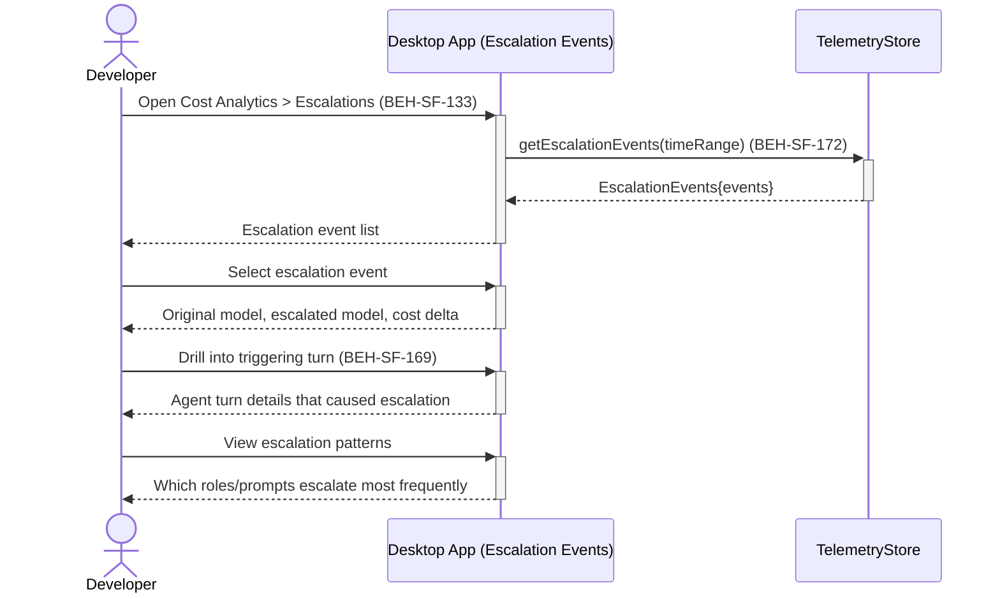

# Review Model Escalation Events

## Use Case

A developer opens the Escalation Events in the desktop app. Understanding escalation patterns helps optimize routing rules and identify problematic prompts.

## Interaction Flow

```text
┌───────────┐     ┌───────────┐     ┌────────────────┐
│ Developer │     │ Desktop App │     │ TelemetryStore │
└─────┬─────┘     └─────┬─────┘     └───────┬────────┘
      │                 │                    │
      │ Open Cost       │                    │
      │ Analytics >     │                    │
      │ Escalations     │                    │
      │────────────────►│                    │
      │                 │ getEscalation      │
      │                 │ Events(timeRange)  │
      │                 │───────────────────►│
      │                 │ EscalationEvents   │
      │                 │ {events}           │
      │                 │◄───────────────────│
      │ Escalation      │                    │
      │ event list      │                    │
      │◄────────────────│                    │
      │                 │                    │
      │ Select          │                    │
      │ escalation event│                    │
      │────────────────►│                    │
      │ Original model, │                    │
      │ escalated model,│                    │
      │ cost delta      │                    │
      │◄────────────────│                    │
      │                 │                    │
      │ Drill into      │                    │
      │ triggering turn │                    │
      │────────────────►│                    │
      │ Agent turn      │                    │
      │ details         │                    │
      │◄────────────────│                    │
      │                 │                    │
      │ View escalation │                    │
      │ patterns        │                    │
      │────────────────►│                    │
      │ Which roles/    │                    │
      │ prompts escalate│                    │
      │ most frequently │                    │
      │◄────────────────│                    │
      │                 │                    │
```



## Steps

1. Open the Escalation Events in the desktop app
2. View escalation events with timestamps, source role, and trigger reason (BEH-SF-172)
3. See the original model, escalated model, and cost delta
4. Drill into the agent turn that triggered escalation (BEH-SF-169)
5. Identify patterns: which roles escalate most, which prompts trigger escalation
6. Adjust routing rules based on findings
7. Set alerts for escalation frequency thresholds

## Traceability

| Behavior   | Feature     | Role in this capability            |
| ---------- | ----------- | ---------------------------------- |
| BEH-SF-169 | FEAT-SF-010 | Model routing and escalation logic |
| BEH-SF-172 | FEAT-SF-024 | Escalation event telemetry         |
| BEH-SF-133 | FEAT-SF-010 | Dashboard escalation event view    |
