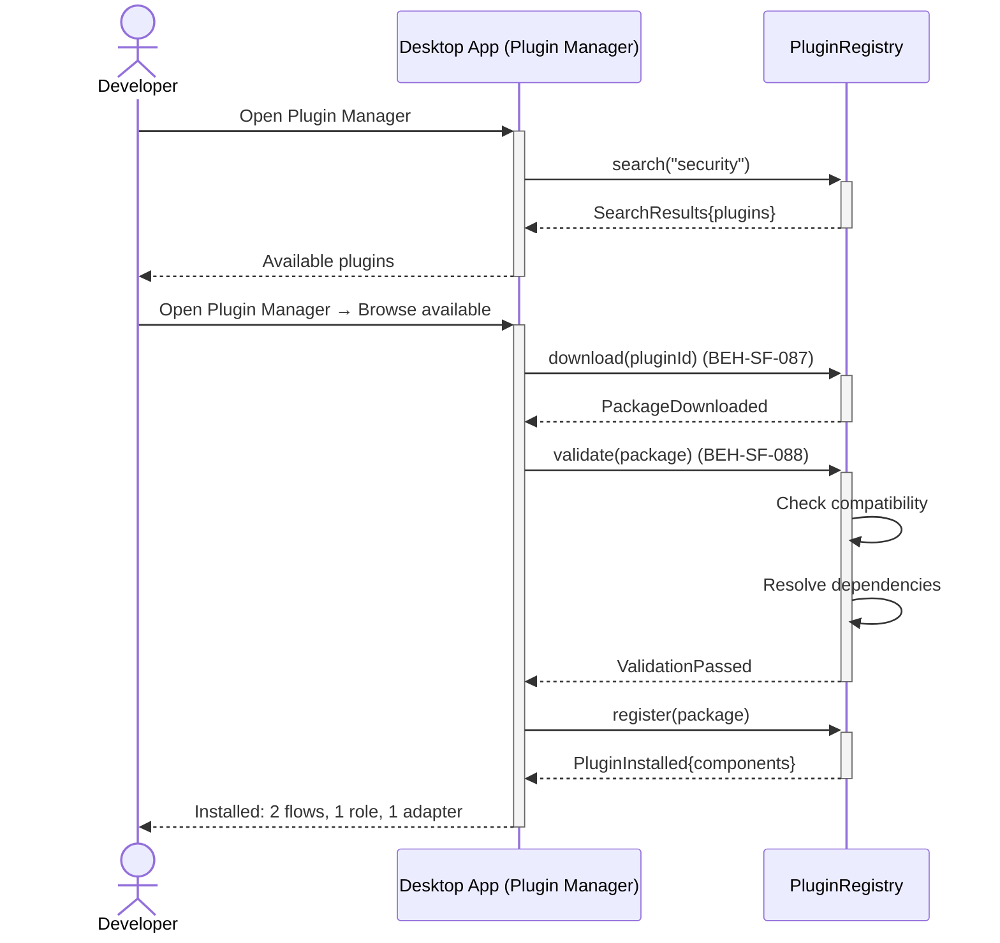
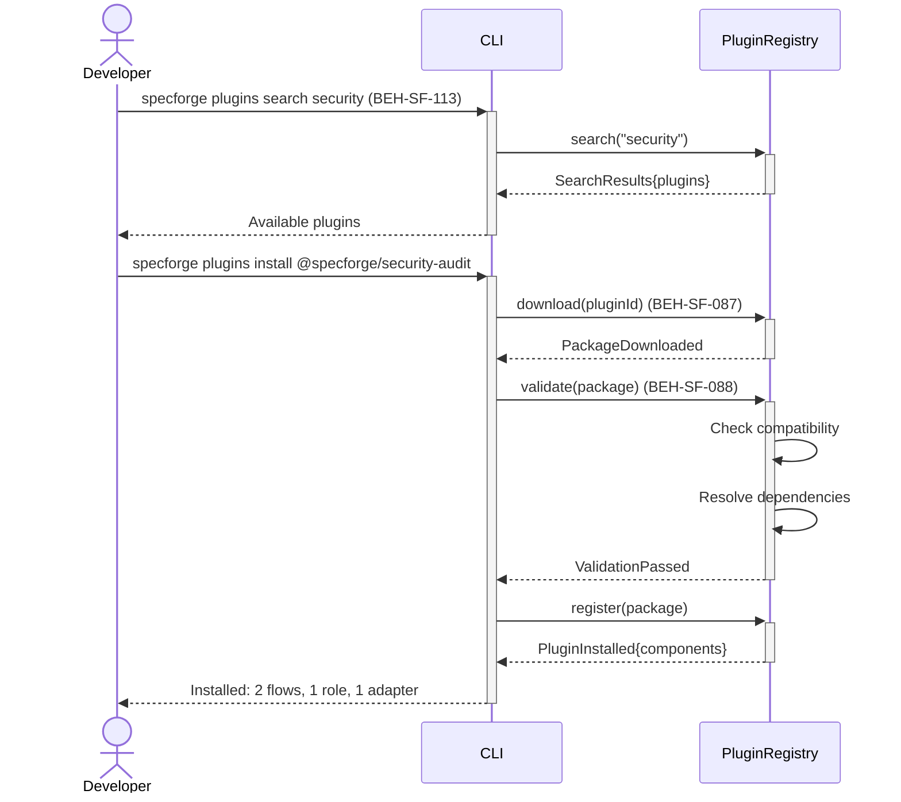
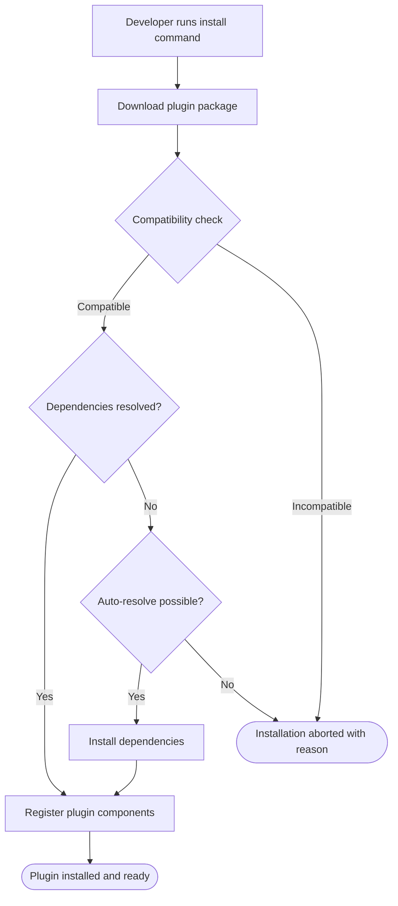

# Install a Plugin

## Use Case

A developer opens the Plugin Manager in the desktop app to install a plugin. The same operation is accessible via CLI (`specforge plugins search security`) for scripted/CI workflows.

## Interaction Flow

### Desktop App

```text
┌───────────┐     ┌─────────────────┐     ┌────────────────┐
│ Developer │     │   Desktop App   │     │ PluginRegistry │
└─────┬─────┘     └────────┬────────┘     └───────┬────────┘
      │               │               │
      │ plugins search│               │
      │ security      │               │
      │──────────────►│               │
      │               │ search        │
      │               │ ("security")  │
      │               │──────────────►│
      │               │ SearchResults │
      │               │ {plugins}     │
      │               │◄──────────────│
      │ Available     │               │
      │ plugins       │               │
      │◄──────────────│               │
      │               │               │
      │ plugins install               │
      │ @specforge/   │               │
      │ security-audit│               │
      │──────────────►│               │
      │               │ download      │
      │               │ (pluginId)    │
      │               │──────────────►│
      │               │ Package       │
      │               │ Downloaded    │
      │               │◄──────────────│
      │               │               │
      │               │ validate      │
      │               │ (package)     │
      │               │──────────────►│
      │               │               │──┐ Check
      │               │               │  │ compat.
      │               │               │◄─┘
      │               │               │──┐ Resolve
      │               │               │  │ deps
      │               │               │◄─┘
      │               │ Validation    │
      │               │ Passed        │
      │               │◄──────────────│
      │               │               │
      │               │ register      │
      │               │ (package)     │
      │               │──────────────►│
      │               │ PluginInstalled
      │               │ {components}  │
      │               │◄──────────────│
      │ Installed:    │               │
      │ 2 flows,      │               │
      │ 1 role,       │               │
      │ 1 adapter     │               │
      │◄──────────────│               │
      │               │               │
```



### CLI

```text
┌───────────┐     ┌─────┐     ┌────────────────┐
│ Developer │     │ CLI │     │ PluginRegistry │
└─────┬─────┘     └──┬──┘     └───────┬────────┘
      │               │               │
      │ plugins search│               │
      │ security      │               │
      │──────────────►│               │
      │               │ search        │
      │               │ ("security")  │
      │               │──────────────►│
      │               │ SearchResults │
      │               │ {plugins}     │
      │               │◄──────────────│
      │ Available     │               │
      │ plugins       │               │
      │◄──────────────│               │
      │               │               │
      │ plugins install               │
      │ @specforge/   │               │
      │ security-audit│               │
      │──────────────►│               │
      │               │ download      │
      │               │ (pluginId)    │
      │               │──────────────►│
      │               │ Package       │
      │               │ Downloaded    │
      │               │◄──────────────│
      │               │               │
      │               │ validate      │
      │               │ (package)     │
      │               │──────────────►│
      │               │               │──┐ Check
      │               │               │  │ compat.
      │               │               │◄─┘
      │               │               │──┐ Resolve
      │               │               │  │ deps
      │               │               │◄─┘
      │               │ Validation    │
      │               │ Passed        │
      │               │◄──────────────│
      │               │               │
      │               │ register      │
      │               │ (package)     │
      │               │──────────────►│
      │               │ PluginInstalled
      │               │ {components}  │
      │               │◄──────────────│
      │ Installed:    │               │
      │ 2 flows,      │               │
      │ 1 role,       │               │
      │ 1 adapter     │               │
      │◄──────────────│               │
      │               │               │
```



## Steps

1. Open the Plugin Manager in the desktop app
2. Install: `specforge plugins install @specforge/security-audit` (BEH-SF-087)
3. System downloads and validates the plugin package (BEH-SF-088)
4. Plugin dependencies are resolved and installed
5. Plugin components are registered (flows, roles, adapters)
6. CLI displays installed components summary
7. Plugin is ready to use immediately

## Decision Paths

```text
┌─────────────────────────────────┐
│ Developer runs install command  │
└────────────────┬────────────────┘
                 ▼
┌─────────────────────────────────┐
│    Download plugin package      │
└────────────────┬────────────────┘
                 ▼
          ╱ Compatibility ╲
         ╱    check?       ╲
        ╱                   ╲
       Yes                  No
        │                    │
        ▼                    ▼
  ╱ Dependencies ╲   ┌──────────────────┐
 ╱  resolved?     ╲  │  Installation    │
╱                  ╲ │  aborted with    │
Yes                No│  reason          │
 │                  │ └──────────────────┘
 │                  ▼          ▲
 │       ╱ Auto-resolve ╲     │
 │      ╱  possible?     ╲    │
 │     ╱                  ╲   │
 │    Yes                 No──┘
 │     │
 │     ▼
 │  ┌─────────────────────────┐
 │  │  Install dependencies   │
 │  └────────────┬────────────┘
 │               │
 ▼               ▼
┌─────────────────────────────────┐
│   Register plugin components    │
└────────────────┬────────────────┘
                 ▼
┌─────────────────────────────────┐
│   Plugin installed and ready    │
└─────────────────────────────────┘
```



## Traceability

| Behavior   | Feature     | Role in this capability                     |
| ---------- | ----------- | ------------------------------------------- |
| BEH-SF-087 | FEAT-SF-032 | Plugin registration via extensibility hooks |
| BEH-SF-088 | FEAT-SF-032 | Plugin validation and dependency resolution |
| BEH-SF-113 | FEAT-SF-009 | CLI plugin management commands              |
