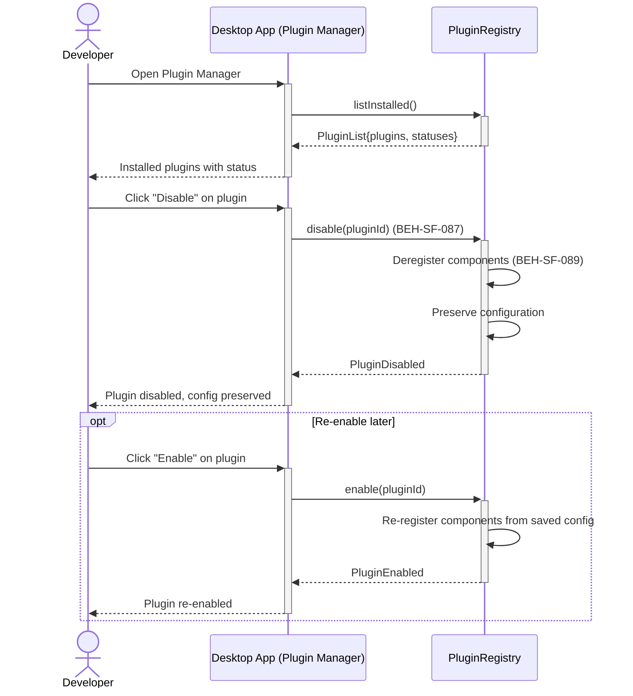
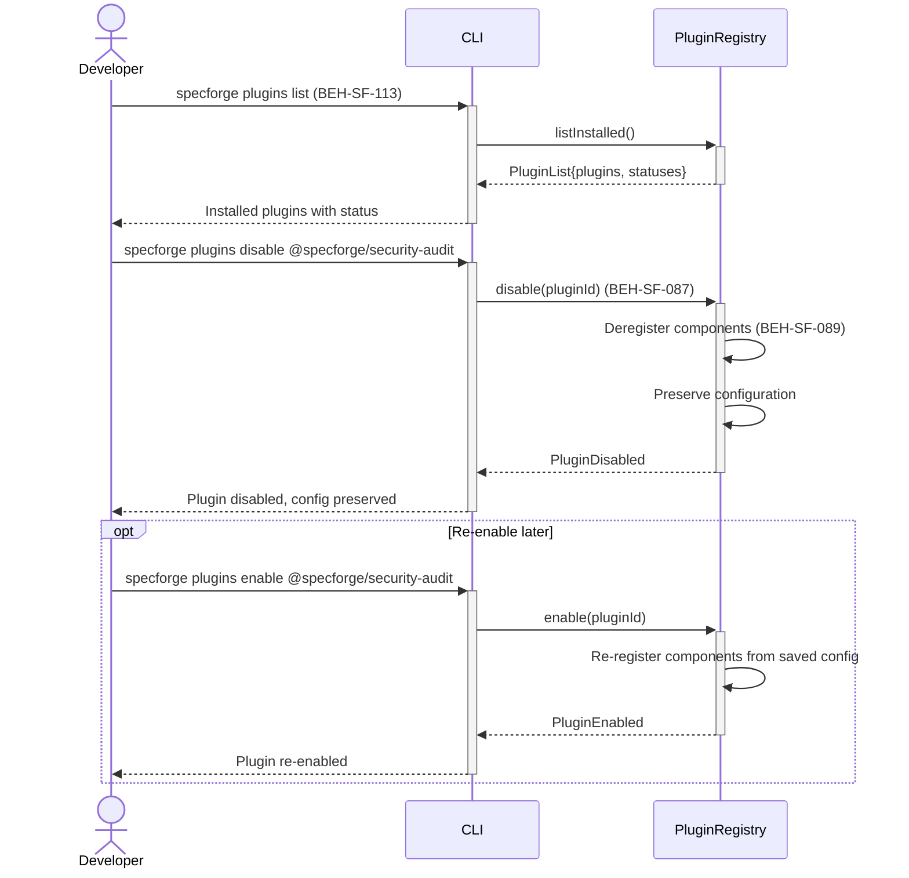
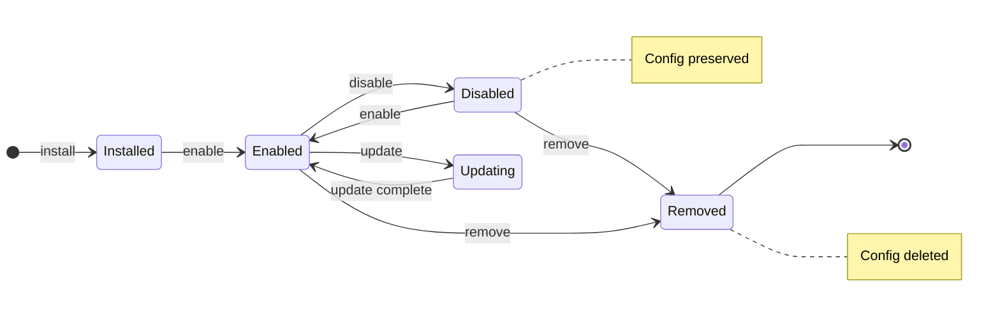

# Enable, Disable, and Manage Plugins

## Use Case

A developer opens the Plugin Manager in the desktop app to enable, disable, and manage plugins. The same operation is accessible via CLI (`specforge plugins list`) for scripted/CI workflows.

## Interaction Flow

### Desktop App

```text
┌───────────┐     ┌─────────────────┐     ┌────────────────┐
│ Developer │     │   Desktop App   │     │ PluginRegistry │
└─────┬─────┘     └────────┬────────┘     └───────┬────────┘
      │               │               │
      │ plugins list  │               │
      │──────────────►│               │
      │               │ listInstalled │
      │               │ ()            │
      │               │──────────────►│
      │               │ PluginList    │
      │               │{plugins,      │
      │               │ statuses}     │
      │               │◄──────────────│
      │ Installed     │               │
      │ plugins with  │               │
      │ status        │               │
      │◄──────────────│               │
      │               │               │
      │ Toggle               │
      │ @specforge/   │               │
      │ security-audit│               │
      │──────────────►│               │
      │               │ disable       │
      │               │ (pluginId)    │
      │               │──────────────►│
      │               │               │──┐ Deregister
      │               │               │  │ components
      │               │               │◄─┘
      │               │               │──┐ Preserve
      │               │               │  │ config
      │               │               │◄─┘
      │               │ PluginDisabled│
      │               │◄──────────────│
      │ Plugin disabled               │
      │ config preserved              │
      │◄──────────────│               │
      │               │               │
      │ [opt: Re-enable later]        │
      │ Toggle│               │
      │ @specforge/   │               │
      │ security-audit│               │
      │──────────────►│               │
      │               │ enable        │
      │               │ (pluginId)    │
      │               │──────────────►│
      │               │               │──┐ Re-register
      │               │               │  │ components
      │               │               │◄─┘
      │               │ PluginEnabled │
      │               │◄──────────────│
      │ Plugin        │               │
      │ re-enabled    │               │
      │◄──────────────│               │
      │               │               │
```



### CLI

```text
┌───────────┐     ┌─────┐     ┌────────────────┐
│ Developer │     │ CLI │     │ PluginRegistry │
└─────┬─────┘     └──┬──┘     └───────┬────────┘
      │               │               │
      │ plugins list  │               │
      │──────────────►│               │
      │               │ listInstalled │
      │               │ ()            │
      │               │──────────────►│
      │               │ PluginList    │
      │               │{plugins,      │
      │               │ statuses}     │
      │               │◄──────────────│
      │ Installed     │               │
      │ plugins with  │               │
      │ status        │               │
      │◄──────────────│               │
      │               │               │
      │ plugins disable               │
      │ @specforge/   │               │
      │ security-audit│               │
      │──────────────►│               │
      │               │ disable       │
      │               │ (pluginId)    │
      │               │──────────────►│
      │               │               │──┐ Deregister
      │               │               │  │ components
      │               │               │◄─┘
      │               │               │──┐ Preserve
      │               │               │  │ config
      │               │               │◄─┘
      │               │ PluginDisabled│
      │               │◄──────────────│
      │ Plugin disabled               │
      │ config preserved              │
      │◄──────────────│               │
      │               │               │
      │ [opt: Re-enable later]        │
      │ plugins enable│               │
      │ @specforge/   │               │
      │ security-audit│               │
      │──────────────►│               │
      │               │ enable        │
      │               │ (pluginId)    │
      │               │──────────────►│
      │               │               │──┐ Re-register
      │               │               │  │ components
      │               │               │◄─┘
      │               │ PluginEnabled │
      │               │◄──────────────│
      │ Plugin        │               │
      │ re-enabled    │               │
      │◄──────────────│               │
      │               │               │
```



## Steps

1. Open the Plugin Manager in the desktop app
2. Disable a plugin: `specforge plugins disable @specforge/security-audit` (BEH-SF-087)
3. Plugin components are deregistered; configuration is preserved (BEH-SF-089)
4. Re-enable: `specforge plugins enable @specforge/security-audit`
5. Update: `specforge plugins update @specforge/security-audit`
6. Remove: `specforge plugins remove @specforge/security-audit`
7. View plugin details: `specforge plugins info @specforge/security-audit`

## State Model

```text
                                          ┌──────────────┐
              install         enable      │   Updating   │
 [*] ──────────────► Installed ────► Enabled ──update──►│              │
                                     ▲  │  │  ▲         │update        │
                                     │  │  │  │         │complete      │
                               enable│  │  │  └─────────┘              │
                                     │  │  │
                                Disabled │  │  remove
                                  │ disable│  │
                                  │  ◄─────┘  │
                                  │           ▼
                  (Config         │ remove   Removed ──────────► [*]
                   preserved)     └────────►  (Config deleted)
```



## Traceability

| Behavior   | Feature     | Role in this capability                       |
| ---------- | ----------- | --------------------------------------------- |
| BEH-SF-087 | FEAT-SF-011 | Plugin lifecycle management                   |
| BEH-SF-089 | FEAT-SF-011 | Plugin enable/disable with state preservation |
| BEH-SF-113 | FEAT-SF-009 | CLI plugin management interface               |
