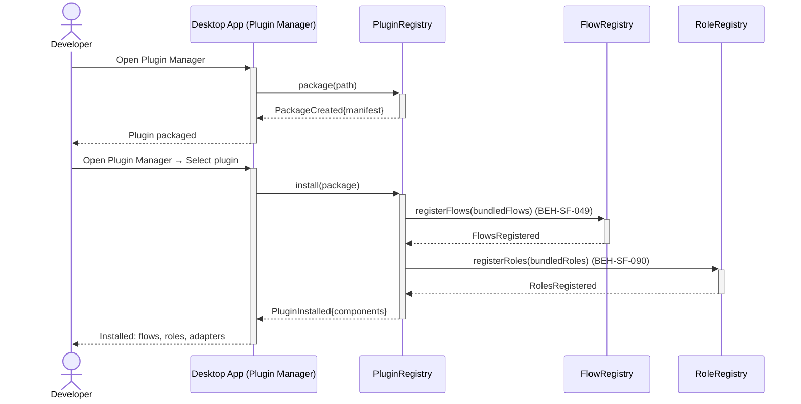

# Register Custom Flows and Agents via Plugin

## Use Case

A developer opens the Plugin Manager in the desktop app to register custom flows and agents via plugin. The same operation is accessible via CLI (`specforge plugins pack ./my-plugin`) for scripted/CI workflows.

## Interaction Flow

### Desktop App

```text
┌───────────┐  ┌─────────────────┐  ┌──────────┐  ┌────────────┐  ┌────────────┐
│ Developer │  │   Desktop App   │  │ Plugin   │  │ Flow       │  │ Role       │
│           │  │     │  │ Registry │  │ Registry   │  │ Registry   │
└─────┬─────┘  └────────┬────────┘  └────┬─────┘  └─────┬──────┘  └─────┬──────┘
      │            │          │              │              │
      │ plugins    │          │              │              │
      │ pack       │          │              │              │
      │ ./my-plugin│          │              │              │
      │───────────►│          │              │              │
      │            │ package  │              │              │
      │            │ (path)   │              │              │
      │            │─────────►│              │              │
      │            │ Package  │              │              │
      │            │ Created  │              │              │
      │            │ {manifest}              │              │
      │            │◄─────────│              │              │
      │ Plugin     │          │              │              │
      │ packaged   │          │              │              │
      │◄───────────│          │              │              │
      │            │          │              │              │
      │ plugins install       │              │              │
      │ ./my-plugin│          │              │              │
      │ .tgz       │          │              │              │
      │───────────►│          │              │              │
      │            │ install  │              │              │
      │            │ (package)│              │              │
      │            │─────────►│              │              │
      │            │          │ registerFlows│              │
      │            │          │─────────────►│              │
      │            │          │ FlowsReg'd   │              │
      │            │          │◄─────────────│              │
      │            │          │ registerRoles│              │
      │            │          │─────────────────────────────►
      │            │          │ RolesReg'd   │              │
      │            │          │◄─────────────────────────────
      │            │ Plugin   │              │              │
      │            │ Installed│              │              │
      │            │{components}             │              │
      │            │◄─────────│              │              │
      │ Installed: │          │              │              │
      │ flows,     │          │              │              │
      │ roles,     │          │              │              │
      │ adapters   │          │              │              │
      │◄───────────│          │              │              │
      │            │          │              │              │
```



### CLI

```text
┌───────────┐  ┌─────┐  ┌──────────┐  ┌────────────┐  ┌────────────┐
│ Developer │  │ CLI │  │ Plugin   │  │ Flow       │  │ Role       │
│           │  │     │  │ Registry │  │ Registry   │  │ Registry   │
└─────┬─────┘  └──┬──┘  └────┬─────┘  └─────┬──────┘  └─────┬──────┘
      │            │          │              │              │
      │ plugins    │          │              │              │
      │ pack       │          │              │              │
      │ ./my-plugin│          │              │              │
      │───────────►│          │              │              │
      │            │ package  │              │              │
      │            │ (path)   │              │              │
      │            │─────────►│              │              │
      │            │ Package  │              │              │
      │            │ Created  │              │              │
      │            │ {manifest}              │              │
      │            │◄─────────│              │              │
      │ Plugin     │          │              │              │
      │ packaged   │          │              │              │
      │◄───────────│          │              │              │
      │            │          │              │              │
      │ plugins install       │              │              │
      │ ./my-plugin│          │              │              │
      │ .tgz       │          │              │              │
      │───────────►│          │              │              │
      │            │ install  │              │              │
      │            │ (package)│              │              │
      │            │─────────►│              │              │
      │            │          │ registerFlows│              │
      │            │          │─────────────►│              │
      │            │          │ FlowsReg'd   │              │
      │            │          │◄─────────────│              │
      │            │          │ registerRoles│              │
      │            │          │─────────────────────────────►
      │            │          │ RolesReg'd   │              │
      │            │          │◄─────────────────────────────
      │            │ Plugin   │              │              │
      │            │ Installed│              │              │
      │            │{components}             │              │
      │            │◄─────────│              │              │
      │ Installed: │          │              │              │
      │ flows,     │          │              │              │
      │ roles,     │          │              │              │
      │ adapters   │          │              │              │
      │◄───────────│          │              │              │
      │            │          │              │              │
```



```mermaid
sequenceDiagram
    actor Dev as Developer
    participant CLI
    participant Plugins as PluginRegistry
    participant Flows as FlowRegistry
    participant Roles as RoleRegistry

    Dev->>+CLI: specforge plugins pack ./my-plugin (BEH-SF-087)
    CLI->>+Plugins: package(path)
    Plugins-->>-CLI: PackageCreated{manifest}
    CLI-->>-Dev: Plugin packaged

    Dev->>+CLI: specforge plugins install ./my-plugin.tgz
    CLI->>+Plugins: install(package)
    Plugins->>+Flows: registerFlows(bundledFlows) (BEH-SF-049)
    Flows-->>-Plugins: FlowsRegistered
    Plugins->>+Roles: registerRoles(bundledRoles) (BEH-SF-090)
    Roles-->>-Plugins: RolesRegistered
    Plugins-->>-CLI: PluginInstalled{components}
    CLI-->>-Dev: Installed: flows, roles, adapters
```

## Steps

1. Open the Plugin Manager in the desktop app
2. Package the plugin: `specforge plugins pack ./my-plugin` (BEH-SF-087)
3. Install the plugin (locally or publish to marketplace)
4. System registers all bundled flows via the flow registry (BEH-SF-049)
5. Agent roles are registered and available for flow definitions (BEH-SF-090)
6. All components appear in their respective list commands
7. Components are versioned and managed as a unit with the plugin

## Traceability

| Behavior   | Feature     | Role in this capability              |
| ---------- | ----------- | ------------------------------------ |
| BEH-SF-087 | FEAT-SF-011 | Plugin packaging and registration    |
| BEH-SF-090 | FEAT-SF-011 | Component bundling within plugins    |
| BEH-SF-049 | FEAT-SF-004 | Flow definition registry integration |
