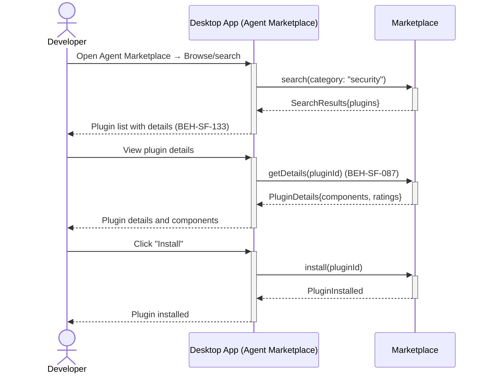
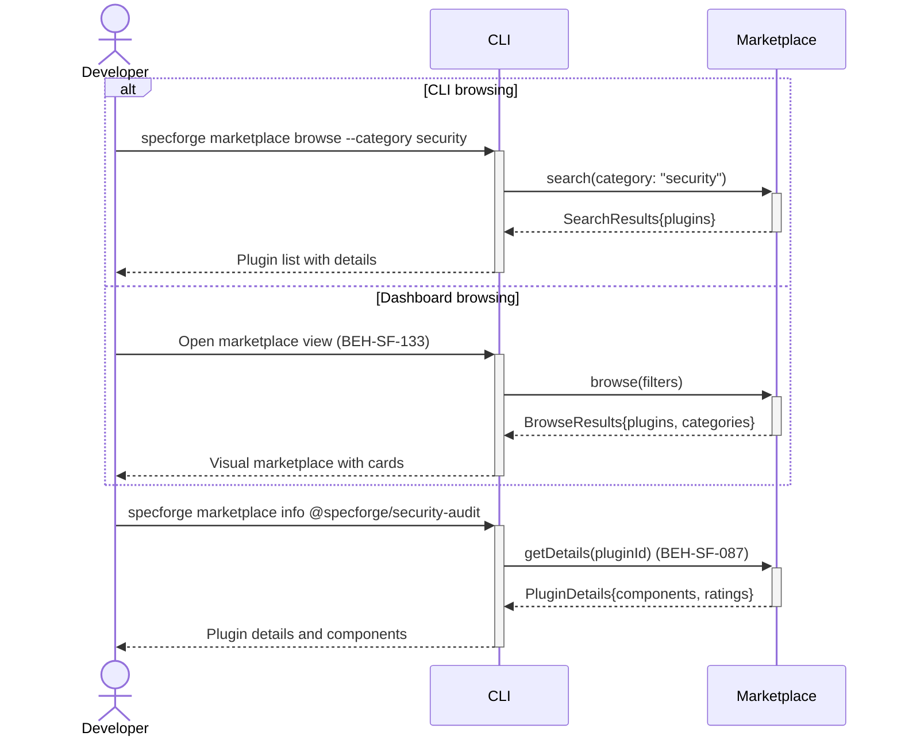

# Browse and Search Agent Marketplace

## Use Case

A developer opens the Agent Marketplace in the desktop app. The marketplace supports search by category, rating, compatibility, and description keywords. The same operation is accessible via CLI (`specforge marketplace browse --category security`) for scripted/CI workflows.

## Interaction Flow

### Desktop App

```text
┌───────────┐  ┌─────────────────┐  ┌───────────┐  ┌─────────────┐
│ Developer │  │   Desktop App   │  │ Marketplace │  │ AgentRegistry│
└─────┬─────┘  └────────┬────────┘  └─────┬─────┘  └──────┬──────┘
      │            │           │               │
      │ [alt: CLI browsing]    │               │
      │ marketplace│           │               │
      │ browse     │           │               │
      │ --category │           │               │
      │ security   │           │               │
      │───────────►│           │               │
      │            │ search(category:          │
      │            │ "security")│               │
      │            │───────────────────────────►│
      │            │ SearchResults{plugins}     │
      │            │◄───────────────────────────│
      │ Plugin list│           │               │
      │ with details           │               │
      │◄───────────│           │               │
      │            │           │               │
      │ [else: Dashboard browsing]             │
      │ Open marketplace       │               │
      │ view       │           │               │
      │────────────────────────►               │
      │            │           │ browse        │
      │            │           │ (filters)     │
      │            │           │──────────────►│
      │            │           │ BrowseResults │
      │            │           │{plugins,      │
      │            │           │ categories}   │
      │            │           │◄──────────────│
      │ Visual marketplace     │               │
      │ with cards │           │               │
      │◄────────────────────────               │
      │            │           │               │
      │ marketplace│           │               │
      │ info       │           │               │
      │ @specforge/│           │               │
      │ security-  │           │               │
      │ audit      │           │               │
      │───────────►│           │               │
      │            │ getDetails(pluginId)       │
      │            │───────────────────────────►│
      │            │ PluginDetails{components,  │
      │            │ ratings}   │               │
      │            │◄───────────────────────────│
      │ Plugin     │           │               │
      │ details and│           │               │
      │ components │           │               │
      │◄───────────│           │               │
      │            │           │               │
```



### CLI

```text
┌───────────┐  ┌─────┐  ┌───────────┐  ┌─────────────┐
│ Developer │  │ CLI │  │ Marketplace │
└─────┬─────┘  └──┬──┘  └─────┬─────┘  └──────┬──────┘
      │            │           │               │
      │ [alt: CLI browsing]    │               │
      │ marketplace│           │               │
      │ browse     │           │               │
      │ --category │           │               │
      │ security   │           │               │
      │───────────►│           │               │
      │            │ search(category:          │
      │            │ "security")│               │
      │            │───────────────────────────►│
      │            │ SearchResults{plugins}     │
      │            │◄───────────────────────────│
      │ Plugin list│           │               │
      │ with details           │               │
      │◄───────────│           │               │
      │            │           │               │
      │ [else: Dashboard browsing]             │
      │ Open marketplace       │               │
      │ view       │           │               │
      │────────────────────────►               │
      │            │           │ browse        │
      │            │           │ (filters)     │
      │            │           │──────────────►│
      │            │           │ BrowseResults │
      │            │           │{plugins,      │
      │            │           │ categories}   │
      │            │           │◄──────────────│
      │ Visual marketplace     │               │
      │ with cards │           │               │
      │◄────────────────────────               │
      │            │           │               │
      │ marketplace│           │               │
      │ info       │           │               │
      │ @specforge/│           │               │
      │ security-  │           │               │
      │ audit      │           │               │
      │───────────►│           │               │
      │            │ getDetails(pluginId)       │
      │            │───────────────────────────►│
      │            │ PluginDetails{components,  │
      │            │ ratings}   │               │
      │            │◄───────────────────────────│
      │ Plugin     │           │               │
      │ details and│           │               │
      │ components │           │               │
      │◄───────────│           │               │
      │            │           │               │
```



## Steps

1. Open the Agent Marketplace in the desktop app
2. Or Open the desktop app marketplace view (BEH-SF-133)
3. Search by keyword, tag, or compatibility version
4. View plugin details: description, author, rating, download count
5. Preview plugin components (which flows, roles, adapters it provides) (BEH-SF-087)
6. Install directly from the marketplace listing
7. Rate and review installed plugins

## Traceability

| Behavior   | Feature     | Role in this capability       |
| ---------- | ----------- | ----------------------------- |
| BEH-SF-087 | FEAT-SF-032 | Plugin discovery and metadata |
| BEH-SF-133 | FEAT-SF-032 | Dashboard marketplace view    |
