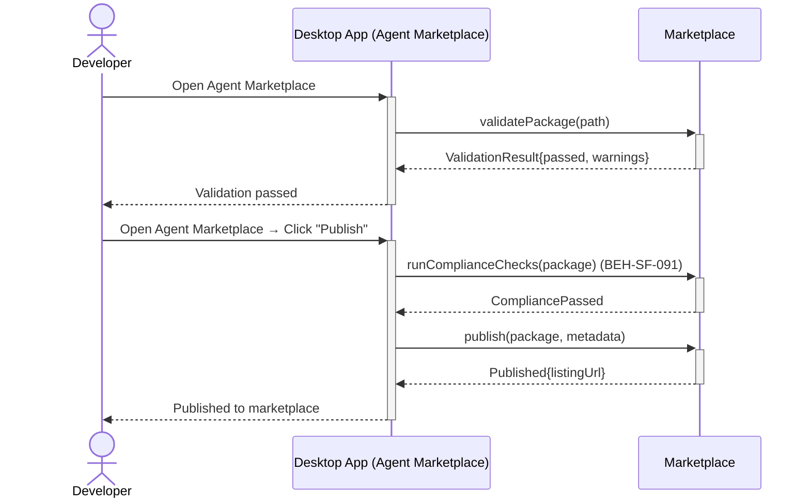
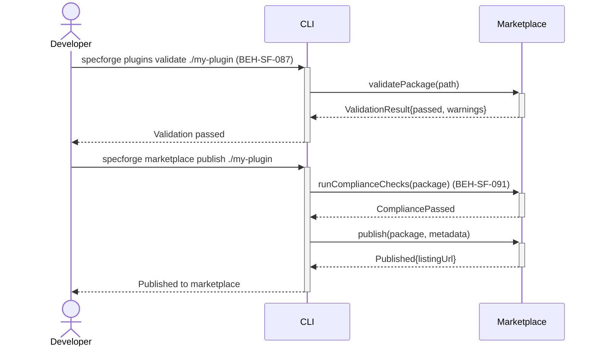

# Publish a Custom Agent Pack

## Use Case

A developer opens the Agent Marketplace in the desktop app to publish a custom agent pack. The same operation is accessible via CLI (`specforge plugins validate ./my-plugin`) for scripted/CI workflows.

## Interaction Flow

### Desktop App

```text
┌───────────┐     ┌─────────────────┐     ┌─────────────┐
│ Developer │     │   Desktop App   │     │ Marketplace │
└─────┬─────┘     └────────┬────────┘     └──────┬──────┘
      │               │              │
      │ plugins       │              │
      │ validate      │              │
      │ ./my-plugin   │              │
      │──────────────►│              │
      │               │ validate     │
      │               │ Package(path)│
      │               │─────────────►│
      │               │ Validation   │
      │               │ Result{passed│
      │               │ ,warnings}   │
      │               │◄─────────────│
      │ Validation    │              │
      │ passed        │              │
      │◄──────────────│              │
      │               │              │
      │ marketplace   │              │
      │ publish       │              │
      │ ./my-plugin   │              │
      │──────────────►│              │
      │               │ runCompliance│
      │               │ Checks       │
      │               │ (package)    │
      │               │─────────────►│
      │               │ Compliance   │
      │               │ Passed       │
      │               │◄─────────────│
      │               │ publish      │
      │               │ (package,    │
      │               │  metadata)   │
      │               │─────────────►│
      │               │ Published    │
      │               │ {listingUrl} │
      │               │◄─────────────│
      │ Published to  │              │
      │ marketplace   │              │
      │◄──────────────│              │
      │               │              │
```



### CLI

```text
┌───────────┐     ┌─────┐     ┌─────────────┐
│ Developer │     │ CLI │     │ Marketplace │
└─────┬─────┘     └──┬──┘     └──────┬──────┘
      │               │              │
      │ plugins       │              │
      │ validate      │              │
      │ ./my-plugin   │              │
      │──────────────►│              │
      │               │ validate     │
      │               │ Package(path)│
      │               │─────────────►│
      │               │ Validation   │
      │               │ Result{passed│
      │               │ ,warnings}   │
      │               │◄─────────────│
      │ Validation    │              │
      │ passed        │              │
      │◄──────────────│              │
      │               │              │
      │ marketplace   │              │
      │ publish       │              │
      │ ./my-plugin   │              │
      │──────────────►│              │
      │               │ runCompliance│
      │               │ Checks       │
      │               │ (package)    │
      │               │─────────────►│
      │               │ Compliance   │
      │               │ Passed       │
      │               │◄─────────────│
      │               │ publish      │
      │               │ (package,    │
      │               │  metadata)   │
      │               │─────────────►│
      │               │ Published    │
      │               │ {listingUrl} │
      │               │◄─────────────│
      │ Published to  │              │
      │ marketplace   │              │
      │◄──────────────│              │
      │               │              │
```



## Steps

1. Open the Agent Marketplace in the desktop app
2. Validate locally: `specforge plugins validate ./my-plugin` (BEH-SF-087)
3. Run marketplace compliance checks (BEH-SF-091)
4. Publish: `specforge marketplace publish ./my-plugin`
5. System uploads the package and creates the marketplace listing
6. Plugin appears in marketplace search results
7. Track downloads and ratings from the developer dashboard

## Traceability

| Behavior   | Feature     | Role in this capability            |
| ---------- | ----------- | ---------------------------------- |
| BEH-SF-087 | FEAT-SF-032 | Plugin validation and packaging    |
| BEH-SF-091 | FEAT-SF-032 | Marketplace publication compliance |
