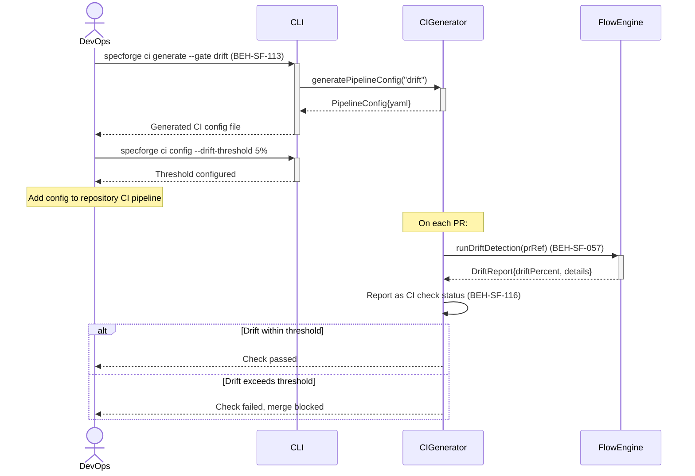

# Set Up CI Gate for Drift Detection

## Use Case

A DevOps engineer configures a CI pipeline gate that detects specification drift — when code changes diverge from the spec, or when spec changes haven't been reflected in code. The gate blocks merges when drift exceeds configured thresholds, ensuring spec-code alignment.

## Interaction Flow

```text
┌────────┐     ┌─────┐     ┌─────────────┐  ┌────────────┐
│ DevOps │     │ CLI │     │ CIGenerator │  │ FlowEngine │
└───┬────┘     └──┬──┘     └──────┬──────┘  └─────┬──────┘
    │              │              │               │
    │ ci generate  │              │               │
    │ --gate drift │              │               │
    │─────────────►│              │               │
    │              │ generate     │               │
    │              │ Pipeline     │               │
    │              │ Config       │               │
    │              │ ("drift")   │               │
    │              │─────────────►│               │
    │              │ PipelineConfig               │
    │              │ {yaml}       │               │
    │              │◄─────────────│               │
    │ Generated CI │              │               │
    │ config file  │              │               │
    │◄─────────────│              │               │
    │              │              │               │
    │ ci config    │              │               │
    │ --drift-     │              │               │
    │ threshold 5% │              │               │
    │─────────────►│              │               │
    │ Threshold    │              │               │
    │ configured   │              │               │
    │◄─────────────│              │               │
    │              │              │               │
    │ --- Add config to repo CI pipeline ---     │
    │              │              │               │
    │              │   --- On each PR: ---        │
    │              │              │ runDrift       │
    │              │              │ Detection     │
    │              │              │ (prRef)       │
    │              │              │──────────────►│
    │              │              │ DriftReport   │
    │              │              │{driftPercent} │
    │              │              │◄──────────────│
    │              │              │──┐ Report as  │
    │              │              │  │ CI check   │
    │              │              │◄─┘ status     │
    │              │              │               │
    │ [if drift within threshold] │               │
    │ Check passed │              │               │
    │◄─────────────────────────────               │
    │              │              │               │
    │ [else drift exceeds threshold]              │
    │ Check failed,│              │               │
    │ merge blocked│              │               │
    │◄─────────────────────────────               │
    │              │              │               │
```



## Steps

1. Generate CI config: `specforge ci generate --gate drift` (BEH-SF-113)
2. System outputs pipeline configuration (GitHub Actions, GitLab CI, etc.)
3. Configure drift thresholds: `specforge ci config --drift-threshold 5%`
4. Add the generated config to the repository's CI pipeline
5. On each PR, the gate runs a drift detection flow (BEH-SF-057)
6. Results are reported as CI check status with details (BEH-SF-116)
7. Merge is blocked if drift exceeds threshold

## Traceability

| Behavior   | Feature     | Role in this capability         |
| ---------- | ----------- | ------------------------------- |
| BEH-SF-113 | FEAT-SF-009 | CLI CI configuration generation |
| BEH-SF-116 | FEAT-SF-029 | CI gate status reporting        |
| BEH-SF-057 | FEAT-SF-029 | Drift detection flow execution  |
