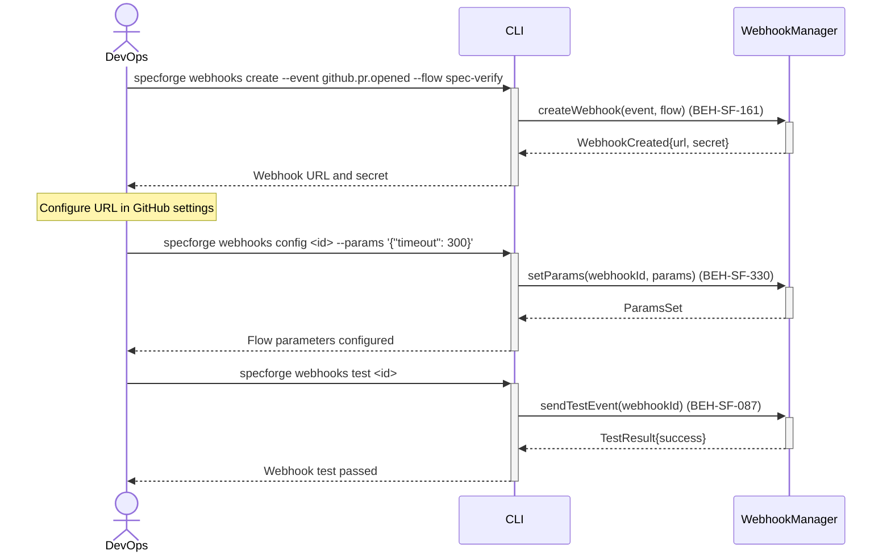

# Configure Webhook Triggers for Flows

## Use Case

A DevOps engineer configures webhooks that automatically trigger SpecForge flows in response to external events — for example, triggering a spec-verify flow when a GitHub PR is opened, or a drift-check when a deployment completes. Webhooks bridge SpecForge with external CI/CD and collaboration tools.

## Interaction Flow

```text
┌────────┐     ┌─────┐     ┌────────────────┐
│ DevOps │     │ CLI │     │ WebhookManager │
└───┬────┘     └──┬──┘     └───────┬────────┘
    │              │               │
    │ webhooks     │               │
    │ create       │               │
    │ --event      │               │
    │ github.pr.   │               │
    │ opened       │               │
    │ --flow       │               │
    │ spec-verify  │               │
    │─────────────►│               │
    │              │ createWebhook │
    │              │ (event, flow) │
    │              │──────────────►│
    │              │ WebhookCreated│
    │              │ {url, secret} │
    │              │◄──────────────│
    │ Webhook URL  │               │
    │ and secret   │               │
    │◄─────────────│               │
    │              │               │
    │ --- Configure URL in GitHub settings ---
    │              │               │
    │ webhooks     │               │
    │ config <id>  │               │
    │ --params     │               │
    │ '{"timeout": │               │
    │  300}'       │               │
    │─────────────►│               │
    │              │ setParams     │
    │              │(webhookId,    │
    │              │ params)       │
    │              │──────────────►│
    │              │ ParamsSet     │
    │              │◄──────────────│
    │ Flow params  │               │
    │ configured   │               │
    │◄─────────────│               │
    │              │               │
    │ webhooks     │               │
    │ test <id>    │               │
    │─────────────►│               │
    │              │ sendTestEvent │
    │              │ (webhookId)   │
    │              │──────────────►│
    │              │ TestResult    │
    │              │ {success}     │
    │              │◄──────────────│
    │ Webhook test │               │
    │ passed       │               │
    │◄─────────────│               │
    │              │               │
```



## Steps

1. Create a webhook: `specforge webhooks create --event github.pr.opened --flow spec-verify`
2. System generates a webhook URL and secret (BEH-SF-161)
3. Configure the webhook URL in the external service (GitHub, GitLab, etc.)
4. Set flow parameters for webhook-triggered runs (BEH-SF-330)
5. Register event filters to narrow trigger conditions (BEH-SF-087)
6. Test the webhook: `specforge webhooks test <webhook-id>`
7. View webhook activity logs: `specforge webhooks logs`

## Traceability

| Behavior   | Feature     | Role in this capability              |
| ---------- | ----------- | ------------------------------------ |
| BEH-SF-087 | FEAT-SF-030 | Event hook registration              |
| BEH-SF-161 | FEAT-SF-030 | Hook pipeline for webhook processing |
| BEH-SF-330 | FEAT-SF-028 | Webhook configuration persistence    |
