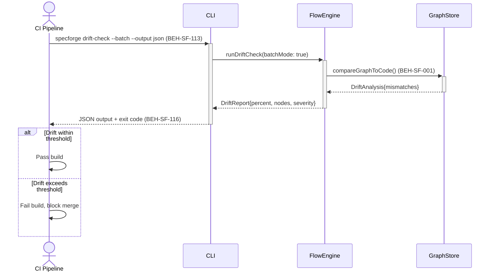

# Run Drift Check in CI Pipeline

## Use Case

A DevOps engineer runs a drift check as part of a CI pipeline to verify that code and spec remain aligned. Unlike the setup capability (UX-SF-049), this focuses on the execution itself — interpreting results, understanding drift reports, and acting on findings.

## Interaction Flow

```text
┌───────────┐ ┌─────┐ ┌───────────┐ ┌───────────┐
│CI Pipeline│ │ CLI │ │FlowEngine │ │GraphStore │
└─────┬─────┘ └──┬──┘ └─────┬─────┘ └─────┬─────┘
      │           │          │              │
      │ drift-check --batch  │              │
      │──────────►│          │              │
      │           │ runDriftCheck(batch)     │
      │           │─────────►│              │
      │           │          │ compareGraphToCode()
      │           │          │─────────────►│
      │           │          │ DriftAnalysis │
      │           │          │◄─────────────│
      │           │ DriftReport              │
      │           │◄─────────│              │
      │ JSON + exit code     │              │
      │◄──────────│          │              │
      │           │          │              │
      │ [if drift within threshold]         │
      │ Pass build│          │              │
      │           │          │              │
      │ [else drift exceeds threshold]      │
      │ Fail build, block merge             │
      │           │          │              │
```



## Steps

1. CI pipeline triggers: `specforge drift-check --batch --output json` (BEH-SF-113)
2. System compares the knowledge graph against the current codebase (BEH-SF-001)
3. Drift analysis identifies mismatches: unimplemented specs, undocumented code
4. Results are output as structured JSON for CI parsing (BEH-SF-116)
5. Summary includes drift percentage, affected nodes, and severity levels
6. CI gate uses the exit code to pass or fail the build
7. Detailed drift report is available in the flow run history

## Traceability

| Behavior   | Feature     | Role in this capability              |
| ---------- | ----------- | ------------------------------------ |
| BEH-SF-113 | FEAT-SF-029 | CLI batch mode for drift check       |
| BEH-SF-116 | FEAT-SF-029 | Structured output for CI integration |
| BEH-SF-001 | FEAT-SF-029 | Graph comparison for drift detection |
