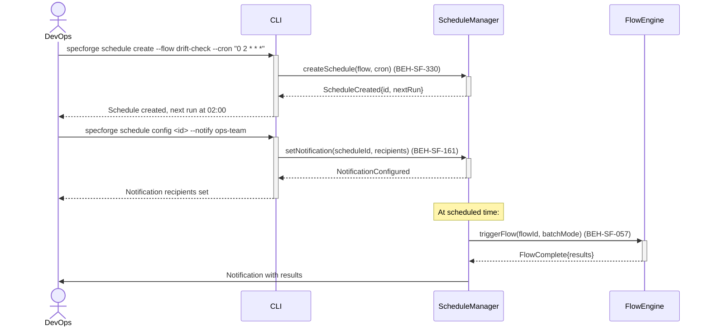

# Schedule Recurring Verification Flows

## Use Case

A DevOps engineer sets up scheduled flows that run automatically on a recurring basis — for example, a nightly drift check, a weekly compliance verification, or a monthly cost analysis. Scheduled flows use the hook pipeline's cron-like scheduling and operate in batch mode.

## Interaction Flow

```text
┌────────┐ ┌─────┐ ┌───────────────┐ ┌───────────┐
│ DevOps │ │ CLI │ │ScheduleManager│ │FlowEngine │
└───┬────┘ └──┬──┘ └──────┬────────┘ └─────┬─────┘
    │          │           │                │
    │ schedule create --cron "0 2 * * *"    │
    │─────────►│           │                │
    │          │ createSchedule(flow, cron)  │
    │          │──────────►│                │
    │          │ ScheduleCreated{id}        │
    │          │◄──────────│                │
    │ next run at 02:00    │                │
    │◄─────────│           │                │
    │          │           │                │
    │ schedule config --notify ops-team     │
    │─────────►│           │                │
    │          │ setNotification()          │
    │          │──────────►│                │
    │          │ NotificationConfigured     │
    │          │◄──────────│                │
    │ recipients set       │                │
    │◄─────────│           │                │
    │          │           │                │
    │          │    [At scheduled time]     │
    │          │           │ triggerFlow()  │
    │          │           │───────────────►│
    │          │           │ FlowComplete   │
    │          │           │◄───────────────│
    │ Notification with results             │
    │◄─────────────────────│                │
    │          │           │                │
```



## Steps

1. Create a schedule: `specforge schedule create --flow drift-check --cron "0 2 * * *"` (BEH-SF-330)
2. Configure flow parameters for the scheduled run (BEH-SF-161)
3. Set notification recipients for schedule completion
4. System triggers the flow at the configured times (BEH-SF-057)
5. Results are stored in flow history with schedule metadata
6. View schedule status: `specforge schedule list`
7. Disable/enable schedules: `specforge schedule disable <schedule-id>`

## Traceability

| Behavior   | Feature     | Role in this capability            |
| ---------- | ----------- | ---------------------------------- |
| BEH-SF-057 | FEAT-SF-030 | Flow execution for scheduled runs  |
| BEH-SF-161 | FEAT-SF-030 | Hook pipeline scheduling           |
| BEH-SF-330 | FEAT-SF-028 | Schedule configuration persistence |
