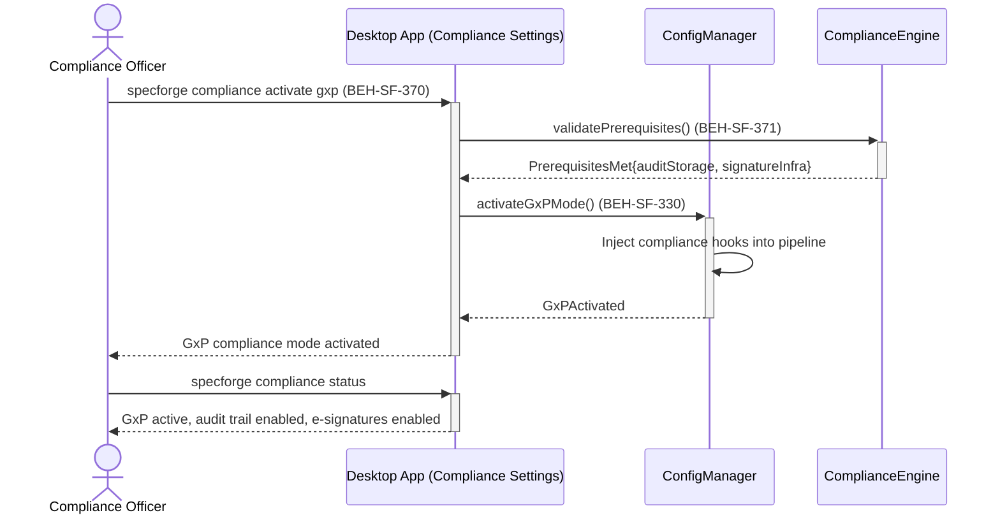
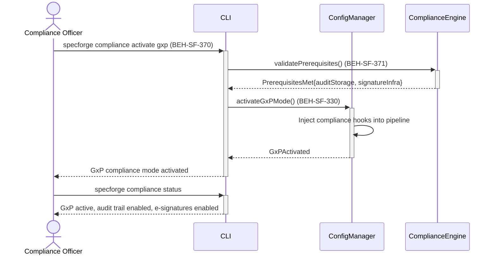
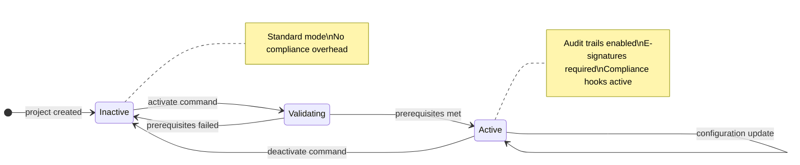

# Activate GxP Compliance Mode

## Use Case

A compliance officer opens the Compliance Settings in the desktop app to activate gxp compliance mode. The same operation is accessible via CLI (`specforge compliance activate gxp`) for scripted/CI workflows.

## Interaction Flow

### Desktop App

```text
┌──────────────────┐ ┌─────────────────┐ ┌─────────────┐ ┌────────────────┐
│Compliance Officer│ │   Desktop App   │ │ConfigManager│ │ComplianceEngine│
└────────┬─────────┘ └────────┬────────┘ └──────┬──────┘ └───────┬────────┘
         │               │          │                 │
         │ compliance activate gxp  │                 │
         │──────────────►│          │                 │
         │               │ validatePrerequisites()    │
         │               │───────────────────────────►│
         │               │ PrerequisitesMet            │
         │               │◄───────────────────────────│
         │               │          │                 │
         │               │ activateGxPMode()          │
         │               │─────────►│                 │
         │               │          │ Inject hooks    │
         │               │ GxPActivated               │
         │               │◄─────────│                 │
         │ GxP mode activated       │                 │
         │◄──────────────│          │                 │
         │               │          │                 │
         │ compliance status        │                 │
         │──────────────►│          │                 │
         │ GxP active, audit+esig   │                 │
         │◄──────────────│          │                 │
         │               │          │                 │
```



### CLI

```text
┌──────────────────┐ ┌─────┐ ┌─────────────┐ ┌────────────────┐
│Compliance Officer│ │ CLI │ │ConfigManager│ │ComplianceEngine│
└────────┬─────────┘ └──┬──┘ └──────┬──────┘ └───────┬────────┘
         │               │          │                 │
         │ compliance activate gxp  │                 │
         │──────────────►│          │                 │
         │               │ validatePrerequisites()    │
         │               │───────────────────────────►│
         │               │ PrerequisitesMet            │
         │               │◄───────────────────────────│
         │               │          │                 │
         │               │ activateGxPMode()          │
         │               │─────────►│                 │
         │               │          │ Inject hooks    │
         │               │ GxPActivated               │
         │               │◄─────────│                 │
         │ GxP mode activated       │                 │
         │◄──────────────│          │                 │
         │               │          │                 │
         │ compliance status        │                 │
         │──────────────►│          │                 │
         │ GxP active, audit+esig   │                 │
         │◄──────────────│          │                 │
         │               │          │                 │
```



## Steps

1. Open the Compliance Settings in the desktop app
2. System validates prerequisites (audit storage, signature infrastructure) (BEH-SF-371)
3. Compliance hooks are injected into the flow pipeline (BEH-SF-330)
4. All subsequent flow executions produce audit trail records
5. Electronic signature prompts appear at approval gates
6. Verify activation: `specforge compliance status`
7. GxP mode persists across sessions until explicitly deactivated

## State Model

```text
                    project        activate       prerequisites
            [*] ──────────► Inactive ──────────► Validating ──────────► Active
                              ▲                      │                  │  │
                              │   prerequisites      │                  │  │
                              │      failed          │                  │  │
                              └──────────────────────┘                  │  │
                              │                                         │  │
                              │           deactivate command            │  │
                              └─────────────────────────────────────────┘  │
                                                                          │
                                              configuration update        │
                                            Active ───────► Active ───────┘

            Active:   Audit trails enabled, E-signatures required,
                      Compliance hooks active
            Inactive: Standard mode, No compliance overhead
```



## Traceability

| Behavior   | Feature     | Role in this capability              |
| ---------- | ----------- | ------------------------------------ |
| BEH-SF-370 | FEAT-SF-021 | GxP compliance plugin activation     |
| BEH-SF-371 | FEAT-SF-021 | Compliance prerequisite validation   |
| BEH-SF-330 | FEAT-SF-028 | Compliance configuration persistence |
