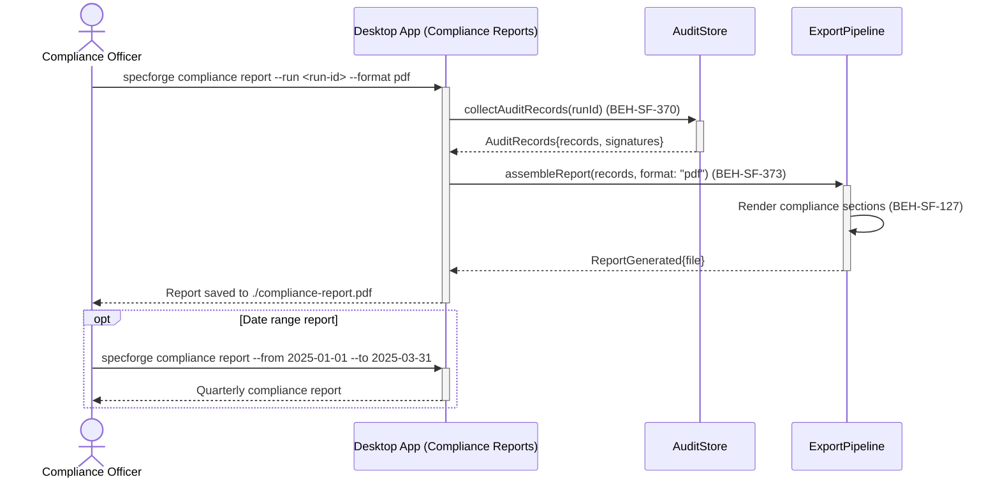
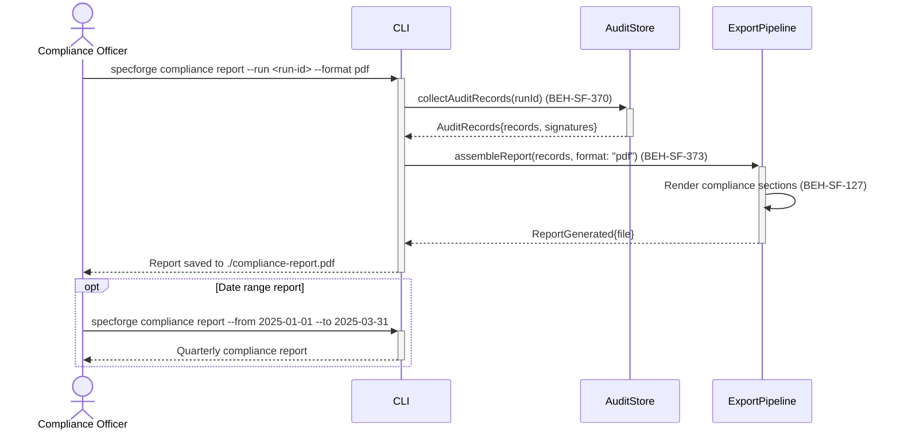

# Generate Compliance Audit Report

## Use Case

A compliance officer opens the Compliance Reports in the desktop app. The report includes complete audit trails, electronic signatures, approval decisions, and traceability matrices — all in a format suitable for FDA or EU GMP inspectors. The same operation is accessible via CLI (`specforge compliance report --run <run-id> --format pdf`) for scripted/CI workflows.

## Interaction Flow

### Desktop App

```text
┌──────────────────┐ ┌─────────────────┐ ┌──────────┐ ┌──────────────┐
│Compliance Officer│ │   Desktop App   │ │AuditStore│ │ExportPipeline│
└────────┬─────────┘ └────────┬────────┘ └────┬─────┘ └──────┬───────┘
         │               │        │               │
         │ report --run <id> --format pdf         │
         │──────────────►│        │               │
         │               │ collectAuditRecords()  │
         │               │───────►│               │
         │               │ AuditRecords           │
         │               │◄───────│               │
         │               │        │               │
         │               │ assembleReport(pdf)    │
         │               │───────────────────────►│
         │               │        │  Render sections
         │               │ ReportGenerated        │
         │               │◄───────────────────────│
         │ Report saved  │        │               │
         │◄──────────────│        │               │
         │               │        │               │
         │ [opt: date range report]               │
         │ report --from .. --to ..               │
         │──────────────►│        │               │
         │ Quarterly report       │               │
         │◄──────────────│        │               │
         │               │        │               │
```



### CLI

```text
┌──────────────────┐ ┌─────┐ ┌──────────┐ ┌──────────────┐
│Compliance Officer│ │ CLI │ │AuditStore│ │ExportPipeline│
└────────┬─────────┘ └──┬──┘ └────┬─────┘ └──────┬───────┘
         │               │        │               │
         │ report --run <id> --format pdf         │
         │──────────────►│        │               │
         │               │ collectAuditRecords()  │
         │               │───────►│               │
         │               │ AuditRecords           │
         │               │◄───────│               │
         │               │        │               │
         │               │ assembleReport(pdf)    │
         │               │───────────────────────►│
         │               │        │  Render sections
         │               │ ReportGenerated        │
         │               │◄───────────────────────│
         │ Report saved  │        │               │
         │◄──────────────│        │               │
         │               │        │               │
         │ [opt: date range report]               │
         │ report --from .. --to ..               │
         │──────────────►│        │               │
         │ Quarterly report       │               │
         │◄──────────────│        │               │
         │               │        │               │
```



## Steps

1. Open the Compliance Reports in the desktop app
2. Or generate for a date range: `specforge compliance report --from 2025-01-01 --to 2025-03-31`
3. System collects audit trail records for the scope (BEH-SF-370)
4. Report is assembled with required compliance sections (BEH-SF-373)
5. Export pipeline renders the report in the requested format (BEH-SF-127)
6. Report includes digital signature verification status
7. Desktop app provides a preview before download (from dashboard surface)

## Traceability

| Behavior   | Feature     | Role in this capability              |
| ---------- | ----------- | ------------------------------------ |
| BEH-SF-370 | FEAT-SF-021 | GxP audit trail data collection      |
| BEH-SF-373 | FEAT-SF-021 | Compliance report assembly           |
| BEH-SF-127 | FEAT-SF-012 | Export pipeline for report rendering |
