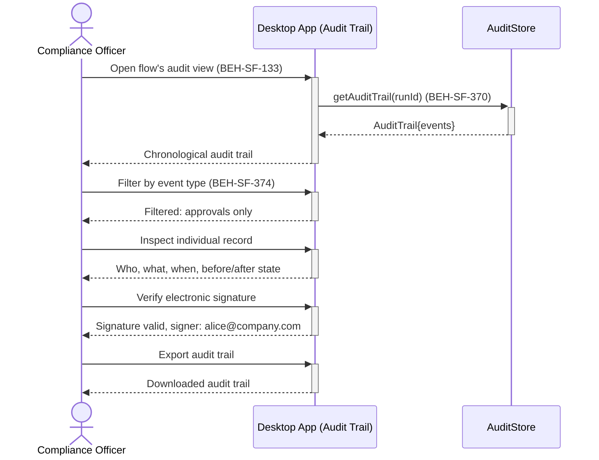

# View Audit Trail for a Flow

## Use Case

A compliance officer opens the Audit Trail in the desktop app. The audit trail provides the immutable record required for regulatory compliance.

## Interaction Flow

```text
┌──────────────────┐ ┌─────────┐ ┌──────────┐
│Compliance Officer│ │ Desktop App │ │AuditStore│
└────────┬─────────┘ └────┬────┘ └────┬─────┘
         │                │           │
         │ Open audit view│           │
         │───────────────►│           │
         │                │ getAuditTrail(runId)
         │                │──────────►│
         │                │ AuditTrail{events}
         │                │◄──────────│
         │ Chronological trail        │
         │◄───────────────│           │
         │                │           │
         │ Filter by event type       │
         │───────────────►│           │
         │ Filtered: approvals        │
         │◄───────────────│           │
         │                │           │
         │ Inspect record │           │
         │───────────────►│           │
         │ Who, what, when│           │
         │◄───────────────│           │
         │                │           │
         │ Verify e-signature         │
         │───────────────►│           │
         │ Signature valid│           │
         │◄───────────────│           │
         │                │           │
         │ Export audit trail          │
         │───────────────►│           │
         │ Downloaded     │           │
         │◄───────────────│           │
         │                │           │
```



## Steps

1. Open the Audit Trail in the desktop app
2. View the chronological audit trail with all recorded events (BEH-SF-370)
3. Filter by event type: approvals, data changes, access events (BEH-SF-374)
4. Inspect individual records: who, what, when, before/after state
5. Verify electronic signatures on approval events
6. Check for gaps or anomalies in the audit trail
7. Export the audit trail for external archival

## Traceability

| Behavior   | Feature     | Role in this capability         |
| ---------- | ----------- | ------------------------------- |
| BEH-SF-370 | FEAT-SF-021 | GxP audit trail recording       |
| BEH-SF-374 | FEAT-SF-021 | Audit trail query and filtering |
| BEH-SF-133 | FEAT-SF-024 | Dashboard audit trail view      |
