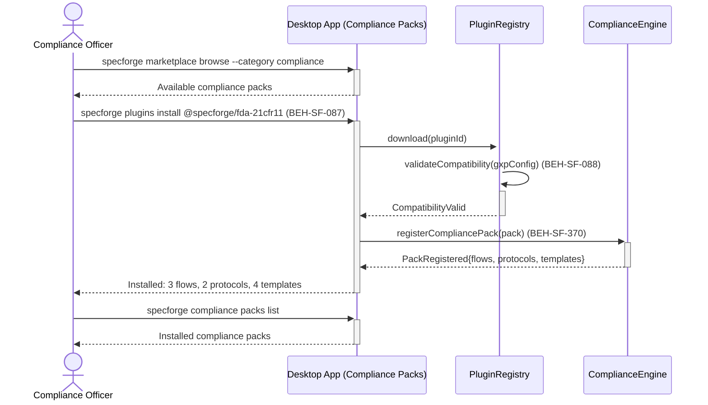
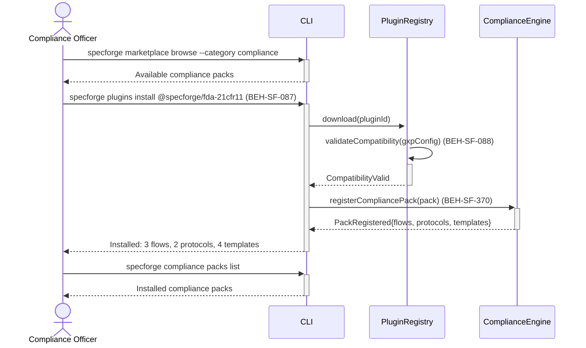

# Install and Configure Compliance Packs

## Use Case

A compliance officer opens the Compliance Packs in the desktop app (e.g., FDA 21 CFR Part 11, ISO 13485, SOC 2). Compliance packs extend the GxP baseline with domain-specific requirements. The same operation is accessible via CLI (`specforge marketplace browse --category compliance`) for scripted/CI workflows.

## Interaction Flow

### Desktop App

```text
┌──────────────────┐ ┌─────────────────┐ ┌──────────────┐ ┌────────────────┐
│Compliance Officer│ │   Desktop App   │ │PluginRegistry│ │ComplianceEngine│
└────────┬─────────┘ └────────┬────────┘ └──────┬───────┘ └───────┬────────┘
         │               │          │                  │
         │ marketplace browse --category compliance    │
         │──────────────►│          │                  │
         │ Available packs          │                  │
         │◄──────────────│          │                  │
         │               │          │                  │
         │ plugins install fda-21cfr11                 │
         │──────────────►│          │                  │
         │               │ download(pluginId)          │
         │               │─────────►│                  │
         │               │          │ validateCompat() │
         │               │ CompatibilityValid          │
         │               │◄─────────│                  │
         │               │          │                  │
         │               │ registerCompliancePack()    │
         │               │────────────────────────────►│
         │               │ PackRegistered              │
         │               │◄────────────────────────────│
         │ Installed: 3 flows, 2 protocols, 4 templates│
         │◄──────────────│          │                  │
         │               │          │                  │
         │ compliance packs list    │                  │
         │──────────────►│          │                  │
         │ Installed packs          │                  │
         │◄──────────────│          │                  │
         │               │          │                  │
```



### CLI

```text
┌──────────────────┐ ┌─────┐ ┌──────────────┐ ┌────────────────┐
│Compliance Officer│ │ CLI │ │PluginRegistry│ │ComplianceEngine│
└────────┬─────────┘ └──┬──┘ └──────┬───────┘ └───────┬────────┘
         │               │          │                  │
         │ marketplace browse --category compliance    │
         │──────────────►│          │                  │
         │ Available packs          │                  │
         │◄──────────────│          │                  │
         │               │          │                  │
         │ plugins install fda-21cfr11                 │
         │──────────────►│          │                  │
         │               │ download(pluginId)          │
         │               │─────────►│                  │
         │               │          │ validateCompat() │
         │               │ CompatibilityValid          │
         │               │◄─────────│                  │
         │               │          │                  │
         │               │ registerCompliancePack()    │
         │               │────────────────────────────►│
         │               │ PackRegistered              │
         │               │◄────────────────────────────│
         │ Installed: 3 flows, 2 protocols, 4 templates│
         │◄──────────────│          │                  │
         │               │          │                  │
         │ compliance packs list    │                  │
         │──────────────►│          │                  │
         │ Installed packs          │                  │
         │◄──────────────│          │                  │
         │               │          │                  │
```



## Steps

1. Open the Compliance Packs in the desktop app
2. Install: `specforge plugins install @specforge/fda-21cfr11` (BEH-SF-087)
3. System validates pack compatibility with current GxP configuration (BEH-SF-088)
4. Pack registers its flows, validation protocols, and report templates (BEH-SF-370)
5. Configure pack-specific settings (e.g., retention periods, signature requirements)
6. Verify installation: `specforge compliance packs list`
7. Pack components are available in compliance workflows

## Traceability

| Behavior   | Feature     | Role in this capability                    |
| ---------- | ----------- | ------------------------------------------ |
| BEH-SF-370 | FEAT-SF-036 | GxP compliance infrastructure integration  |
| BEH-SF-087 | FEAT-SF-032 | Plugin installation for compliance packs   |
| BEH-SF-088 | FEAT-SF-032 | Pack validation and compatibility checking |
