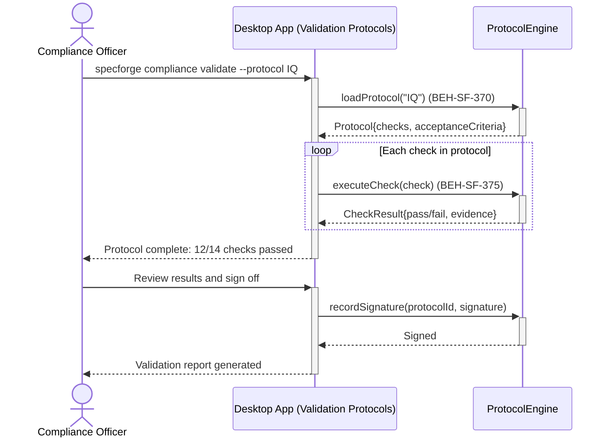
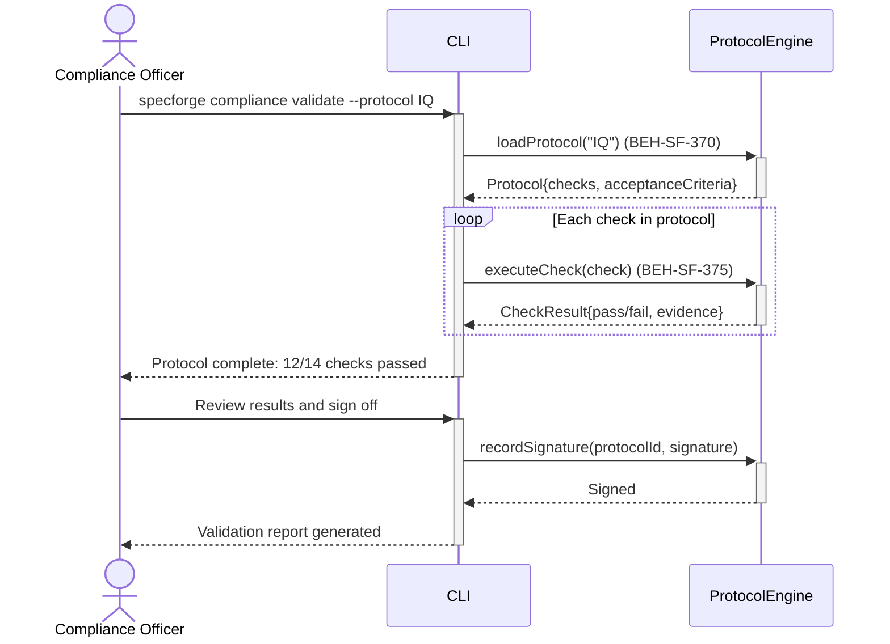
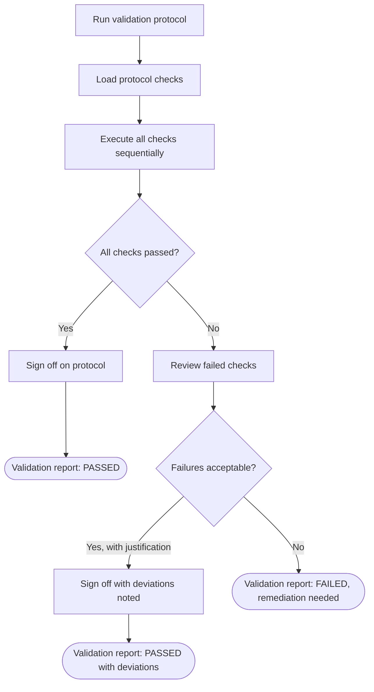

# Run Validation Protocol (IQ/OQ/PQ)

## Use Case

A compliance officer opens the Validation Protocols in the desktop app. Each protocol runs a predefined set of checks, records results with electronic signatures, and produces a validation report. The same operation is accessible via CLI (`specforge compliance validate --protocol IQ`) for scripted/CI workflows.

## Interaction Flow

### Desktop App

```text
┌──────────────────┐ ┌─────────────────┐ ┌──────────────┐
│Compliance Officer│ │   Desktop App   │ │ProtocolEngine│
└────────┬─────────┘ └────────┬────────┘ └──────┬───────┘
         │               │          │
         │ validate --protocol IQ   │
         │──────────────►│          │
         │               │ loadProtocol("IQ")
         │               │─────────►│
         │               │ Protocol{checks}
         │               │◄─────────│
         │               │          │
         │               │ [loop: each check]
         │               │ executeCheck()
         │               │─────────►│
         │               │ CheckResult
         │               │◄─────────│
         │               │ [end loop]
         │               │          │
         │ 12/14 passed  │          │
         │◄──────────────│          │
         │               │          │
         │ Review + sign off        │
         │──────────────►│          │
         │               │ recordSignature()
         │               │─────────►│
         │               │ Signed   │
         │               │◄─────────│
         │ Report generated         │
         │◄──────────────│          │
         │               │          │
```



### CLI

```text
┌──────────────────┐ ┌─────┐ ┌──────────────┐
│Compliance Officer│ │ CLI │ │ProtocolEngine│
└────────┬─────────┘ └──┬──┘ └──────┬───────┘
         │               │          │
         │ validate --protocol IQ   │
         │──────────────►│          │
         │               │ loadProtocol("IQ")
         │               │─────────►│
         │               │ Protocol{checks}
         │               │◄─────────│
         │               │          │
         │               │ [loop: each check]
         │               │ executeCheck()
         │               │─────────►│
         │               │ CheckResult
         │               │◄─────────│
         │               │ [end loop]
         │               │          │
         │ 12/14 passed  │          │
         │◄──────────────│          │
         │               │          │
         │ Review + sign off        │
         │──────────────►│          │
         │               │ recordSignature()
         │               │─────────►│
         │               │ Signed   │
         │               │◄─────────│
         │ Report generated         │
         │◄──────────────│          │
         │               │          │
```



## Steps

1. Open the Validation Protocols in the desktop app
2. System loads the protocol definition (checks, acceptance criteria) (BEH-SF-370)
3. Each check executes in sequence, recording pass/fail with evidence (BEH-SF-375)
4. Failures are recorded but do not halt the protocol (all checks run)
5. At completion, compliance officer reviews results and signs off
6. Electronic signature is recorded with the validation record
7. Validation report is generated automatically

## Decision Paths

```text
    ┌──────────────────────────┐
    │  Run validation protocol │
    └────────────┬─────────────┘
                 ▼
    ┌──────────────────────────┐
    │   Load protocol checks   │
    └────────────┬─────────────┘
                 ▼
    ┌──────────────────────────┐
    │ Execute all checks       │
    │ sequentially             │
    └────────────┬─────────────┘
                 ▼
          ╱─────────────╲
         ╱ All checks    ╲
        ╱  passed?        ╲
        ╲                 ╱
         ╲               ╱
          ╲─────────────╱
          Yes │     │ No
              ▼     │
  ┌───────────────┐ │
  │Sign off on    │ │
  │protocol       │ │
  └───────┬───────┘ │
          ▼         │
  ┌───────────────┐ │
  │ PASSED        │ │
  └───────────────┘ │
                    ▼
        ┌───────────────────┐
        │Review failed      │
        │checks             │
        └─────────┬─────────┘
                  ▼
           ╱────────────╲
          ╱  Failures    ╲
         ╱   acceptable?  ╲
         ╲                ╱
          ╲              ╱
           ╲────────────╱
     Yes, with  │    │ No
   justification│    │
                ▼    │
  ┌──────────────┐   │
  │Sign off with │   │
  │deviations    │   │
  └──────┬───────┘   │
         ▼           ▼
  ┌──────────────┐ ┌──────────────────┐
  │ PASSED with  │ │ FAILED,          │
  │ deviations   │ │ remediation      │
  └──────────────┘ │ needed           │
                   └──────────────────┘
```



## Traceability

| Behavior   | Feature     | Role in this capability                              |
| ---------- | ----------- | ---------------------------------------------------- |
| BEH-SF-370 | FEAT-SF-021 | GxP validation protocol infrastructure               |
| BEH-SF-375 | FEAT-SF-021 | Protocol execution, evidence recording, and sign-off |
