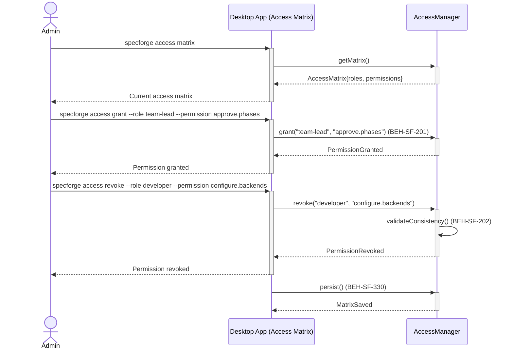
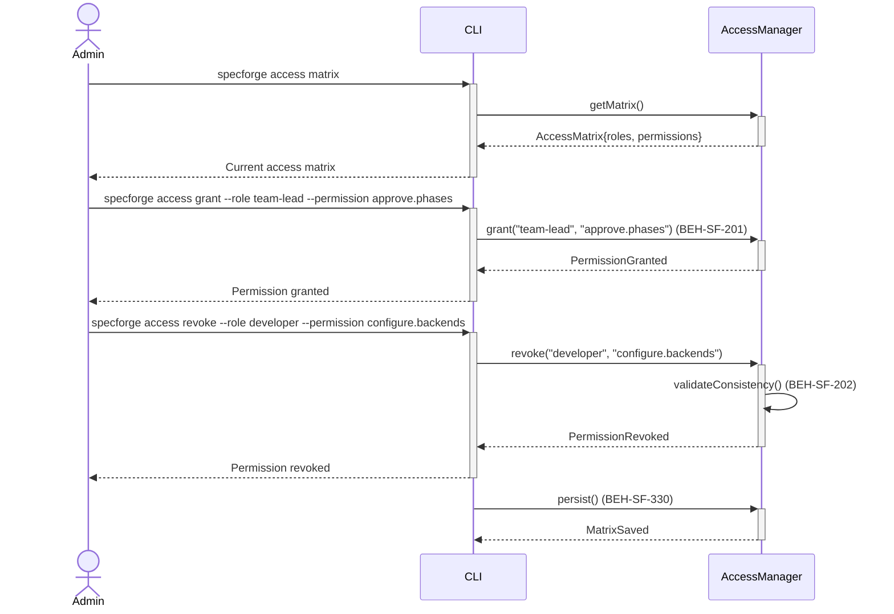

# Configure Role-Based Access Matrix

## Use Case

An admin opens the Access Matrix in the desktop app. Roles (developer, team-lead, devops, compliance-officer, admin) are mapped to permissions (run flows, approve changes, configure backends, etc.). The matrix is enforced at every operation boundary. The same operation is accessible via CLI (`specforge access matrix`) for scripted/CI workflows.

## Interaction Flow

### Desktop App

```text
┌───────┐ ┌─────────────────┐ ┌─────────────┐
│ Admin │ │   Desktop App   │ │AccessManager│
└───┬───┘ └────────┬────────┘ └──────┬──────┘
    │         │           │
    │ access matrix       │
    │────────►│           │
    │         │ getMatrix()
    │         │──────────►│
    │         │ AccessMatrix
    │         │◄──────────│
    │ Current matrix      │
    │◄────────│           │
    │         │           │
    │ grant --role team-lead
    │ --permission approve.phases
    │────────►│           │
    │         │ grant()   │
    │         │──────────►│
    │         │ Granted   │
    │         │◄──────────│
    │ Permission granted  │
    │◄────────│           │
    │         │           │
    │ revoke --role developer
    │ --permission configure.backends
    │────────►│           │
    │         │ revoke()  │
    │         │──────────►│
    │         │    validateConsistency()
    │         │ Revoked   │
    │         │◄──────────│
    │ Permission revoked  │
    │◄────────│           │
    │         │           │
    │         │ persist() │
    │         │──────────►│
    │         │ MatrixSaved
    │         │◄──────────│
    │         │           │
```



### CLI

```text
┌───────┐ ┌─────┐ ┌─────────────┐
│ Admin │ │ CLI │ │AccessManager│
└───┬───┘ └──┬──┘ └──────┬──────┘
    │         │           │
    │ access matrix       │
    │────────►│           │
    │         │ getMatrix()
    │         │──────────►│
    │         │ AccessMatrix
    │         │◄──────────│
    │ Current matrix      │
    │◄────────│           │
    │         │           │
    │ grant --role team-lead
    │ --permission approve.phases
    │────────►│           │
    │         │ grant()   │
    │         │──────────►│
    │         │ Granted   │
    │         │◄──────────│
    │ Permission granted  │
    │◄────────│           │
    │         │           │
    │ revoke --role developer
    │ --permission configure.backends
    │────────►│           │
    │         │ revoke()  │
    │         │──────────►│
    │         │    validateConsistency()
    │         │ Revoked   │
    │         │◄──────────│
    │ Permission revoked  │
    │◄────────│           │
    │         │           │
    │         │ persist() │
    │         │──────────►│
    │         │ MatrixSaved
    │         │◄──────────│
    │         │           │
```



## Steps

1. Open the Access Matrix in the desktop app
2. Modify permissions: `specforge access grant --role team-lead --permission approve.phases` (BEH-SF-201)
3. Revoke permissions: `specforge access revoke --role developer --permission configure.backends`
4. System validates the matrix for consistency (no orphaned permissions) (BEH-SF-202)
5. Persist the matrix (BEH-SF-330)
6. Changes take effect immediately for all active sessions
7. Audit trail records all access matrix changes

## Traceability

| Behavior   | Feature     | Role in this capability                     |
| ---------- | ----------- | ------------------------------------------- |
| BEH-SF-201 | FEAT-SF-014 | Permission governance model                 |
| BEH-SF-202 | FEAT-SF-014 | Access matrix validation                    |
| BEH-SF-330 | FEAT-SF-028 | Configuration persistence for access matrix |
