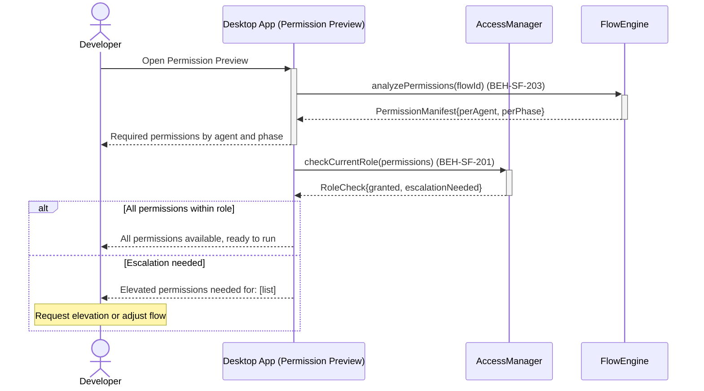
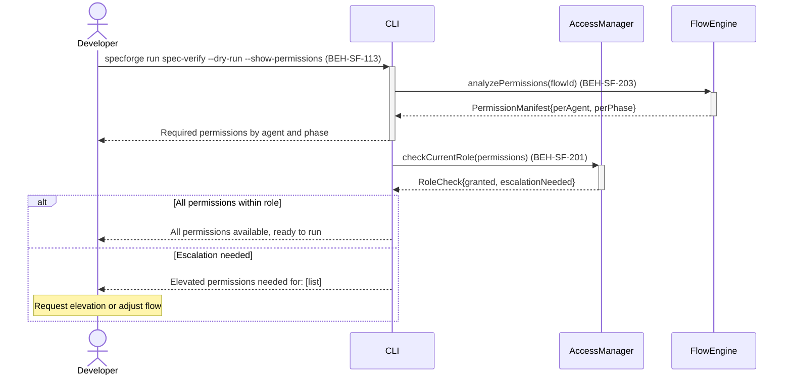

# Preview Permissions Before Execution

## Use Case

A developer opens the Permission Preview in the desktop app to preview permissions before execution. The same operation is accessible via CLI (`specforge run spec-verify --dry-run --show-permissions`) for scripted/CI workflows.

## Interaction Flow

### Desktop App

```text
┌─────────┐ ┌─────────────────┐ ┌─────────────┐ ┌───────────┐
│Developer│ │   Desktop App   │ │AccessManager│ │FlowEngine │
└────┬────┘ └────────┬────────┘ └──────┬──────┘ └─────┬─────┘
     │          │           │              │
     │ run --dry-run --show-permissions    │
     │─────────►│           │              │
     │          │ analyzePermissions()     │
     │          │─────────────────────────►│
     │          │ PermissionManifest       │
     │          │◄─────────────────────────│
     │ Required permissions                │
     │◄─────────│           │              │
     │          │           │              │
     │          │ checkCurrentRole()       │
     │          │──────────►│              │
     │          │ RoleCheck │              │
     │          │◄──────────│              │
     │          │           │              │
     │ [if all permissions within role]    │
     │ Ready to run         │              │
     │◄─────────│           │              │
     │          │           │              │
     │ [else escalation needed]            │
     │ Elevated permissions needed         │
     │◄─────────│           │              │
     │          │           │              │
```



### CLI

```text
┌─────────┐ ┌─────┐ ┌─────────────┐ ┌───────────┐
│Developer│ │ CLI │ │AccessManager│ │FlowEngine │
└────┬────┘ └──┬──┘ └──────┬──────┘ └─────┬─────┘
     │          │           │              │
     │ run --dry-run --show-permissions    │
     │─────────►│           │              │
     │          │ analyzePermissions()     │
     │          │─────────────────────────►│
     │          │ PermissionManifest       │
     │          │◄─────────────────────────│
     │ Required permissions                │
     │◄─────────│           │              │
     │          │           │              │
     │          │ checkCurrentRole()       │
     │          │──────────►│              │
     │          │ RoleCheck │              │
     │          │◄──────────│              │
     │          │           │              │
     │ [if all permissions within role]    │
     │ Ready to run         │              │
     │◄─────────│           │              │
     │          │           │              │
     │ [else escalation needed]            │
     │ Elevated permissions needed         │
     │◄─────────│           │              │
     │          │           │              │
```



## Steps

1. Open the Permission Preview in the desktop app
2. System analyzes the flow definition and agent role tool mappings (BEH-SF-203)
3. Displays required permissions grouped by agent and phase
4. Highlights any permissions that exceed the developer's current role (BEH-SF-201)
5. Shows which approvals will be needed during execution
6. Developer reviews and decides whether to proceed
7. Optionally request elevated permissions before starting

## Traceability

| Behavior   | Feature     | Role in this capability        |
| ---------- | ----------- | ------------------------------ |
| BEH-SF-201 | FEAT-SF-014 | Permission governance checks   |
| BEH-SF-203 | FEAT-SF-014 | Permission preview computation |
| BEH-SF-113 | FEAT-SF-009 | CLI dry-run mode and output    |
