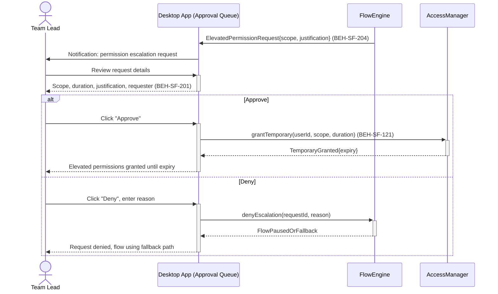
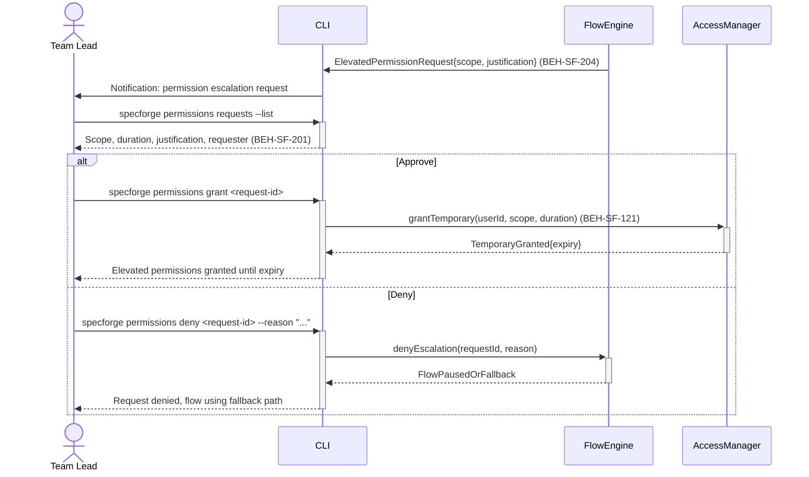
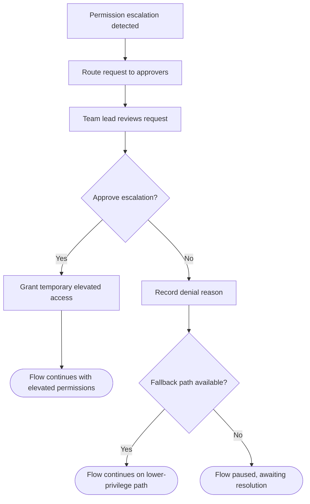

# Approve Elevated Permission Requests

## Use Case

A team lead opens the Approval Queue in the desktop app (e.g., a tool that can write to production systems), the system generates an elevated permission request routed to a team lead. The team lead reviews the request context and either approves (granting temporary elevated access) or denies. The same operation is accessible via CLI for scripted/CI workflows.

## Interaction Flow

### Desktop App

```text
┌─────────┐ ┌─────────┐ ┌───────────┐ ┌─────────────┐
│Team Lead│ │   Desktop App   │ │FlowEngine │ │AccessManager│
└────┬────┘ └────┬────┘ └─────┬─────┘ └──────┬──────┘
     │           │            │               │
     │           │ ElevatedPermissionRequest   │
     │           │◄───────────│               │
     │ Notification           │               │
     │◄──────────│            │               │
     │           │            │               │
     │ Review request         │               │
     │──────────►│            │               │
     │ Scope, justification   │               │
     │◄──────────│            │               │
     │           │            │               │
     │ [if approve]           │               │
     │ Click "Approve"        │               │
     │──────────►│            │               │
     │           │ grantTemporary()           │
     │           │───────────────────────────►│
     │           │ TemporaryGranted           │
     │           │◄───────────────────────────│
     │ Granted until expiry   │               │
     │◄──────────│            │               │
     │           │            │               │
     │ [else deny]            │               │
     │ Click "Deny" + reason  │               │
     │──────────►│            │               │
     │           │ denyEscalation()           │
     │           │───────────►│               │
     │           │ FlowPausedOrFallback       │
     │           │◄───────────│               │
     │ Denied, fallback path  │               │
     │◄──────────│            │               │
     │           │            │               │
```



### CLI

```text
┌─────────┐ ┌─────────┐ ┌───────────┐ ┌─────────────┐
│Team Lead│ │ CLI │ │FlowEngine │ │AccessManager│
└────┬────┘ └────┬────┘ └─────┬─────┘ └──────┬──────┘
     │           │            │               │
     │           │ ElevatedPermissionRequest   │
     │           │◄───────────│               │
     │ Notification           │               │
     │◄──────────│            │               │
     │           │            │               │
     │ Review request         │               │
     │──────────►│            │               │
     │ Scope, justification   │               │
     │◄──────────│            │               │
     │           │            │               │
     │ [if approve]           │               │
     │ Click "Approve"        │               │
     │──────────►│            │               │
     │           │ grantTemporary()           │
     │           │───────────────────────────►│
     │           │ TemporaryGranted           │
     │           │◄───────────────────────────│
     │ Granted until expiry   │               │
     │◄──────────│            │               │
     │           │            │               │
     │ [else deny]            │               │
     │ Click "Deny" + reason  │               │
     │──────────►│            │               │
     │           │ denyEscalation()           │
     │           │───────────►│               │
     │           │ FlowPausedOrFallback       │
     │           │◄───────────│               │
     │ Denied, fallback path  │               │
     │◄──────────│            │               │
     │           │            │               │
```



## Steps

1. Open the Approval Queue in the desktop app
2. Elevated permission request is created and routed to approvers (BEH-SF-204)
3. Team lead receives notification via CLI or dashboard
4. Review the request: scope, duration, justification (BEH-SF-201)
5. Approve: temporary elevated permissions are granted (BEH-SF-121)
6. Or deny with reason: flow pauses or falls back to lower-privilege path
7. Decision is recorded in the audit trail with approver identity

## Decision Paths

```text
    ┌───────────────────────────────┐
    │ Permission escalation detected│
    └───────────────┬───────────────┘
                    ▼
    ┌───────────────────────────────┐
    │ Route request to approvers   │
    └───────────────┬───────────────┘
                    ▼
    ┌───────────────────────────────┐
    │ Team lead reviews request    │
    └───────────────┬───────────────┘
                    ▼
             ╱─────────────╲
            ╱   Approve     ╲
           ╱    escalation?  ╲
           ╲                 ╱
            ╲               ╱
             ╲─────────────╱
           Yes │       │ No
               ▼       │
  ┌────────────────────┐│
  │Grant temporary     ││
  │elevated access     ││
  └─────────┬──────────┘│
            ▼           │
  ┌────────────────────┐│
  │Flow continues with ││
  │elevated permissions││
  └────────────────────┘│
                        ▼
            ┌──────────────────┐
            │Record denial     │
            │reason            │
            └────────┬─────────┘
                     ▼
              ╱────────────╲
             ╱  Fallback    ╲
            ╱   path avail?  ╲
            ╲                ╱
             ╲              ╱
              ╲────────────╱
          Yes │        │ No
              ▼        ▼
  ┌──────────────┐ ┌──────────────┐
  │Flow continues│ │Flow paused,  │
  │lower-priv    │ │awaiting      │
  │path          │ │resolution    │
  └──────────────┘ └──────────────┘
```



## Traceability

| Behavior   | Feature     | Role in this capability              |
| ---------- | ----------- | ------------------------------------ |
| BEH-SF-201 | FEAT-SF-014 | Permission governance and escalation |
| BEH-SF-204 | FEAT-SF-019 | Elevated permission request routing  |
| BEH-SF-121 | FEAT-SF-014 | Human approval handling              |
