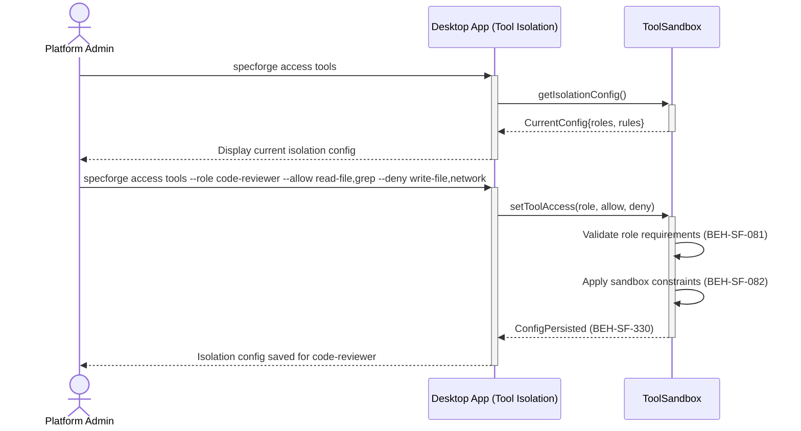
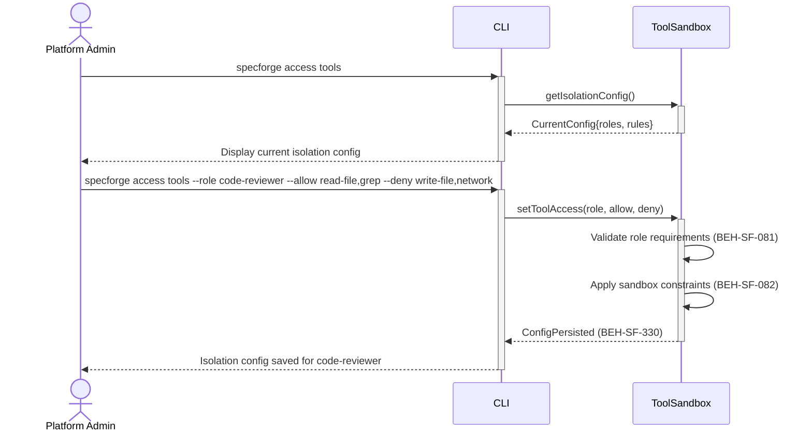

# Configure Tool Isolation per Role

## Use Case

An admin opens the Tool Isolation in the desktop app. For example, the code-reviewer role might have read-only file access, while the code-generator role has write access but no network access. Isolation prevents agents from exceeding their intended capabilities. The same operation is accessible via CLI (`specforge access tools`) for scripted/CI workflows.

## Interaction Flow

### Desktop App

```text
┌──────────────┐  ┌─────────────────┐  ┌─────────────┐
│ Platform Admin│  │   Desktop App   │  │ ToolSandbox │
└──────┬───────┘  └────────┬────────┘  └──────┬──────┘
       │  access tools  │              │
       │────────────────►│              │
       │              │ getIsolation() │
       │              │───────────────►│
       │              │  Config{roles} │
       │              │◄───────────────│
       │  current cfg │              │
       │◄────────────────│              │
       │              │              │
       │  --role code-reviewer ...    │
       │────────────────►│              │
       │              │ setToolAccess()│
       │              │───────────────►│
       │              │  ┌────────────┐│
       │              │  │Validate    ││
       │              │  │role reqs   ││
       │              │  │(BEH-081)   ││
       │              │  ├────────────┤│
       │              │  │Apply sandbox││
       │              │  │(BEH-082)   ││
       │              │  └────────────┘│
       │              │ ConfigPersisted│
       │              │◄───────────────│
       │  config saved│              │
       │◄────────────────│              │
       │              │              │
```



### CLI

```text
┌──────────────┐  ┌─────┐  ┌─────────────┐
│ Platform Admin│  │ CLI │  │ ToolSandbox │
└──────┬───────┘  └──┬──┘  └──────┬──────┘
       │  access tools  │              │
       │────────────────►│              │
       │              │ getIsolation() │
       │              │───────────────►│
       │              │  Config{roles} │
       │              │◄───────────────│
       │  current cfg │              │
       │◄────────────────│              │
       │              │              │
       │  --role code-reviewer ...    │
       │────────────────►│              │
       │              │ setToolAccess()│
       │              │───────────────►│
       │              │  ┌────────────┐│
       │              │  │Validate    ││
       │              │  │role reqs   ││
       │              │  │(BEH-081)   ││
       │              │  ├────────────┤│
       │              │  │Apply sandbox││
       │              │  │(BEH-082)   ││
       │              │  └────────────┘│
       │              │ ConfigPersisted│
       │              │◄───────────────│
       │  config saved│              │
       │◄────────────────│              │
       │              │              │
```



## Steps

1. Open the Tool Isolation in the desktop app
2. Configure tool access: `specforge access tools --role code-reviewer --allow read-file,grep --deny write-file,network` (BEH-SF-081)
3. Set sandbox constraints: file system boundaries, network rules (BEH-SF-082)
4. System validates that tool access aligns with role requirements
5. Persist isolation configuration (BEH-SF-330)
6. Isolation is enforced when agent sessions start for the role
7. Violations are logged and optionally trigger alerts

## Traceability

| Behavior   | Feature     | Role in this capability             |
| ---------- | ----------- | ----------------------------------- |
| BEH-SF-081 | FEAT-SF-019 | Tool access control definitions     |
| BEH-SF-082 | FEAT-SF-019 | Sandbox constraint enforcement      |
| BEH-SF-330 | FEAT-SF-028 | Isolation configuration persistence |
