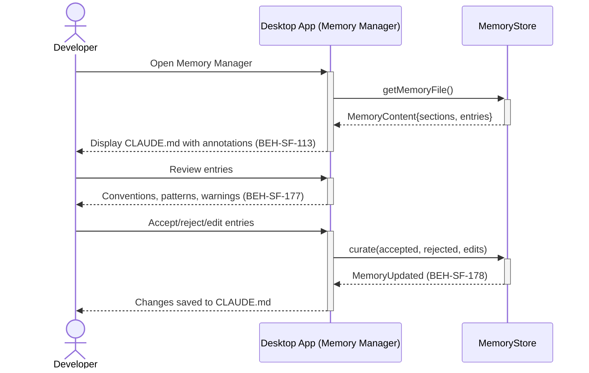
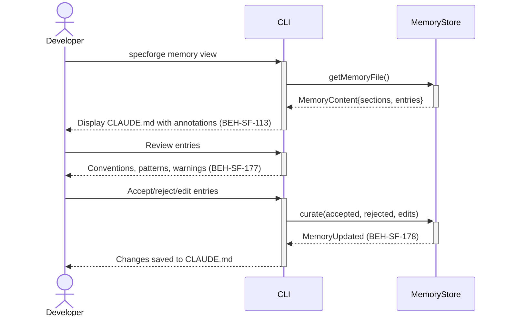

# View and Curate Generated CLAUDE.md

## Use Case

A developer opens the Memory Manager in the desktop app. md` file that captures project knowledge, conventions, and patterns discovered by agent sessions. The system generates this file from session observations, and the developer can accept, reject, or edit individual entries to ensure the accumulated knowledge is accurate. The same operation is accessible via CLI (`specforge memory view`) for scripted/CI workflows.

## Interaction Flow

### Desktop App

```text
┌───────────┐  ┌─────────────────┐  ┌─────────────┐
│ Developer │  │   Desktop App   │  │ MemoryStore │
└─────┬─────┘  └────────┬────────┘  └──────┬──────┘
      │ memory view │           │
      │────────────►│           │
      │           │ getMemory() │
      │           │────────────►│
      │           │  Content{}  │
      │           │◄────────────│
      │  CLAUDE.md│           │
      │◄────────────│           │
      │           │           │
      │ review    │           │
      │────────────►│           │
      │ conventions│           │
      │◄────────────│           │
      │           │           │
      │ accept/   │           │
      │ reject    │           │
      │────────────►│           │
      │           │ curate()   │
      │           │────────────►│
      │           │  Updated   │
      │           │◄────────────│
      │  saved    │           │
      │◄────────────│           │
      │           │           │
```



### CLI

```text
┌───────────┐  ┌─────┐  ┌─────────────┐
│ Developer │  │ CLI │  │ MemoryStore │
└─────┬─────┘  └──┬──┘  └──────┬──────┘
      │ memory view │           │
      │────────────►│           │
      │           │ getMemory() │
      │           │────────────►│
      │           │  Content{}  │
      │           │◄────────────│
      │  CLAUDE.md│           │
      │◄────────────│           │
      │           │           │
      │ review    │           │
      │────────────►│           │
      │ conventions│           │
      │◄────────────│           │
      │           │           │
      │ accept/   │           │
      │ reject    │           │
      │────────────►│           │
      │           │ curate()   │
      │           │────────────►│
      │           │  Updated   │
      │           │◄────────────│
      │  saved    │           │
      │◄────────────│           │
      │           │           │
```



## Steps

1. Open the Memory Manager in the desktop app
2. System displays the current memory file with section annotations
3. Review individual entries: conventions, patterns, warnings (BEH-SF-177)
4. Accept entries to keep them, reject to remove (BEH-SF-178)
5. Edit entries to refine wording or correct inaccuracies
6. Changes are saved to the CLAUDE.md file
7. Curated knowledge influences future agent sessions

## Traceability

| Behavior   | Feature     | Role in this capability                     |
| ---------- | ----------- | ------------------------------------------- |
| BEH-SF-177 | FEAT-SF-015 | Memory generation from session observations |
| BEH-SF-178 | FEAT-SF-015 | Memory curation and acceptance/rejection    |
| BEH-SF-113 | FEAT-SF-015 | CLI memory management commands              |
