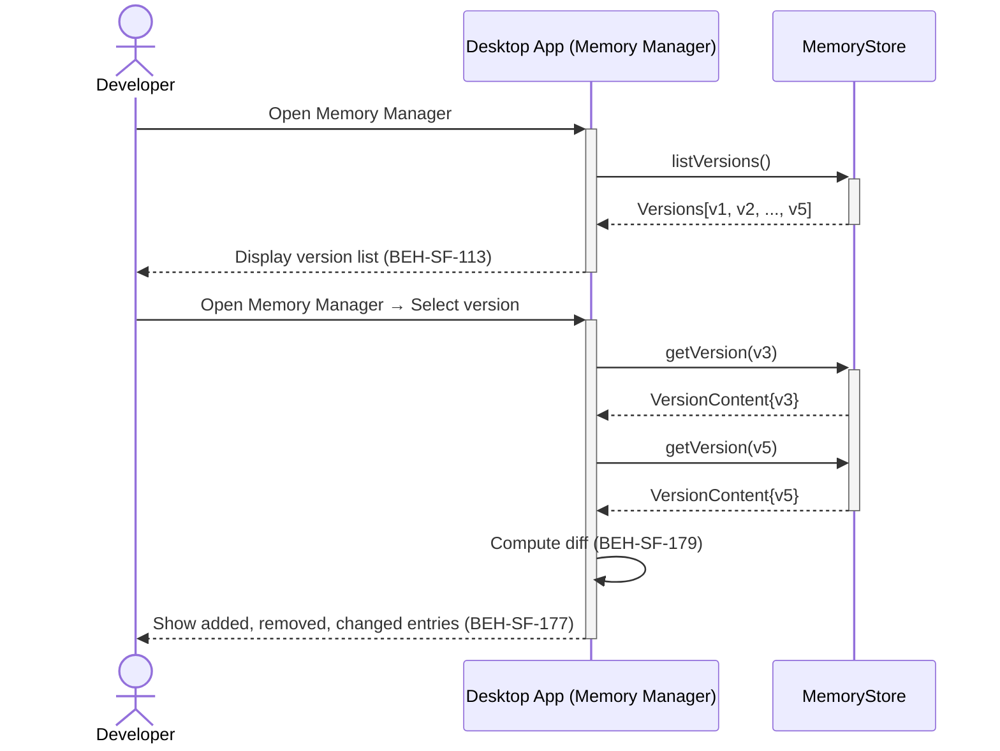
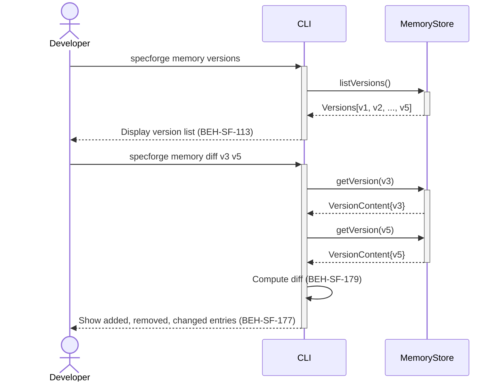

# Diff Memory Versions

## Use Case

A developer opens the Memory Manager in the desktop app. This helps track knowledge drift and ensures important conventions aren't accidentally lost. The same operation is accessible via CLI (`specforge memory versions`) for scripted/CI workflows.

## Interaction Flow

### Desktop App

```text
┌───────────┐  ┌─────────────────┐  ┌─────────────┐
│ Developer │  │   Desktop App   │  │ MemoryStore │
└─────┬─────┘  └────────┬────────┘  └──────┬──────┘
      │ memory    │           │
      │ versions  │           │
      │───────────►│           │
      │           │listVersions│
      │           │───────────►│
      │           │ [v1..v5]  │
      │           │◄───────────│
      │ version   │           │
      │ list      │           │
      │◄───────────│           │
      │           │           │
      │ memory    │           │
      │ diff v3 v5│           │
      │───────────►│           │
      │           │getVer(v3) │
      │           │───────────►│
      │           │Content{v3}│
      │           │◄───────────│
      │           │getVer(v5) │
      │           │───────────►│
      │           │Content{v5}│
      │           │◄───────────│
      │           │           │
      │           │┌─────────┐│
      │           ││ Compute ││
      │           ││  diff   ││
      │           │└─────────┘│
      │  added,   │           │
      │  removed, │           │
      │  changed  │           │
      │◄───────────│           │
      │           │           │
```



### CLI

```text
┌───────────┐  ┌─────┐  ┌─────────────┐
│ Developer │  │ CLI │  │ MemoryStore │
└─────┬─────┘  └──┬──┘  └──────┬──────┘
      │ memory    │           │
      │ versions  │           │
      │───────────►│           │
      │           │listVersions│
      │           │───────────►│
      │           │ [v1..v5]  │
      │           │◄───────────│
      │ version   │           │
      │ list      │           │
      │◄───────────│           │
      │           │           │
      │ memory    │           │
      │ diff v3 v5│           │
      │───────────►│           │
      │           │getVer(v3) │
      │           │───────────►│
      │           │Content{v3}│
      │           │◄───────────│
      │           │getVer(v5) │
      │           │───────────►│
      │           │Content{v5}│
      │           │◄───────────│
      │           │           │
      │           │┌─────────┐│
      │           ││ Compute ││
      │           ││  diff   ││
      │           │└─────────┘│
      │  added,   │           │
      │  removed, │           │
      │  changed  │           │
      │◄───────────│           │
      │           │           │
```



## Steps

1. Open the Memory Manager in the desktop app
2. Diff two versions: `specforge memory diff v3 v5`
3. System retrieves both versions and computes the diff (BEH-SF-179)
4. Display shows added, removed, and changed entries (BEH-SF-177)
5. Developer can restore specific entries from older versions
6. History helps understand how project understanding evolved
7. Optionally pin entries to prevent future auto-removal

## Traceability

| Behavior   | Feature     | Role in this capability          |
| ---------- | ----------- | -------------------------------- |
| BEH-SF-177 | FEAT-SF-015 | Memory generation and versioning |
| BEH-SF-179 | FEAT-SF-015 | Memory version comparison        |
| BEH-SF-113 | FEAT-SF-009 | CLI diff display                 |
