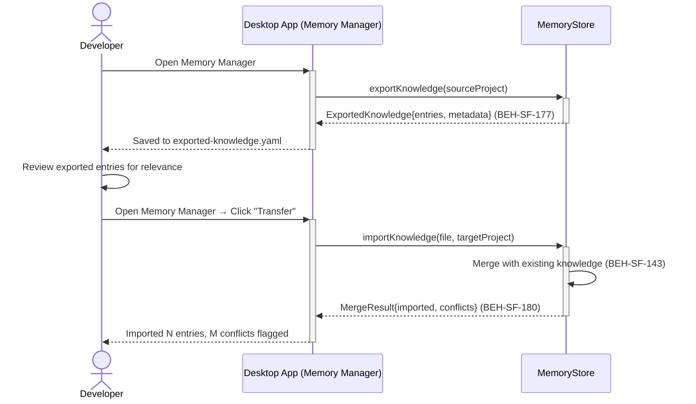
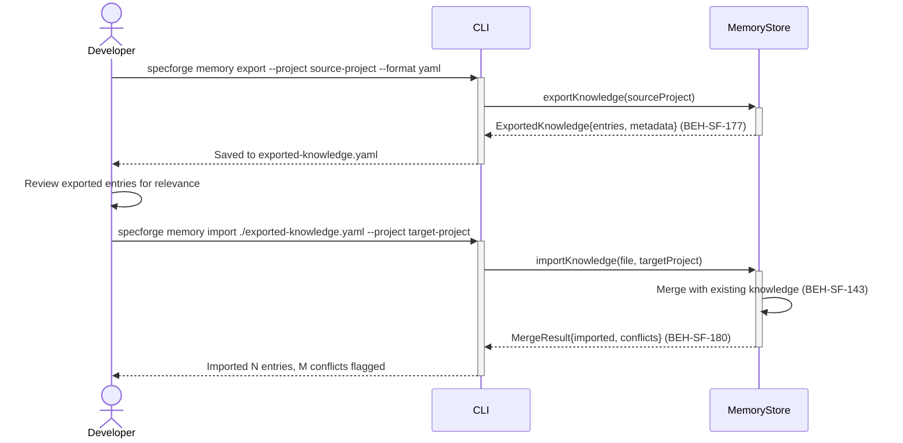

# Transfer Knowledge Across Projects

## Use Case

A developer opens the Memory Manager in the desktop app. This is useful when starting a new project in the same domain, onboarding a fork, or sharing organizational best practices across teams. The same operation is accessible via CLI (`specforge memory export --project source-project --format yaml`) for scripted/CI workflows.

## Interaction Flow

### Desktop App

```text
┌───────────┐  ┌─────────────────┐  ┌─────────────┐
│ Developer │  │   Desktop App   │  │ MemoryStore │
└─────┬─────┘  └────────┬────────┘  └──────┬──────┘
      │ memory    │           │
      │ export    │           │
      │───────────►│           │
      │           │ export()  │
      │           │───────────►│
      │           │ Knowledge{}│
      │           │◄───────────│
      │ saved to  │           │
      │ yaml      │           │
      │◄───────────│           │
      │           │           │
      │┌─────────┐│           │
      ││ Review  ││           │
      ││ entries ││           │
      │└─────────┘│           │
      │           │           │
      │ memory    │           │
      │ import    │           │
      │───────────►│           │
      │           │ import()  │
      │           │───────────►│
      │           │┌─────────┐│
      │           ││ Merge   ││
      │           ││(BEH-143)││
      │           │└─────────┘│
      │           │ Result{}  │
      │           │◄───────────│
      │ N imported│           │
      │ M conflicts           │
      │◄───────────│           │
      │           │           │
```



### CLI

```text
┌───────────┐  ┌─────┐  ┌─────────────┐
│ Developer │  │ CLI │  │ MemoryStore │
└─────┬─────┘  └──┬──┘  └──────┬──────┘
      │ memory    │           │
      │ export    │           │
      │───────────►│           │
      │           │ export()  │
      │           │───────────►│
      │           │ Knowledge{}│
      │           │◄───────────│
      │ saved to  │           │
      │ yaml      │           │
      │◄───────────│           │
      │           │           │
      │┌─────────┐│           │
      ││ Review  ││           │
      ││ entries ││           │
      │└─────────┘│           │
      │           │           │
      │ memory    │           │
      │ import    │           │
      │───────────►│           │
      │           │ import()  │
      │           │───────────►│
      │           │┌─────────┐│
      │           ││ Merge   ││
      │           ││(BEH-143)││
      │           │└─────────┘│
      │           │ Result{}  │
      │           │◄───────────│
      │ N imported│           │
      │ M conflicts           │
      │◄───────────│           │
      │           │           │
```



## Steps

1. Open the Memory Manager in the desktop app
2. Review exported entries for relevance to the target project
3. Import into target: `specforge memory import ./exported-knowledge.yaml --project target-project` (BEH-SF-180)
4. System merges imported entries with existing knowledge (BEH-SF-143)
5. Conflicts are flagged for manual resolution
6. Imported entries are marked as "transferred" for provenance tracking
7. Transferred knowledge influences future sessions in the target project

## Traceability

| Behavior   | Feature     | Role in this capability                                |
| ---------- | ----------- | ------------------------------------------------------ |
| BEH-SF-177 | FEAT-SF-015 | Memory export and import                               |
| BEH-SF-180 | FEAT-SF-015 | Cross-project knowledge transfer                       |
| BEH-SF-143 | FEAT-SF-017 | Collaboration infrastructure for cross-project sharing |
