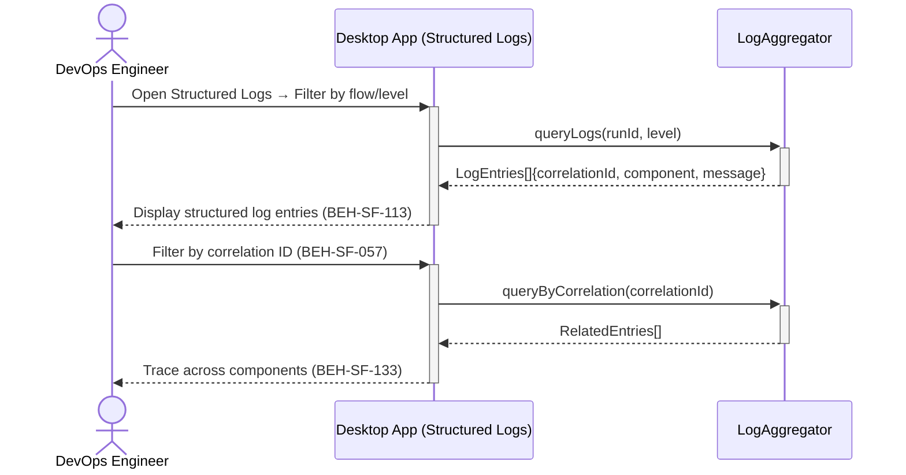
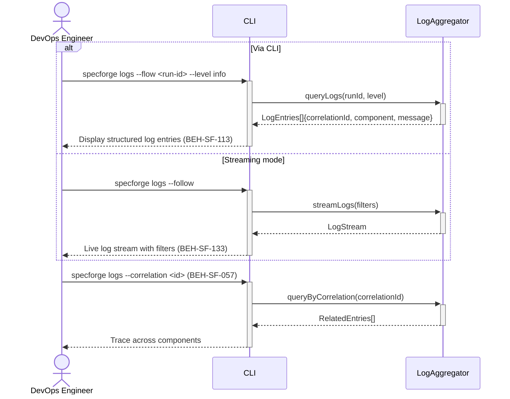

# View Structured Logs with Correlation

## Use Case

A devops engineer opens the Structured Logs in the desktop app. This enables tracing a single operation through the entire system — from CLI invocation to agent tool call and back. The same operation is accessible via CLI (`specforge logs --flow <run-id> --level info`) for scripted/CI workflows.

## Interaction Flow

### Desktop App

```text
┌────────────────┐ ┌─────────────────┐ ┌──────────┐ ┌──────────────┐
│ DevOps Engineer│ │   Desktop App   │ │   Desktop App   │ │LogAggregator │
└───────┬────────┘ └────────┬────────┘ └────┬─────┘ └──────┬───────┘
        │           │       │          │
   [if Via CLI]     │       │          │
        │ logs --flow│       │          │
        │───────────►│       │          │
        │           │ queryLogs()      │
        │           │──────────────────►│
        │           │    LogEntries[]   │
        │           │◄──────────────────│
        │  entries  │       │          │
        │◄───────────│       │          │
   [else Via Dashboard]     │          │
        │ open log  │       │          │
        │───────────────────►│          │
        │           │       │streamLogs│
        │           │       │─────────►│
        │           │       │LogStream │
        │           │       │◄─────────│
        │  live view│       │          │
        │◄───────────────────│          │
   [end]            │       │          │
        │           │       │          │
        │ filter by │       │          │
        │ corr. ID  │       │          │
        │───────────►│       │          │
        │           │ queryByCorr()    │
        │           │──────────────────►│
        │           │ RelatedEntries[] │
        │           │◄──────────────────│
        │  trace    │       │          │
        │◄───────────│       │          │
        │           │       │          │
```



### CLI

```text
┌────────────────┐ ┌─────┐ ┌──────────┐ ┌──────────────┐
│ DevOps Engineer│ │ CLI │ │LogAggregator │
└───────┬────────┘ └──┬──┘ └────┬─────┘ └──────┬───────┘
        │           │       │          │
   [if Via CLI]     │       │          │
        │ logs --flow│       │          │
        │───────────►│       │          │
        │           │ queryLogs()      │
        │           │──────────────────►│
        │           │    LogEntries[]   │
        │           │◄──────────────────│
        │  entries  │       │          │
        │◄───────────│       │          │
   [else Via Dashboard]     │          │
        │ open log  │       │          │
        │───────────────────►│          │
        │           │       │streamLogs│
        │           │       │─────────►│
        │           │       │LogStream │
        │           │       │◄─────────│
        │  live view│       │          │
        │◄───────────────────│          │
   [end]            │       │          │
        │           │       │          │
        │ filter by │       │          │
        │ corr. ID  │       │          │
        │───────────►│       │          │
        │           │ queryByCorr()    │
        │           │──────────────────►│
        │           │ RelatedEntries[] │
        │           │◄──────────────────│
        │  trace    │       │          │
        │◄───────────│       │          │
        │           │       │          │
```



## Steps

1. Open the Structured Logs in the desktop app
2. Or Open the desktop app log viewer (BEH-SF-133)
3. Logs include correlation IDs linking related entries across components
4. Filter by correlation ID to trace a single operation (BEH-SF-057)
5. Filter by level (debug, info, warn, error), component, or time range
6. Click a log entry to see full context and related entries
7. Export logs for external analysis: `specforge logs export --format jsonl`

## Traceability

| Behavior   | Feature     | Role in this capability                     |
| ---------- | ----------- | ------------------------------------------- |
| BEH-SF-057 | FEAT-SF-024 | Flow execution logging with correlation IDs |
| BEH-SF-113 | FEAT-SF-024 | CLI log viewer                              |
| BEH-SF-133 | FEAT-SF-024 | Dashboard log viewer                        |
