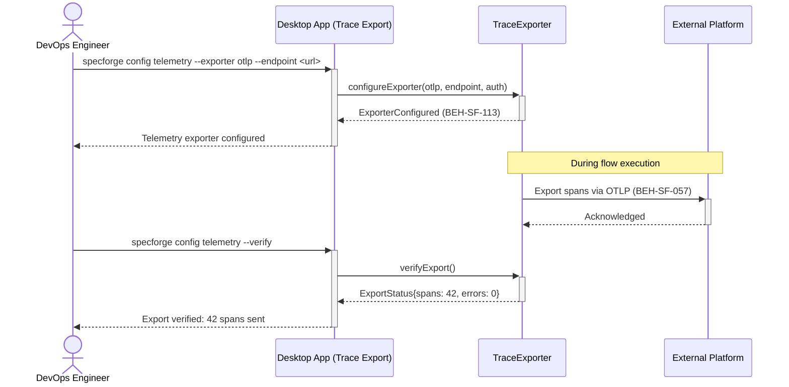
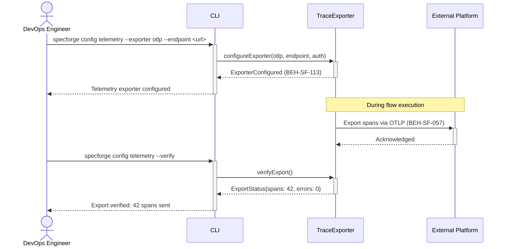

# Export Traces to External Platform

## Use Case

A devops engineer opens the Trace Export in the desktop app (e.g., Datadog, Grafana, Jaeger) using OpenTelemetry. This integrates SpecForge's execution data into the organization's existing monitoring infrastructure. The same operation is accessible via CLI (`specforge config telemetry --exporter otlp --endpoint <url>`) for scripted/CI workflows.

## Interaction Flow

### Desktop App

```text
┌────────────────┐ ┌─────────────────┐ ┌──────────────┐ ┌──────────────┐
│ DevOps Engineer│ │   Desktop App   │ │TraceExporter │ │Ext. Platform │
└───────┬────────┘ └────────┬────────┘ └──────┬───────┘ └──────┬───────┘
        │ config      │          │              │
        │ telemetry   │          │              │
        │────────────►│          │              │
        │           │ configure()│              │
        │           │───────────►│              │
        │           │ Configured │              │
        │           │◄───────────│              │
        │ configured│          │              │
        │◄────────────│          │              │
        │           │          │              │
        │     ── During flow execution ──     │
        │           │          │              │
        │           │          │ Export spans  │
        │           │          │─────────────►│
        │           │          │ Acknowledged │
        │           │          │◄─────────────│
        │           │          │              │
        │ telemetry │          │              │
        │ --verify  │          │              │
        │────────────►│          │              │
        │           │ verify() │              │
        │           │───────────►│              │
        │           │ Status{}  │              │
        │           │◄───────────│              │
        │ 42 spans  │          │              │
        │◄────────────│          │              │
        │           │          │              │
```



### CLI

```text
┌────────────────┐ ┌─────┐ ┌──────────────┐ ┌──────────────┐
│ DevOps Engineer│ │ CLI │ │TraceExporter │ │Ext. Platform │
└───────┬────────┘ └──┬──┘ └──────┬───────┘ └──────┬───────┘
        │ config      │          │              │
        │ telemetry   │          │              │
        │────────────►│          │              │
        │           │ configure()│              │
        │           │───────────►│              │
        │           │ Configured │              │
        │           │◄───────────│              │
        │ configured│          │              │
        │◄────────────│          │              │
        │           │          │              │
        │     ── During flow execution ──     │
        │           │          │              │
        │           │          │ Export spans  │
        │           │          │─────────────►│
        │           │          │ Acknowledged │
        │           │          │◄─────────────│
        │           │          │              │
        │ telemetry │          │              │
        │ --verify  │          │              │
        │────────────►│          │              │
        │           │ verify() │              │
        │           │───────────►│              │
        │           │ Status{}  │              │
        │           │◄───────────│              │
        │ 42 spans  │          │              │
        │◄────────────│          │              │
        │           │          │              │
```



## Steps

1. Open the Trace Export in the desktop app
2. Set authentication for the external platform
3. Configure trace sampling rate and filter criteria
4. System begins exporting traces for all flow executions (BEH-SF-057)
5. Verify export: check the external platform for incoming spans
6. View SpecForge spans in the external platform's trace viewer
7. Adjust sampling and filtering based on volume and cost

## Traceability

| Behavior   | Feature     | Role in this capability                |
| ---------- | ----------- | -------------------------------------- |
| BEH-SF-057 | FEAT-SF-024 | Trace generation during flow execution |
| BEH-SF-113 | FEAT-SF-024 | CLI telemetry configuration            |
