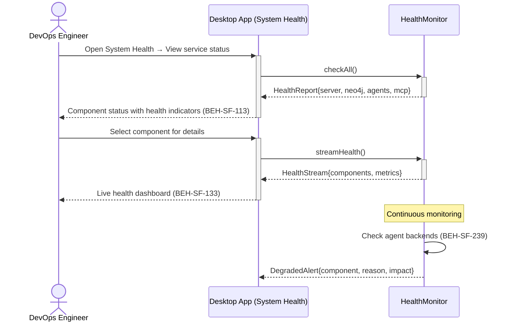
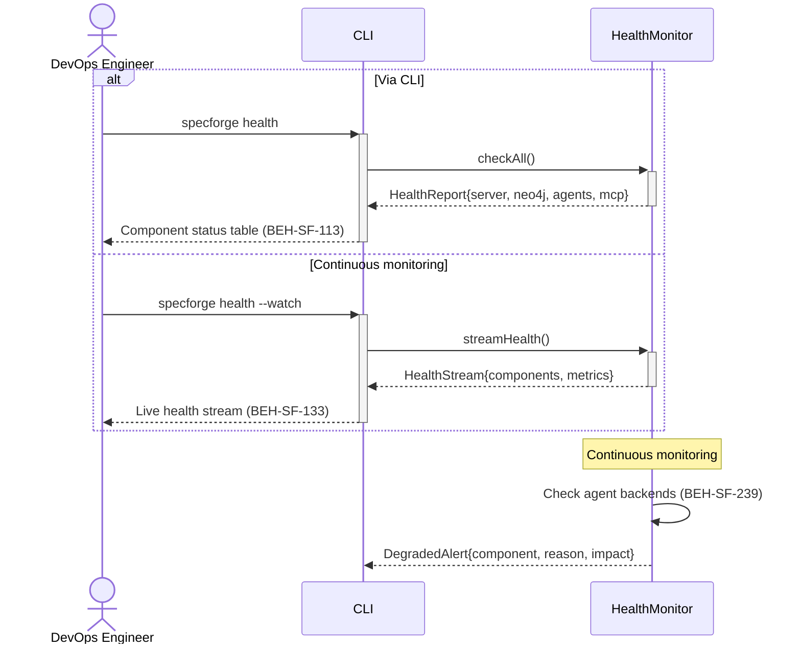

# Monitor System Health

## Use Case

A devops engineer opens the System Health in the desktop app. The health dashboard provides at-a-glance system status with drill-down into individual components. The same operation is accessible via CLI (`specforge health`) for scripted/CI workflows.

## Interaction Flow

### Desktop App

```text
┌────────────────┐ ┌─────────────────┐ ┌──────────┐ ┌───────────────┐
│ DevOps Engineer│ │   Desktop App   │ │   Desktop App   │ │HealthMonitor  │
└───────┬────────┘ └────────┬────────┘ └────┬─────┘ └───────┬───────┘
        │           │       │           │
   [if Via CLI]     │       │           │
        │ health    │       │           │
        │───────────►│       │           │
        │           │ checkAll()        │
        │           │──────────────────►│
        │           │  HealthReport{}   │
        │           │◄──────────────────│
        │  status   │       │           │
        │◄───────────│       │           │
   [else Via Dashboard]     │           │
        │ open health│       │           │
        │───────────────────►│           │
        │           │       │streamHealth│
        │           │       │──────────►│
        │           │       │HealthStream│
        │           │       │◄──────────│
        │  live dash│       │           │
        │◄───────────────────│           │
   [end]            │       │           │
        │           │       │           │
        │      ── Continuous monitoring ──
        │           │       │  ┌───────┐│
        │           │       │  │Check  ││
        │           │       │  │backends││
        │           │       │  │BEH-239││
        │           │       │  └───────┘│
        │           │       │ Degraded  │
        │           │       │◄──────────│
        │           │       │           │
```



### CLI

```text
┌────────────────┐ ┌─────┐ ┌──────────┐ ┌───────────────┐
│ DevOps Engineer│ │ CLI │ │HealthMonitor  │
└───────┬────────┘ └──┬──┘ └────┬─────┘ └───────┬───────┘
        │           │       │           │
   [if Via CLI]     │       │           │
        │ health    │       │           │
        │───────────►│       │           │
        │           │ checkAll()        │
        │           │──────────────────►│
        │           │  HealthReport{}   │
        │           │◄──────────────────│
        │  status   │       │           │
        │◄───────────│       │           │
   [else Via Dashboard]     │           │
        │ open health│       │           │
        │───────────────────►│           │
        │           │       │streamHealth│
        │           │       │──────────►│
        │           │       │HealthStream│
        │           │       │◄──────────│
        │  live dash│       │           │
        │◄───────────────────│           │
   [end]            │       │           │
        │           │       │           │
        │      ── Continuous monitoring ──
        │           │       │  ┌───────┐│
        │           │       │  │Check  ││
        │           │       │  │backends││
        │           │       │  │BEH-239││
        │           │       │  └───────┘│
        │           │       │ Degraded  │
        │           │       │◄──────────│
        │           │       │           │
```



## Steps

1. Open the System Health in the desktop app
2. Or Open the desktop app system health panel (BEH-SF-133)
3. View component health: server, Neo4j, agent backends, MCP servers
4. Backend health includes latency, error rate, and session counts (BEH-SF-239)
5. Degraded components are flagged with reason and impact assessment
6. Historical health data shows uptime and incident trends
7. Set up alerts for health state transitions

## Traceability

| Behavior   | Feature     | Role in this capability         |
| ---------- | ----------- | ------------------------------- |
| BEH-SF-239 | FEAT-SF-025 | Agent backend health monitoring |
| BEH-SF-133 | FEAT-SF-025 | Dashboard health visualization  |
| BEH-SF-113 | FEAT-SF-025 | CLI health check command        |
