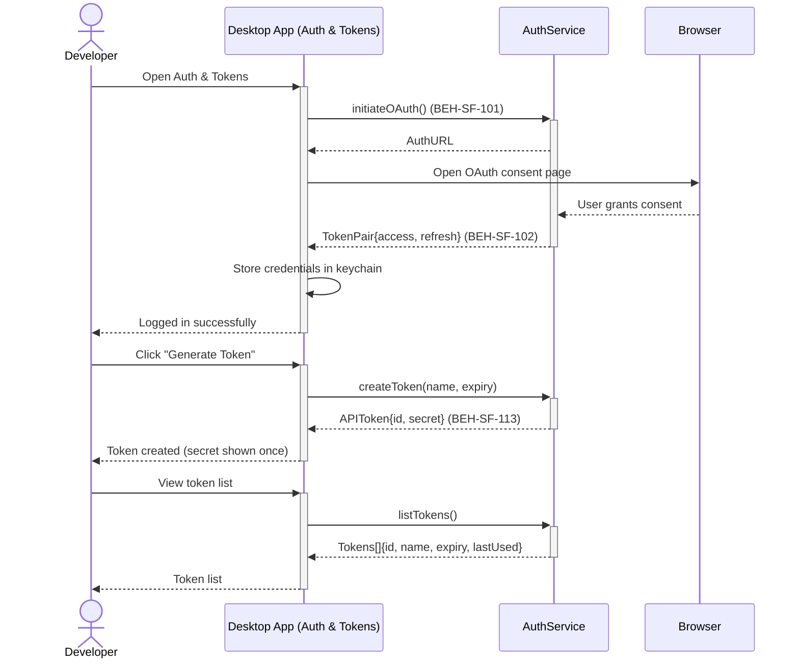
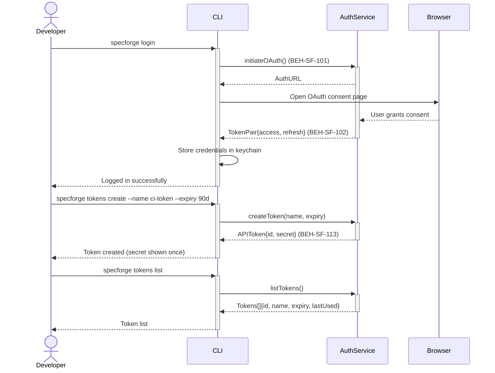

# Log In and Manage API Tokens

## Use Case

A developer opens the Auth & Tokens in the desktop app. In solo mode, this may be minimal (local auth). In SaaS mode, this involves OAuth login, token generation for CI/CD, token rotation, and revocation. API tokens enable headless/programmatic access. The same operation is accessible via CLI (`specforge login`) for scripted/CI workflows.

## Interaction Flow

### Desktop App

```text
┌───────────┐ ┌─────────────────┐ ┌───────────┐ ┌─────────┐
│ Developer │ │   Desktop App   │ │AuthService│ │ Browser │
└─────┬─────┘ └────────┬────────┘ └─────┬─────┘ └────┬────┘
      │ login    │         │            │
      │─────────►│         │            │
      │         │ initOAuth│            │
      │         │─────────►│            │
      │         │ AuthURL  │            │
      │         │◄─────────│            │
      │         │ open OAuth page       │
      │         │──────────────────────►│
      │         │         │   consent   │
      │         │         │◄────────────│
      │         │TokenPair│            │
      │         │◄─────────│            │
      │         │┌───────┐│            │
      │         ││Store  ││            │
      │         ││creds  ││            │
      │         │└───────┘│            │
      │ logged  │         │            │
      │◄─────────│         │            │
      │         │         │            │
      │ tokens  │         │            │
      │ create  │         │            │
      │─────────►│         │            │
      │         │createTkn│            │
      │         │─────────►│            │
      │         │APIToken{}│            │
      │         │◄─────────│            │
      │ secret  │         │            │
      │◄─────────│         │            │
      │         │         │            │
      │ tokens  │         │            │
      │ list    │         │            │
      │─────────►│         │            │
      │         │listTkns()│            │
      │         │─────────►│            │
      │         │ Tokens[] │            │
      │         │◄─────────│            │
      │ list    │         │            │
      │◄─────────│         │            │
      │         │         │            │
```



### CLI

```text
┌───────────┐ ┌─────┐ ┌───────────┐ ┌─────────┐
│ Developer │ │ CLI │ │AuthService│ │ Browser │
└─────┬─────┘ └──┬──┘ └─────┬─────┘ └────┬────┘
      │ login    │         │            │
      │─────────►│         │            │
      │         │ initOAuth│            │
      │         │─────────►│            │
      │         │ AuthURL  │            │
      │         │◄─────────│            │
      │         │ open OAuth page       │
      │         │──────────────────────►│
      │         │         │   consent   │
      │         │         │◄────────────│
      │         │TokenPair│            │
      │         │◄─────────│            │
      │         │┌───────┐│            │
      │         ││Store  ││            │
      │         ││creds  ││            │
      │         │└───────┘│            │
      │ logged  │         │            │
      │◄─────────│         │            │
      │         │         │            │
      │ tokens  │         │            │
      │ create  │         │            │
      │─────────►│         │            │
      │         │createTkn│            │
      │         │─────────►│            │
      │         │APIToken{}│            │
      │         │◄─────────│            │
      │ secret  │         │            │
      │◄─────────│         │            │
      │         │         │            │
      │ tokens  │         │            │
      │ list    │         │            │
      │─────────►│         │            │
      │         │listTkns()│            │
      │         │─────────►│            │
      │         │ Tokens[] │            │
      │         │◄─────────│            │
      │ list    │         │            │
      │◄─────────│         │            │
      │         │         │            │
```



## Steps

1. Open the Auth & Tokens in the desktop app
2. System opens browser for OAuth consent and exchanges tokens (BEH-SF-102)
3. Credentials are stored securely in the system keychain
4. Generate API token: `specforge tokens create --name ci-token --expiry 90d` (BEH-SF-113)
5. List tokens: `specforge tokens list`
6. Revoke a token: `specforge tokens revoke <token-id>`
7. Log out: `specforge logout`

## Traceability

| Behavior   | Feature     | Role in this capability                |
| ---------- | ----------- | -------------------------------------- |
| BEH-SF-101 | FEAT-SF-016 | Authentication flow initiation         |
| BEH-SF-102 | FEAT-SF-016 | OAuth token exchange and storage       |
| BEH-SF-113 | FEAT-SF-016 | CLI auth and token management commands |
