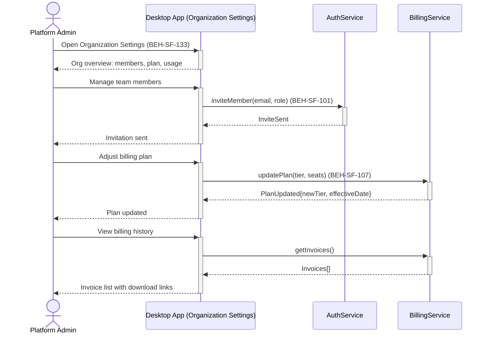

# Configure SaaS Organization and Billing

## Use Case

An admin opens the Organization Settings in the desktop app. This is the administrative control plane for SaaS-mode deployments.

## Interaction Flow

```text
┌──────────────┐ ┌──────────┐ ┌───────────┐ ┌──────────────┐
│Platform Admin│ │ Desktop App │ │AuthService│ │BillingService│
└──────┬───────┘ └────┬─────┘ └─────┬─────┘ └──────┬───────┘
       │ open org    │           │            │
       │ settings    │           │            │
       │────────────►│           │            │
       │ overview    │           │            │
       │◄────────────│           │            │
       │           │           │            │
       │ manage     │           │            │
       │ members    │           │            │
       │────────────►│           │            │
       │           │inviteMember│            │
       │           │───────────►│            │
       │           │ InviteSent│            │
       │           │◄───────────│            │
       │ invite sent│           │            │
       │◄────────────│           │            │
       │           │           │            │
       │ adjust plan│           │            │
       │────────────►│           │            │
       │           │  updatePlan()           │
       │           │────────────────────────►│
       │           │  PlanUpdated{}          │
       │           │◄────────────────────────│
       │ plan      │           │            │
       │ updated   │           │            │
       │◄────────────│           │            │
       │           │           │            │
       │ view      │           │            │
       │ billing   │           │            │
       │────────────►│           │            │
       │           │  getInvoices()          │
       │           │────────────────────────►│
       │           │  Invoices[]             │
       │           │◄────────────────────────│
       │ invoices  │           │            │
       │◄────────────│           │            │
       │           │           │            │
```



## Steps

1. Open the Organization Settings in the desktop app
2. Manage team members: invite, remove, assign roles (BEH-SF-101)
3. View current billing plan and usage against limits
4. Upgrade/downgrade plan or adjust seat count (BEH-SF-107)
5. Configure organization-wide policies (default budgets, compliance requirements)
6. View billing history and download invoices
7. Set up billing alerts for usage thresholds

## Traceability

| Behavior   | Feature     | Role in this capability              |
| ---------- | ----------- | ------------------------------------ |
| BEH-SF-101 | FEAT-SF-016 | Organization and team management     |
| BEH-SF-107 | FEAT-SF-016 | Cloud billing and plan management    |
| BEH-SF-133 | FEAT-SF-016 | Dashboard organization settings view |
