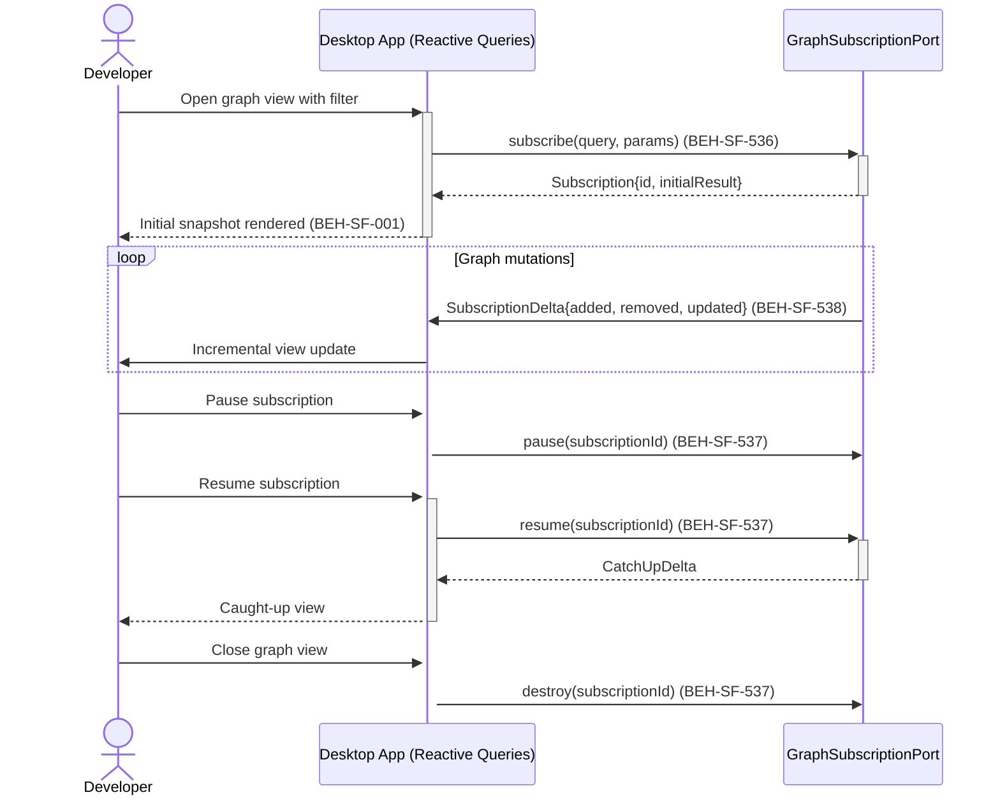

# Subscribe to Reactive Graph Queries

## Use Case

A developer opens the Reactive Queries in the desktop app to monitor a subset of the knowledge graph in real time. Instead of polling or manually refreshing, they subscribe to a parameterized query. The subscription pushes incremental deltas whenever the graph changes, keeping the dashboard view synchronized without full-page reloads.

## Interaction Flow

```text
┌───────────┐     ┌───────────┐     ┌──────────────────┐
│ Developer │     │ Desktop App │     │ GraphSubscription │
└─────┬─────┘     └─────┬─────┘     └────────┬─────────┘
      │ Open graph view  │                    │
      │─────────────────►│                    │
      │                  │ subscribe(query,   │
      │                  │ params)            │
      │                  │───────────────────►│
      │                  │ Subscription{id,   │
      │                  │ initialResult}     │
      │                  │◄───────────────────│
      │ Initial snapshot │                    │
      │◄─────────────────│                    │
      │                  │                    │
      │     [loop: Graph mutations occur]     │
      │                  │ SubscriptionDelta  │
      │                  │ {added, removed,   │
      │                  │  updated}          │
      │                  │◄───────────────────│
      │ Incremental      │                    │
      │ update           │                    │
      │◄─────────────────│                    │
      │     [end loop]   │                    │
      │                  │                    │
      │ Pause sub        │                    │
      │─────────────────►│                    │
      │                  │ pause(subId)       │
      │                  │───────────────────►│
      │                  │                    │
      │ Resume sub       │                    │
      │─────────────────►│                    │
      │                  │ resume(subId)      │
      │                  │───────────────────►│
      │                  │ CatchUpDelta       │
      │                  │◄───────────────────│
      │ Caught-up view   │                    │
      │◄─────────────────│                    │
      │                  │                    │
      │ Close view       │                    │
      │─────────────────►│                    │
      │                  │ destroy(subId)     │
      │                  │───────────────────►│
      │                  │                    │
```



## Steps

1. Open the Reactive Queries in the desktop app
2. Enter a parameterized query (e.g., all Requirements for flow X) (BEH-SF-536)
3. System subscribes and delivers the initial snapshot (BEH-SF-001)
4. As graph mutations occur, receive incremental deltas — only changes are pushed (BEH-SF-538)
5. Optionally pause the subscription when switching tabs or contexts (BEH-SF-537)
6. Resume the subscription to receive a catch-up delta covering paused-period changes (BEH-SF-537)
7. Destroy the subscription when closing the view (BEH-SF-537)

## Traceability

| Behavior   | Feature     | Role in this capability                                  |
| ---------- | ----------- | -------------------------------------------------------- |
| BEH-SF-001 | FEAT-SF-001 | Graph node retrieval for initial query snapshot          |
| BEH-SF-150 | FEAT-SF-007 | Dashboard real-time rendering integration                |
| BEH-SF-536 | FEAT-SF-001 | Reactive query registration and re-evaluation            |
| BEH-SF-537 | FEAT-SF-001 | Subscription lifecycle management (pause/resume/destroy) |
| BEH-SF-538 | FEAT-SF-007 | Delta computation and efficient delivery to dashboard    |
