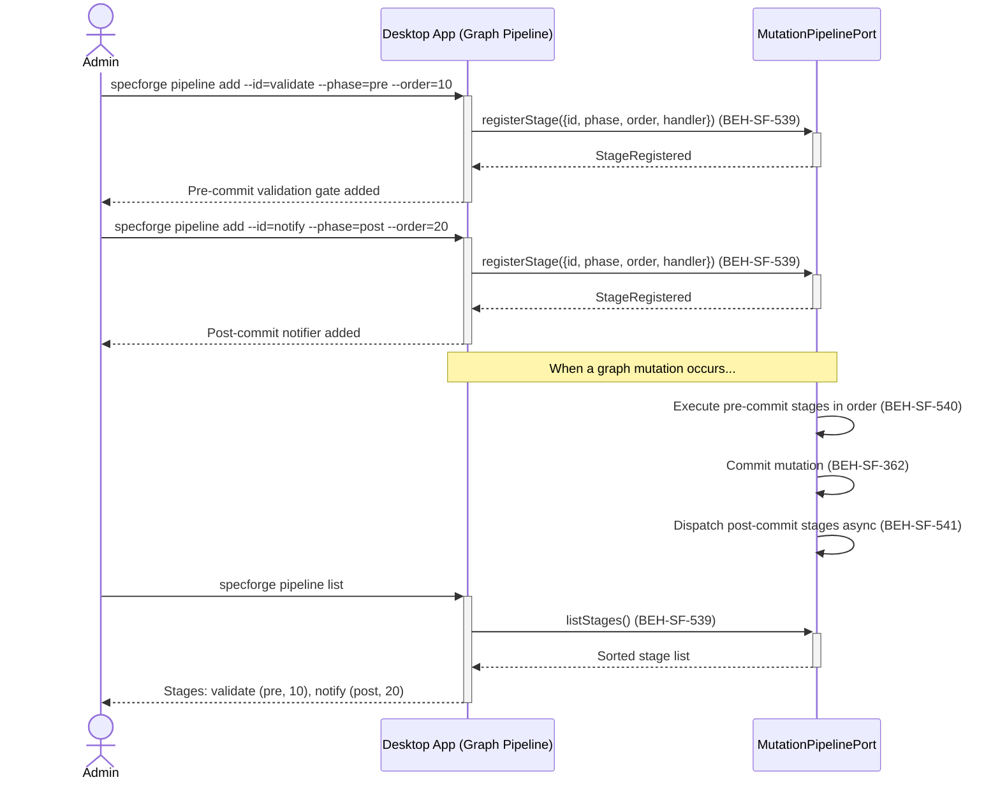
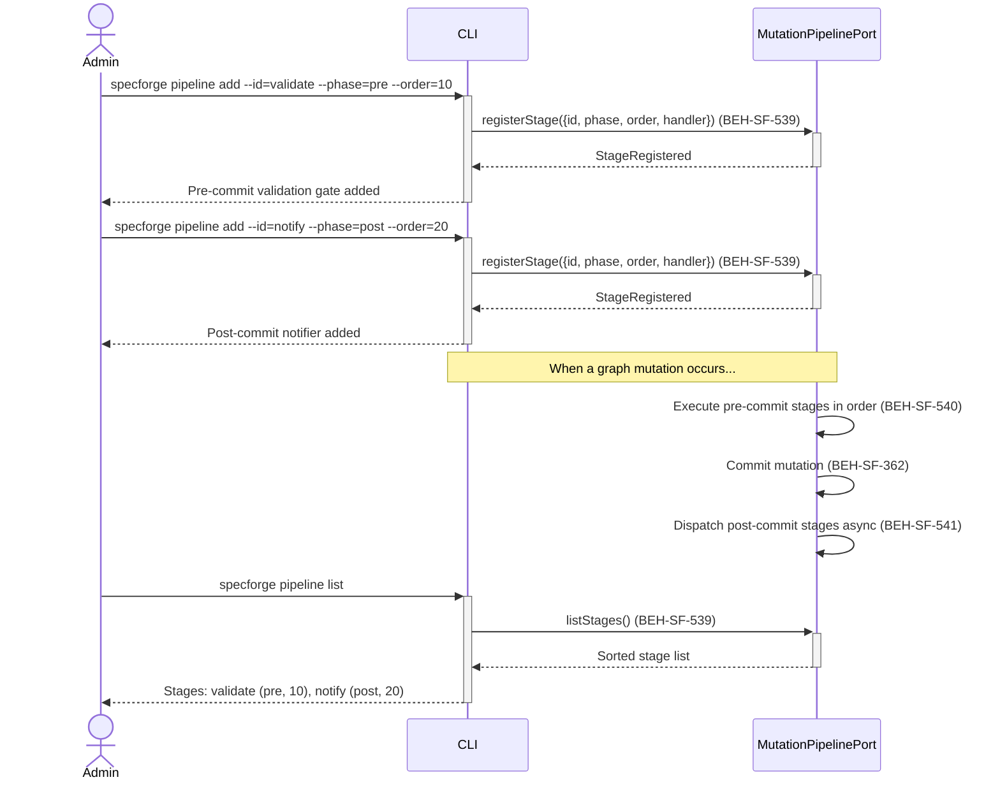

# Configure Graph Mutation Pipeline

## Use Case

A developer opens the Graph Pipeline in the desktop app. Validation gates reject malformed mutations before they reach the database, while post-commit hooks trigger downstream effects like notifying subscribers, syncing external systems, or updating dashboards. The pipeline is configured once and applies to all graph mutations project-wide. The same operation is accessible via CLI for scripted/CI workflows.

## Interaction Flow

### Desktop App

```text
┌───────────┐     ┌─────────────────┐     ┌──────────────────┐
│   Admin   │     │   Desktop App   │     │ MutationPipeline │
└─────┬─────┘     └────────┬────────┘     └────────┬─────────┘
      │               │               │
      │ pipeline add  │               │
      │ --id=validate │               │
      │ --phase=pre   │               │
      │ --order=10    │               │
      │──────────────►│               │
      │               │ registerStage │
      │               │──────────────►│
      │               │ StageRegistered
      │               │◄──────────────│
      │ Stage added   │               │
      │◄──────────────│               │
      │               │               │
      │ pipeline add  │               │
      │ --id=notify   │               │
      │ --phase=post  │               │
      │ --order=20    │               │
      │──────────────►│               │
      │               │ registerStage │
      │               │──────────────►│
      │               │ StageRegistered
      │               │◄──────────────│
      │ Stage added   │               │
      │◄──────────────│               │
      │               │               │
      │ pipeline list │               │
      │──────────────►│               │
      │               │ listStages()  │
      │               │──────────────►│
      │               │ [{validate,   │
      │               │   notify}]    │
      │               │◄──────────────│
      │ 2 stages      │               │
      │◄──────────────│               │
      │               │               │
```



### CLI

```text
┌───────────┐     ┌─────┐     ┌──────────────────┐
│   Admin   │     │ CLI │     │ MutationPipeline │
└─────┬─────┘     └──┬──┘     └────────┬─────────┘
      │               │               │
      │ pipeline add  │               │
      │ --id=validate │               │
      │ --phase=pre   │               │
      │ --order=10    │               │
      │──────────────►│               │
      │               │ registerStage │
      │               │──────────────►│
      │               │ StageRegistered
      │               │◄──────────────│
      │ Stage added   │               │
      │◄──────────────│               │
      │               │               │
      │ pipeline add  │               │
      │ --id=notify   │               │
      │ --phase=post  │               │
      │ --order=20    │               │
      │──────────────►│               │
      │               │ registerStage │
      │               │──────────────►│
      │               │ StageRegistered
      │               │◄──────────────│
      │ Stage added   │               │
      │◄──────────────│               │
      │               │               │
      │ pipeline list │               │
      │──────────────►│               │
      │               │ listStages()  │
      │               │──────────────►│
      │               │ [{validate,   │
      │               │   notify}]    │
      │               │◄──────────────│
      │ 2 stages      │               │
      │◄──────────────│               │
      │               │               │
```



## Steps

1. Open the Graph Pipeline in the desktop app
2. Register post-commit stages for side effects like notifications and sync (BEH-SF-539)
3. Pre-commit stages execute synchronously and can reject mutations (BEH-SF-540)
4. Graph mutations commit atomically within a transaction (BEH-SF-362)
5. Graph sync hooks capture file mutations and update Neo4j (BEH-SF-165)
6. Post-commit stages dispatch asynchronously without blocking the caller (BEH-SF-541)
7. Hook lifecycle events are dispatched in causal order (BEH-SF-161)
8. List registered stages to verify pipeline configuration

## Traceability

| Behavior   | Feature     | Role in this capability                                  |
| ---------- | ----------- | -------------------------------------------------------- |
| BEH-SF-161 | FEAT-SF-011 | Hook lifecycle events dispatched in causal order         |
| BEH-SF-165 | FEAT-SF-011 | Graph sync hooks for file mutation to Cypher MERGE       |
| BEH-SF-362 | FEAT-SF-001 | Atomic graph mutation within Neo4j transactions          |
| BEH-SF-539 | FEAT-SF-011 | Mutation pipeline stage registration and ordering        |
| BEH-SF-540 | FEAT-SF-011 | Pre-commit validation gates with synchronous enforcement |
| BEH-SF-541 | FEAT-SF-011 | Post-commit side-effect dispatch (async, non-blocking)   |
