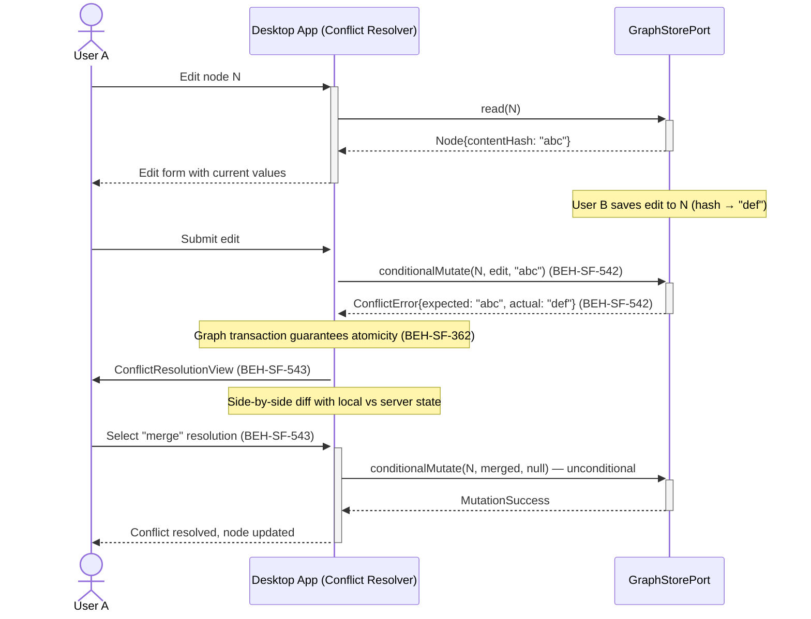

# Resolve Graph Concurrency Conflicts

## Use Case

A developer opens the Conflict Resolver in the desktop app. When the second edit is submitted, the system detects a content-hash mismatch and presents a conflict resolution UI. The user can see both versions side by side, choose to accept their changes, merge non-conflicting fields, or discard their edits. Every resolution is audited.

## Interaction Flow

```text
┌──────────┐     ┌───────────┐     ┌────────────┐
│  User A  │     │ Desktop App │     │ GraphStore │
└────┬─────┘     └─────┬─────┘     └──────┬─────┘
     │                  │                  │
     │ Edit node N      │                  │
     │─────────────────►│                  │
     │                  │ read(N)          │
     │                  │─────────────────►│
     │                  │ Node{hash: abc}  │
     │                  │◄─────────────────│
     │ Editing form     │                  │
     │◄─────────────────│                  │
     │                  │                  │
     │ [User B saves    │                  │
     │  their edit to   │                  │
     │  same node N     │                  │
     │  → hash changes  │                  │
     │  to def]         │                  │
     │                  │                  │
     │ Submit edit      │                  │
     │─────────────────►│                  │
     │                  │ conditionalMutate│
     │                  │ (N, edit, "abc") │
     │                  │─────────────────►│
     │                  │ ConflictError    │
     │                  │ {expected: abc,  │
     │                  │  actual: def,    │
     │                  │  serverState}    │
     │                  │◄─────────────────│
     │                  │                  │
     │ Conflict UI:     │                  │
     │ side-by-side     │                  │
     │ diff             │                  │
     │◄─────────────────│                  │
     │                  │                  │
     │ Resolve: merge   │                  │
     │─────────────────►│                  │
     │                  │ conditionalMutate│
     │                  │ (N, merged, null)│
     │                  │─────────────────►│
     │                  │ MutationSuccess  │
     │                  │◄─────────────────│
     │ Conflict resolved│                  │
     │◄─────────────────│                  │
     │                  │                  │
```



## Steps

1. Open the Conflict Resolver in the desktop app
2. User submits their edit with the expected content hash (BEH-SF-542)
3. System detects hash mismatch if another user modified the node (BEH-SF-542)
4. Content-hash comparison occurs within an atomic graph transaction (BEH-SF-362)
5. Idempotent sync ensures no duplicate nodes from concurrent operations (BEH-SF-303, BEH-SF-304)
6. Desktop app presents the conflict resolution UI with side-by-side diff (BEH-SF-543)
7. User selects resolution strategy: accept-local, merge, or discard (BEH-SF-543)
8. Resolution is recorded as an audit entry and the mutation is re-executed

## Traceability

| Behavior   | Feature     | Role in this capability                                         |
| ---------- | ----------- | --------------------------------------------------------------- |
| BEH-SF-303 | FEAT-SF-001 | Content-addressed identity prevents duplicate nodes during sync |
| BEH-SF-304 | FEAT-SF-001 | Idempotent sync replay for crash recovery scenarios             |
| BEH-SF-362 | FEAT-SF-001 | Atomic graph transactions ensure no partial writes              |
| BEH-SF-542 | FEAT-SF-003 | Conditional mutation with content-hash precondition check       |
| BEH-SF-543 | FEAT-SF-003 | Conflict resolution UI with accept/merge/discard strategies     |
