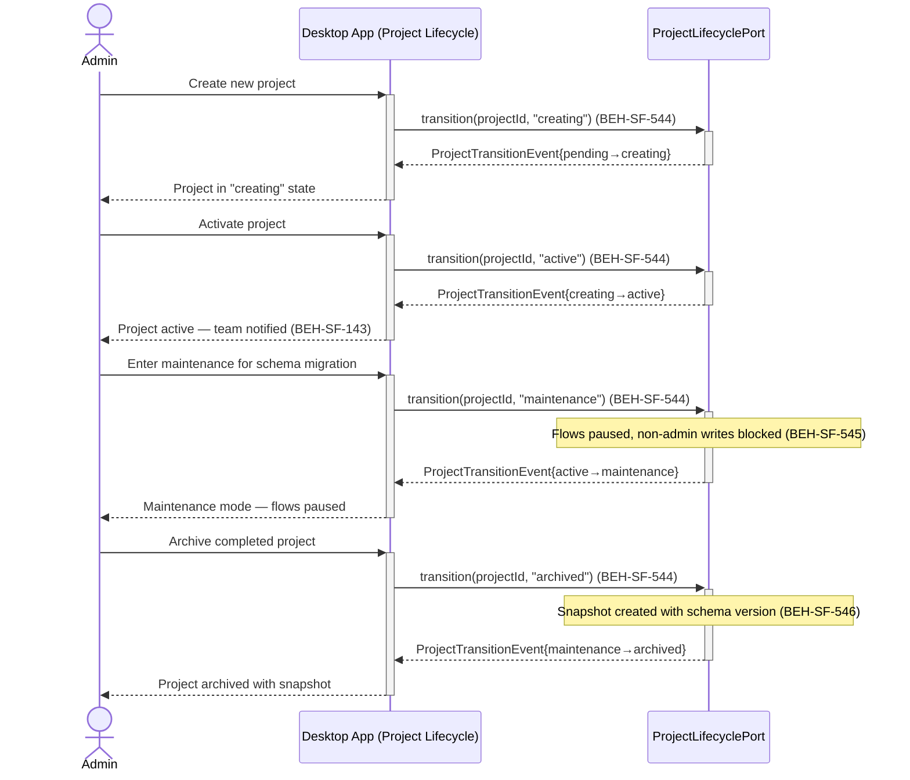
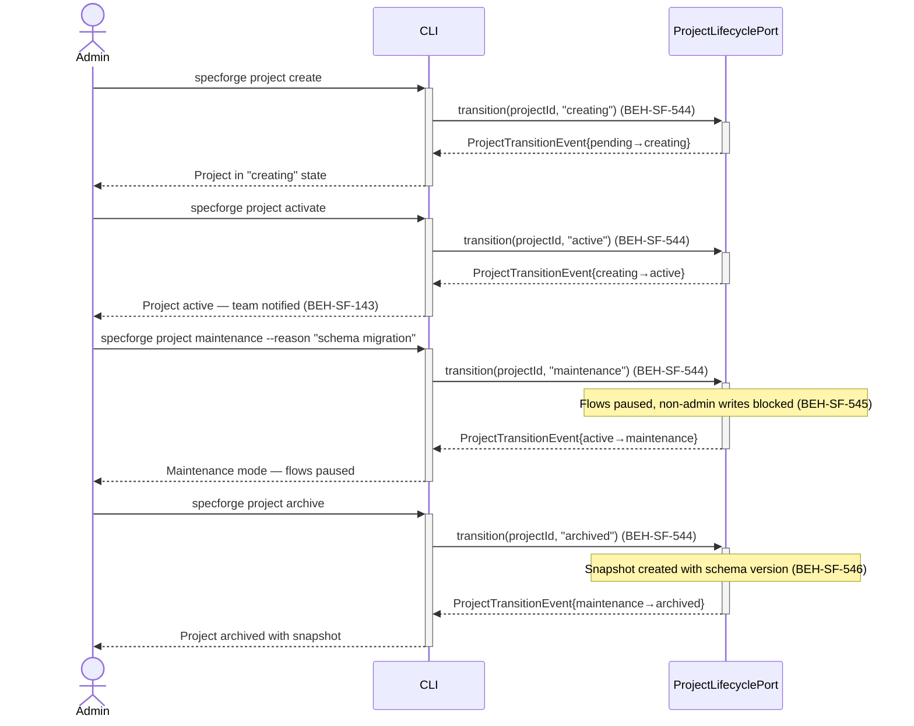
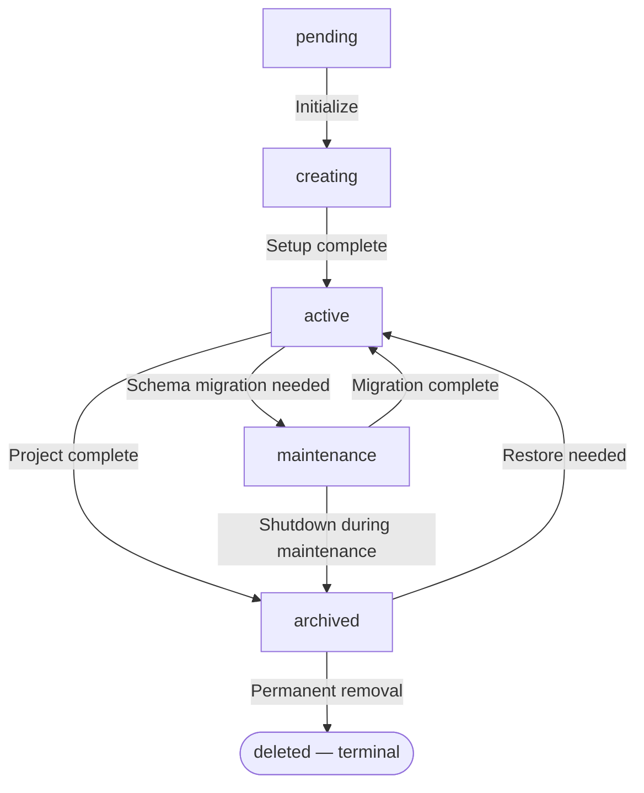

# Manage Project Lifecycle States

## Use Case

An admin opens the Project Lifecycle in the desktop app. The state machine enforces valid transitions, maintenance mode pauses running flows and restricts non-admin writes, and archival captures a restorable snapshot with schema migration support. The same operation is accessible via CLI for scripted/CI workflows.

## Interaction Flow

### Desktop App

```text
┌──────────┐     ┌───────────┐     ┌──────────────────┐
│  Admin   │     │   Desktop App   │     │ ProjectLifecycle │
└────┬─────┘     └─────┬─────┘     └────────┬─────────┘
     │                  │                    │
     │ Create project   │                    │
     │─────────────────►│                    │
     │                  │ transition(id,     │
     │                  │ "creating")        │
     │                  │───────────────────►│
     │                  │ TransitionEvent    │
     │                  │◄───────────────────│
     │ Project creating │                    │
     │◄─────────────────│                    │
     │                  │                    │
     │ Activate project │                    │
     │─────────────────►│                    │
     │                  │ transition(id,     │
     │                  │ "active")          │
     │                  │───────────────────►│
     │                  │ TransitionEvent    │
     │                  │◄───────────────────│
     │ Project active   │                    │
     │◄─────────────────│                    │
     │                  │                    │
     │ Enter maintenance│                    │
     │─────────────────►│                    │
     │                  │ transition(id,     │
     │                  │ "maintenance")     │
     │                  │───────────────────►│
     │                  │ [Flows paused,     │
     │                  │  writes restricted]│
     │                  │ TransitionEvent    │
     │                  │◄───────────────────│
     │ Maintenance mode │                    │
     │◄─────────────────│                    │
     │                  │                    │
     │ Archive project  │                    │
     │─────────────────►│                    │
     │                  │ transition(id,     │
     │                  │ "archived")        │
     │                  │───────────────────►│
     │                  │ [Snapshot created] │
     │                  │ TransitionEvent    │
     │                  │◄───────────────────│
     │ Project archived │                    │
     │◄─────────────────│                    │
     │                  │                    │
```



### CLI

```text
┌──────────┐     ┌───────────┐     ┌──────────────────┐
│  Admin   │     │ CLI │     │ ProjectLifecycle │
└────┬─────┘     └─────┬─────┘     └────────┬─────────┘
     │                  │                    │
     │ Create project   │                    │
     │─────────────────►│                    │
     │                  │ transition(id,     │
     │                  │ "creating")        │
     │                  │───────────────────►│
     │                  │ TransitionEvent    │
     │                  │◄───────────────────│
     │ Project creating │                    │
     │◄─────────────────│                    │
     │                  │                    │
     │ Activate project │                    │
     │─────────────────►│                    │
     │                  │ transition(id,     │
     │                  │ "active")          │
     │                  │───────────────────►│
     │                  │ TransitionEvent    │
     │                  │◄───────────────────│
     │ Project active   │                    │
     │◄─────────────────│                    │
     │                  │                    │
     │ Enter maintenance│                    │
     │─────────────────►│                    │
     │                  │ transition(id,     │
     │                  │ "maintenance")     │
     │                  │───────────────────►│
     │                  │ [Flows paused,     │
     │                  │  writes restricted]│
     │                  │ TransitionEvent    │
     │                  │◄───────────────────│
     │ Maintenance mode │                    │
     │◄─────────────────│                    │
     │                  │                    │
     │ Archive project  │                    │
     │─────────────────►│                    │
     │                  │ transition(id,     │
     │                  │ "archived")        │
     │                  │───────────────────►│
     │                  │ [Snapshot created] │
     │                  │ TransitionEvent    │
     │                  │◄───────────────────│
     │ Project archived │                    │
     │◄─────────────────│                    │
     │                  │                    │
```



## Steps

1. Open the Project Lifecycle in the desktop app
2. Transition through `creating` → `active` to begin development (BEH-SF-544)
3. Team members are notified of project activation (BEH-SF-143)
4. Enter `maintenance` mode for schema migrations — flows pause, writes restricted (BEH-SF-545)
5. Perform maintenance tasks (admin-only writes allowed) (BEH-SF-545)
6. Exit maintenance back to `active` or proceed to `archived` (BEH-SF-544)
7. Archival creates a restorable snapshot with schema version metadata (BEH-SF-546)
8. Restore from archive applies schema migrations if the schema has evolved (BEH-SF-546)
9. Configuration changes are recorded in project history (BEH-SF-330)

## Decision Paths



## Traceability

| Behavior   | Feature     | Role in this capability                                          |
| ---------- | ----------- | ---------------------------------------------------------------- |
| BEH-SF-143 | FEAT-SF-017 | Team notification on project state changes                       |
| BEH-SF-330 | FEAT-SF-028 | Configuration change recording in project history                |
| BEH-SF-544 | FEAT-SF-028 | Project state machine with enforced transitions                  |
| BEH-SF-545 | FEAT-SF-028 | Maintenance mode enforcement — flow pause and access restriction |
| BEH-SF-546 | FEAT-SF-028 | Archive snapshot and restore with schema migration               |
