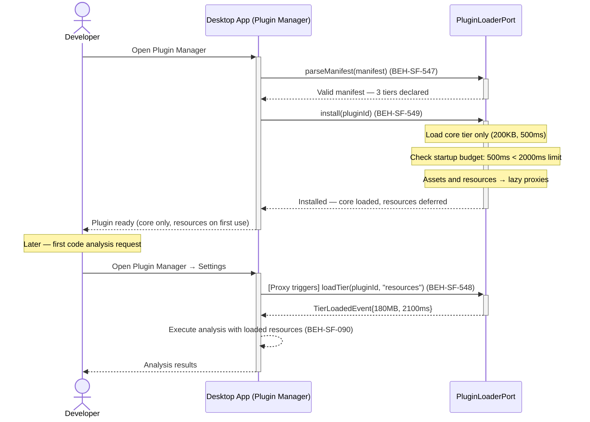
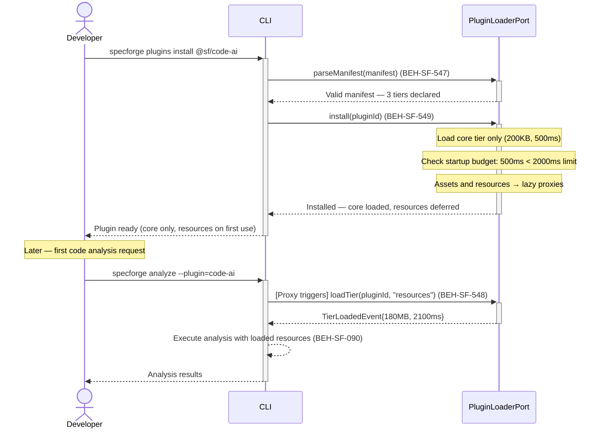

# Configure Plugin Lazy Loading Strategy

## Use Case

A developer opens the Plugin Manager in the desktop app. Rather than loading the entire plugin at startup (which would add 3 seconds and 200MB of memory), the plugin declares a three-tier manifest: core logic loads at install time, UI assets load when the plugin's panel is first opened, and the ML model loads on first analysis request. The admin configures per-plugin budgets to prevent any single plugin from degrading startup performance. The same operation is accessible via CLI for scripted/CI workflows.

## Interaction Flow

### Desktop App

```text
┌───────────┐     ┌─────────────────┐     ┌──────────────┐
│ Developer │     │   Desktop App   │     │ PluginLoader │
└─────┬─────┘     └────────┬────────┘     └──────┬───────┘
      │               │              │
      │ plugins install│              │
      │ @sf/code-ai   │              │
      │──────────────►│              │
      │               │ parseManifest│
      │               │─────────────►│
      │               │ Manifest OK  │
      │               │ {core: 200KB,│
      │               │  assets: 1MB,│
      │               │  resources:  │
      │               │  180MB}      │
      │               │◄─────────────│
      │               │              │
      │               │ install(id)  │
      │               │ [load core   │
      │               │  only]       │
      │               │─────────────►│
      │               │──┐ Check     │
      │               │  │ budget    │
      │               │◄─┘           │
      │               │ Installed    │
      │               │ (500ms,12MB) │
      │               │◄─────────────│
      │ Installed.    │              │
      │ Core loaded.  │              │
      │ Resources:    │              │
      │ deferred.     │              │
      │◄──────────────│              │
      │               │              │
      │ [First use of │              │
      │  code analysis]              │
      │               │              │
      │ analyze code  │              │
      │──────────────►│              │
      │               │ loadTier(id, │
      │               │ "resources") │
      │               │─────────────►│
      │               │ TierLoaded   │
      │               │ {180MB,      │
      │               │  2100ms}     │
      │               │◄─────────────│
      │               │              │
      │               │ [analyze]    │
      │               │─────────────►│
      │               │ Result       │
      │               │◄─────────────│
      │ Analysis      │              │
      │ result        │              │
      │◄──────────────│              │
      │               │              │
```



### CLI

```text
┌───────────┐     ┌─────┐     ┌──────────────┐
│ Developer │     │ CLI │     │ PluginLoader │
└─────┬─────┘     └──┬──┘     └──────┬───────┘
      │               │              │
      │ plugins install│              │
      │ @sf/code-ai   │              │
      │──────────────►│              │
      │               │ parseManifest│
      │               │─────────────►│
      │               │ Manifest OK  │
      │               │ {core: 200KB,│
      │               │  assets: 1MB,│
      │               │  resources:  │
      │               │  180MB}      │
      │               │◄─────────────│
      │               │              │
      │               │ install(id)  │
      │               │ [load core   │
      │               │  only]       │
      │               │─────────────►│
      │               │──┐ Check     │
      │               │  │ budget    │
      │               │◄─┘           │
      │               │ Installed    │
      │               │ (500ms,12MB) │
      │               │◄─────────────│
      │ Installed.    │              │
      │ Core loaded.  │              │
      │ Resources:    │              │
      │ deferred.     │              │
      │◄──────────────│              │
      │               │              │
      │ [First use of │              │
      │  code analysis]              │
      │               │              │
      │ analyze code  │              │
      │──────────────►│              │
      │               │ loadTier(id, │
      │               │ "resources") │
      │               │─────────────►│
      │               │ TierLoaded   │
      │               │ {180MB,      │
      │               │  2100ms}     │
      │               │◄─────────────│
      │               │              │
      │               │ [analyze]    │
      │               │─────────────►│
      │               │ Result       │
      │               │◄─────────────│
      │ Analysis      │              │
      │ result        │              │
      │◄──────────────│              │
      │               │              │
```



## Steps

1. Open the Plugin Manager in the desktop app
2. System validates manifest structure — all three tiers must be declared (BEH-SF-547)
3. Core tier loads immediately and is checked against startup budget (BEH-SF-549)
4. If budget is exceeded, installation is rolled back with clear error (BEH-SF-549)
5. Assets and resources tiers are registered as lazy proxies (BEH-SF-548)
6. On first use, resource proxy intercepts the access and triggers lazy loading (BEH-SF-548)
7. Concurrent first accesses coalesce into a single load operation (BEH-SF-548)
8. Plugin extensibility hooks connect loaded plugin to the system (BEH-SF-090, BEH-SF-091)
9. List plugin tier status to verify what has been loaded

## Traceability

| Behavior   | Feature     | Role in this capability                               |
| ---------- | ----------- | ----------------------------------------------------- |
| BEH-SF-090 | FEAT-SF-032 | Plugin activation lifecycle and hook registration     |
| BEH-SF-091 | FEAT-SF-032 | Plugin dependency resolution and validation           |
| BEH-SF-547 | FEAT-SF-011 | Three-tier manifest parsing and validation            |
| BEH-SF-548 | FEAT-SF-011 | Lazy resource loading via proxy interception          |
| BEH-SF-549 | FEAT-SF-032 | Per-plugin startup time and memory budget enforcement |
