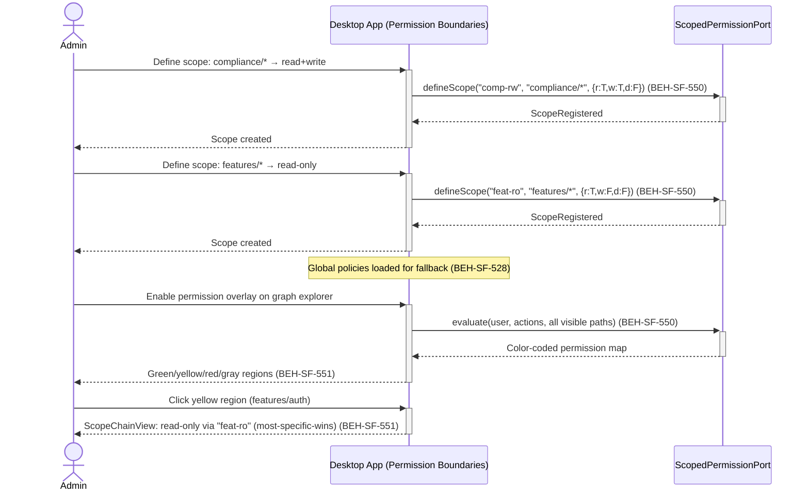
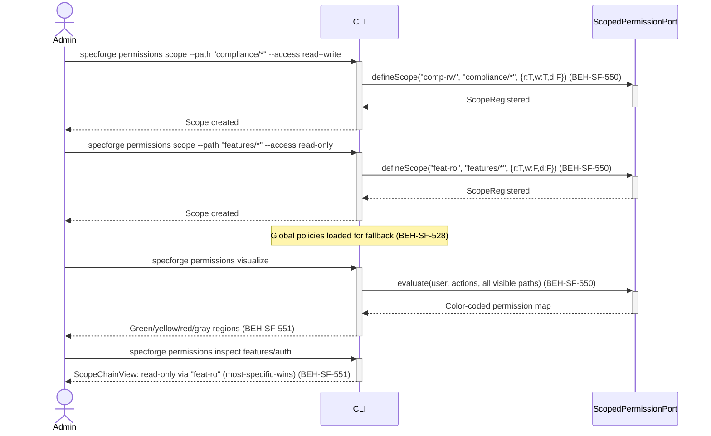

# Configure Scoped Permission Boundaries

## Use Case

An admin opens the Permission Boundaries in the desktop app. The compliance team needs full read-write access to `compliance/*` nodes but read-only access to `features/*`. The dev team gets the inverse. The admin defines these scopes, and the dashboard's graph explorer visually overlays permission boundaries so team leads can verify the configuration at a glance. The same operation is accessible via CLI for scripted/CI workflows.

## Interaction Flow

### Desktop App

```text
┌──────────┐     ┌───────────┐     ┌──────────────────┐
│  Admin   │     │   Desktop App   │     │ ScopedPermission │
└────┬─────┘     └─────┬─────┘     └────────┬─────────┘
     │                  │                    │
     │ Define scope:    │                    │
     │ compliance/*     │                    │
     │ → read+write     │                    │
     │ for compliance   │                    │
     │ team             │                    │
     │─────────────────►│                    │
     │                  │ defineScope(id,    │
     │                  │ "compliance/*",    │
     │                  │ {r:T,w:T,d:F})    │
     │                  │───────────────────►│
     │                  │ ScopeRegistered    │
     │                  │◄───────────────────│
     │ Scope created    │                    │
     │◄─────────────────│                    │
     │                  │                    │
     │ Define scope:    │                    │
     │ features/*       │                    │
     │ → read-only for  │                    │
     │ compliance team  │                    │
     │─────────────────►│                    │
     │                  │ defineScope(id,    │
     │                  │ "features/*",      │
     │                  │ {r:T,w:F,d:F})    │
     │                  │───────────────────►│
     │                  │ ScopeRegistered    │
     │                  │◄───────────────────│
     │ Scope created    │                    │
     │◄─────────────────│                    │
     │                  │                    │
     │ Enable overlay   │                    │
     │─────────────────►│                    │
     │                  │ [Render overlay]   │
     │                  │───────────────────►│
     │                  │ PermissionMap      │
     │                  │◄───────────────────│
     │ Color-coded      │                    │
     │ graph regions    │                    │
     │◄─────────────────│                    │
     │                  │                    │
     │ Click yellow     │                    │
     │ region           │                    │
     │─────────────────►│                    │
     │                  │ getScopeChain()    │
     │                  │───────────────────►│
     │                  │ ScopeChainView     │
     │                  │◄───────────────────│
     │ Scope chain:     │                    │
     │ read-only via    │                    │
     │ "features/*"     │                    │
     │ scope            │                    │
     │◄─────────────────│                    │
     │                  │                    │
```



### CLI

```text
┌──────────┐     ┌───────────┐     ┌──────────────────┐
│  Admin   │     │ CLI │     │ ScopedPermission │
└────┬─────┘     └─────┬─────┘     └────────┬─────────┘
     │                  │                    │
     │ Define scope:    │                    │
     │ compliance/*     │                    │
     │ → read+write     │                    │
     │ for compliance   │                    │
     │ team             │                    │
     │─────────────────►│                    │
     │                  │ defineScope(id,    │
     │                  │ "compliance/*",    │
     │                  │ {r:T,w:T,d:F})    │
     │                  │───────────────────►│
     │                  │ ScopeRegistered    │
     │                  │◄───────────────────│
     │ Scope created    │                    │
     │◄─────────────────│                    │
     │                  │                    │
     │ Define scope:    │                    │
     │ features/*       │                    │
     │ → read-only for  │                    │
     │ compliance team  │                    │
     │─────────────────►│                    │
     │                  │ defineScope(id,    │
     │                  │ "features/*",      │
     │                  │ {r:T,w:F,d:F})    │
     │                  │───────────────────►│
     │                  │ ScopeRegistered    │
     │                  │◄───────────────────│
     │ Scope created    │                    │
     │◄─────────────────│                    │
     │                  │                    │
     │ Enable overlay   │                    │
     │─────────────────►│                    │
     │                  │ [Render overlay]   │
     │                  │───────────────────►│
     │                  │ PermissionMap      │
     │                  │◄───────────────────│
     │ Color-coded      │                    │
     │ graph regions    │                    │
     │◄─────────────────│                    │
     │                  │                    │
     │ Click yellow     │                    │
     │ region           │                    │
     │─────────────────►│                    │
     │                  │ getScopeChain()    │
     │                  │───────────────────►│
     │                  │ ScopeChainView     │
     │                  │◄───────────────────│
     │ Scope chain:     │                    │
     │ read-only via    │                    │
     │ "features/*"     │                    │
     │ scope            │                    │
     │◄─────────────────│                    │
     │                  │                    │
```



## Steps

1. Open the Permission Boundaries in the desktop app
2. Define scoped permissions for graph subtree paths (BEH-SF-550)
3. More specific path patterns override less specific ones (BEH-SF-550)
4. Unscoped graph regions fall back to global policy evaluation (BEH-SF-550)
5. Permission governance framework ensures deny-by-default (BEH-SF-201)
6. Team leads can verify boundaries with the visual overlay (BEH-SF-551)
7. Click any region to see the scope chain and resolution rule (BEH-SF-551)
8. Multi-user collaboration respects permission boundaries (BEH-SF-206)

## Traceability

| Behavior   | Feature     | Role in this capability                                    |
| ---------- | ----------- | ---------------------------------------------------------- |
| BEH-SF-201 | FEAT-SF-014 | Permission governance deny-by-default framework            |
| BEH-SF-206 | FEAT-SF-017 | Multi-user collaboration respects permission boundaries    |
| BEH-SF-528 | FEAT-SF-014 | Global permission policy registration and loading          |
| BEH-SF-550 | FEAT-SF-014 | Graph region scoped permissions with path-based boundaries |
| BEH-SF-551 | FEAT-SF-017 | Interactive permission boundary visualization overlay      |
