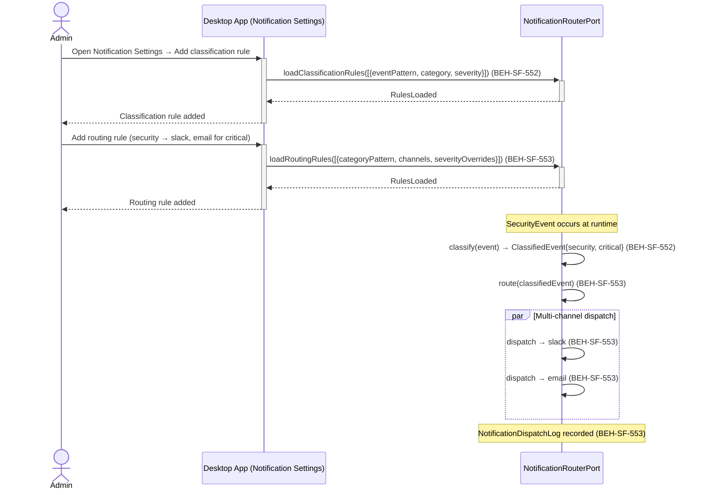
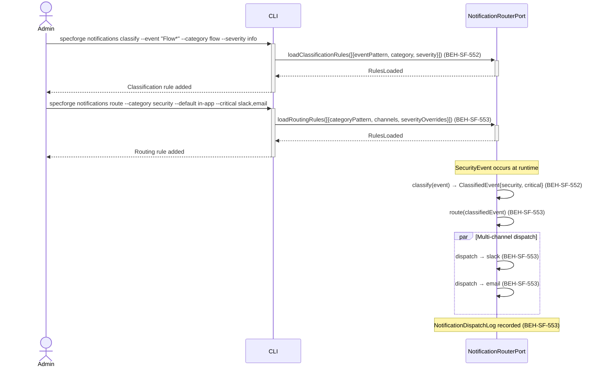
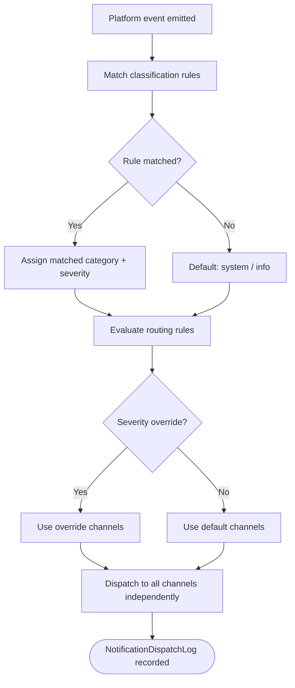

# Configure Notification Classification and Routing

## Use Case

An admin opens the Notification Settings in the desktop app. Critical security events go to Slack and email immediately. Flow completion events go to in-app notifications. Agent errors go to the webhook for the team's incident management system. The classification rules and routing map are configurable at runtime without restart. The same configuration is accessible via CLI (`specforge notifications classify` / `specforge notifications route`) for scripted/CI workflows.

## Interaction Flow

### Desktop App

```text
┌──────────┐     ┌─────────────┐     ┌─────────────────────┐
│  Admin   │     │ Desktop App │     │ NotificationRouter  │
└────┬─────┘     └──────┬──────┘     └──────────┬──────────┘
     │                  │                        │
     │ Open Notification│                        │
     │ Settings panel   │                        │
     │─────────────────►│                        │
     │                  │                        │
     │ Add rule:        │                        │
     │  event=Flow*     │                        │
     │  cat=flow        │                        │
     │  sev=info        │                        │
     │─────────────────►│                        │
     │                  │ loadClassificationRules│
     │                  │ ([...])                │
     │                  │───────────────────────►│
     │                  │ RulesLoaded            │
     │                  │◄───────────────────────│
     │ Rule added       │                        │
     │◄─────────────────│                        │
     │                  │                        │
     │ Add route:       │                        │
     │  cat=security    │                        │
     │  default=in-app  │                        │
     │  critical=       │                        │
     │   slack,email    │                        │
     │─────────────────►│                        │
     │                  │ loadRoutingRules([...])│
     │                  │───────────────────────►│
     │                  │ RulesLoaded            │
     │                  │◄───────────────────────│
     │ Route added      │                        │
     │◄─────────────────│                        │
     │                  │                        │
     │ [SecurityEvent occurs]                    │
     │                  │                        │
     │                  │ classify(event)        │
     │                  │───────────────────────►│
     │                  │ ClassifiedEvent        │
     │                  │ {security, critical}   │
     │                  │◄───────────────────────│
     │                  │                        │
     │                  │ route(classified)      │
     │                  │───────────────────────►│
     │                  │ dispatch→slack         │
     │                  │ dispatch→email         │
     │                  │◄───────────────────────│
     │                  │                        │
```



### CLI

```text
┌──────────┐     ┌─────────────┐     ┌─────────────────────┐
│  Admin   │     │     CLI     │     │ NotificationRouter  │
└────┬─────┘     └──────┬──────┘     └──────────┬──────────┘
     │                  │                        │
     │ specforge notif  │                        │
     │ classify --event │                        │
     │ "Flow*" ...      │                        │
     │─────────────────►│                        │
     │                  │                        │
     │ specforge notif  │                        │
     │ route --category │                        │
     │ security ...     │                        │
     │─────────────────►│                        │
     │                  │ loadClassificationRules│
     │                  │ ([...])                │
     │                  │───────────────────────►│
     │                  │ RulesLoaded            │
     │                  │◄───────────────────────│
     │ Rule added       │                        │
     │◄─────────────────│                        │
     │                  │                        │
     │                  │ loadRoutingRules([...])│
     │                  │───────────────────────►│
     │                  │ RulesLoaded            │
     │                  │◄───────────────────────│
     │ Route added      │                        │
     │◄─────────────────│                        │
     │                  │                        │
     │ [SecurityEvent occurs]                    │
     │                  │                        │
     │                  │ classify(event)        │
     │                  │───────────────────────►│
     │                  │ ClassifiedEvent        │
     │                  │ {security, critical}   │
     │                  │◄───────────────────────│
     │                  │                        │
     │                  │ route(classified)      │
     │                  │───────────────────────►│
     │                  │ dispatch→slack         │
     │                  │ dispatch→email         │
     │                  │◄───────────────────────│
     │                  │                        │
```



## Steps

1. Open the Notification Settings in the desktop app
2. Events are matched against rules in order — first match wins (BEH-SF-552)
3. Unmatched events receive default classification: `system` / `info` (BEH-SF-552)
4. Define routing rules that map classified events to delivery channels (BEH-SF-553)
5. Configure per-severity overrides for high-priority events (BEH-SF-553)
6. Multiple matching routing rules merge their channel lists (BEH-SF-553)
7. Notifications are dispatched per existing notification delivery infrastructure (BEH-SF-594, BEH-SF-595)
8. Notification preferences per user are respected (BEH-SF-596, BEH-SF-597)
9. Failed dispatches to one channel do not block other channels (BEH-SF-553)
10. All dispatches are logged for audit and debugging

## Decision Paths

```text
┌─────────────────────────────────┐
│    Platform event emitted       │
└────────────────┬────────────────┘
                 ▼
┌─────────────────────────────────┐
│   Classify: match against       │
│   ordered classification rules  │
└────────────────┬────────────────┘
                 ▼
          ╱ Rule matched? ╲
         ╱                 ╲
        Yes                 No
         │                   │
         ▼                   ▼
┌─────────────────┐  ┌────────────────┐
│ Assign matched  │  │ Default:       │
│ category +      │  │ system / info  │
│ severity        │  │                │
└────────┬────────┘  └───────┬────────┘
         │                   │
         └──────┬────────────┘
                ▼
┌─────────────────────────────────┐
│   Route: evaluate routing       │
│   rules for category            │
└────────────────┬────────────────┘
                 ▼
          ╱ Severity       ╲
         ╱  override exists? ╲
        ╱                     ╲
       Yes                    No
        │                      │
        ▼                      ▼
┌─────────────────┐   ┌────────────────┐
│ Use override    │   │ Use default    │
│ channels        │   │ channels       │
└────────┬────────┘   └───────┬────────┘
         │                    │
         └──────┬─────────────┘
                ▼
┌─────────────────────────────────┐
│   Dispatch to all resolved      │
│   channels (independent)        │
└─────────────────────────────────┘
```



## Traceability

| Behavior   | Feature     | Role in this capability                              |
| ---------- | ----------- | ---------------------------------------------------- |
| BEH-SF-594 | FEAT-SF-026 | Notification event aggregation from EventBusPort     |
| BEH-SF-595 | FEAT-SF-026 | Notification routing to user-configured channels     |
| BEH-SF-596 | FEAT-SF-026 | Notification preference configuration per event type |
| BEH-SF-597 | FEAT-SF-026 | Notification deduplication and batching              |
| BEH-SF-552 | FEAT-SF-028 | Event classification engine with configurable rules  |
| BEH-SF-553 | FEAT-SF-028 | Multi-channel routing with per-severity overrides    |
