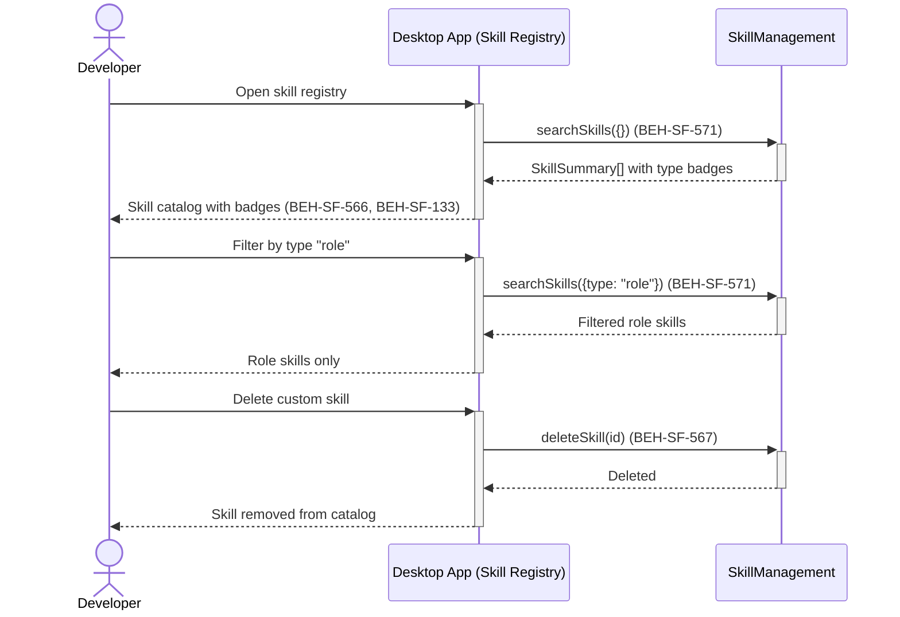

# Browse and Manage Skill Registry

## Use Case

A developer opens the Skill Registry in the desktop app. They can filter by type (system/role), source, bundle, or role assignment, search by keyword, and perform CRUD operations on custom skills. The registry provides a unified view of the skill catalog with type badges and source indicators.

## Interaction Flow

```text
┌───────────┐     ┌───────────┐     ┌──────────────────┐
│ Developer │     │ Desktop App │     │ SkillManagement  │
└─────┬─────┘     └─────┬─────┘     └────────┬─────────┘
      │ Open skill      │                    │
      │ registry        │                    │
      │────────────────►│                    │
      │                 │ searchSkills({})   │
      │                 │───────────────────►│
      │                 │  SkillSummary[]    │
      │                 │◄───────────────────│
      │ Skill catalog   │                    │
      │ with badges     │                    │
      │ (566, 133)      │                    │
      │◄────────────────│                    │
      │                 │                    │
      │ Filter by type  │                    │
      │ "role"          │                    │
      │────────────────►│                    │
      │                 │ searchSkills       │
      │                 │ ({type:"role"})    │
      │                 │───────────────────►│
      │                 │  Filtered results  │
      │                 │◄───────────────────│
      │ Role skills     │                    │
      │ (571)           │                    │
      │◄────────────────│                    │
      │                 │                    │
      │ Delete custom   │                    │
      │ skill           │                    │
      │────────────────►│                    │
      │                 │ deleteSkill(id)    │
      │                 │───────────────────►│
      │                 │  Deleted           │
      │                 │◄───────────────────│
      │ Skill removed   │                    │
      │ (567)           │                    │
      │◄────────────────│                    │
```



## Steps

1. Open the Skill Registry in the desktop app
2. View all skills with type badges — system (blue) and role (green) (BEH-SF-566)
3. Use faceted filters to narrow by type, source, bundle, or role (BEH-SF-571)
4. Search by keyword to find specific skills (BEH-SF-571)
5. Click a skill to view full details including content and metadata (BEH-SF-567)
6. View resolution priority: graph-extracted > builtin > project (BEH-SF-561)
7. View builtin skill bundles and their assigned roles (BEH-SF-558)
8. Delete a custom skill from the registry (BEH-SF-567)

## Traceability

| Behavior   | Feature     | Role in this capability                     |
| ---------- | ----------- | ------------------------------------------- |
| BEH-SF-558 | FEAT-SF-037 | Builtin skill bundles displayed in registry |
| BEH-SF-561 | FEAT-SF-037 | Resolution priority shown on skill details  |
| BEH-SF-566 | FEAT-SF-037 | Type classification with system/role badges |
| BEH-SF-567 | FEAT-SF-037 | CRUD operations on custom skills            |
| BEH-SF-571 | FEAT-SF-037 | Full-text search and faceted filtering      |
| BEH-SF-133 | FEAT-SF-007 | Dashboard rendering and interaction         |
