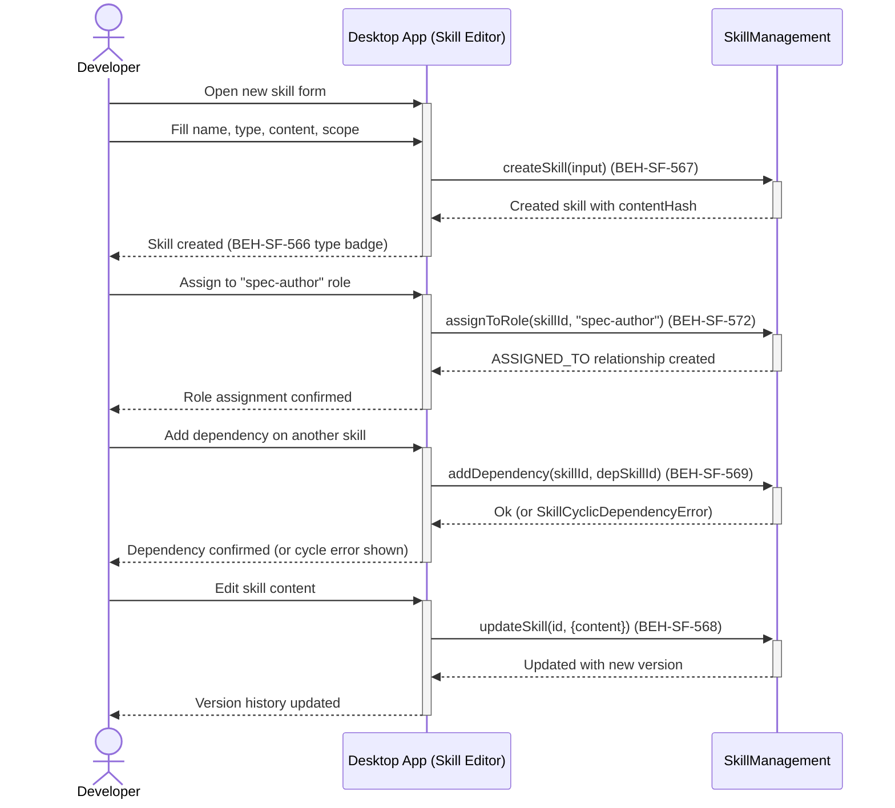
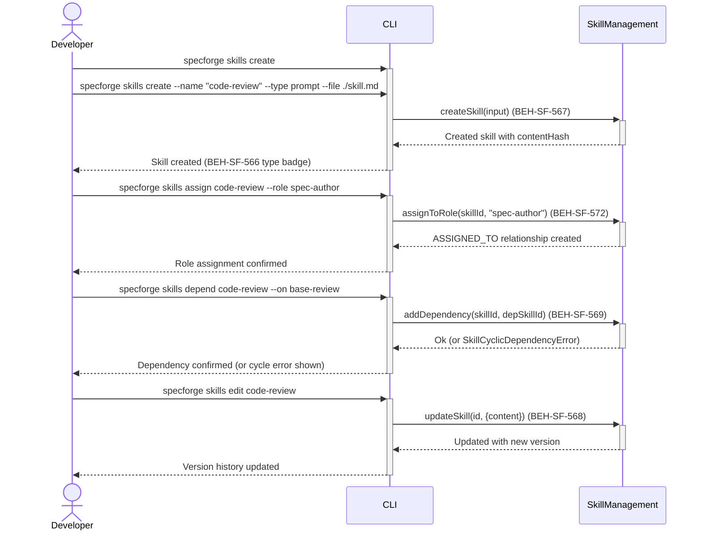
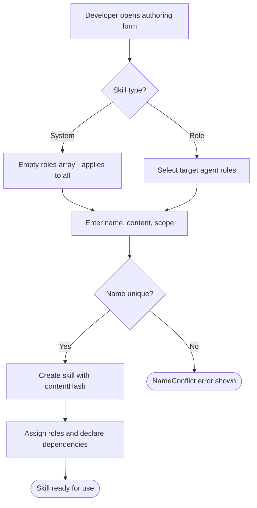

# Author Custom Skills

## Use Case

A developer opens the Skill Editor in the desktop app. The authoring interface supports versioning with content-hash tracking, role assignment management, and dependency declaration with cycle detection. The same operation is accessible via CLI (`specforge skills create`) for scripted/CI workflows.

## Interaction Flow

### Desktop App

```text
┌───────────┐     ┌───────────┐     ┌──────────────────┐
│ Developer │     │   Desktop App   │     │ SkillManagement  │
└─────┬─────┘     └─────┬─────┘     └────────┬─────────┘
      │ New skill       │                    │
      │ form            │                    │
      │────────────────►│                    │
      │                 │                    │
      │ Fill name,      │                    │
      │ type, content   │                    │
      │────────────────►│                    │
      │                 │ createSkill(input) │
      │                 │───────────────────►│
      │                 │  Created skill     │
      │                 │◄───────────────────│
      │ Skill created   │                    │
      │ (567)           │                    │
      │◄────────────────│                    │
      │                 │                    │
      │ Assign to role  │                    │
      │ "spec-author"   │                    │
      │────────────────►│                    │
      │                 │ assignToRole       │
      │                 │ (id, role)         │
      │                 │───────────────────►│
      │                 │  Assigned          │
      │                 │◄───────────────────│
      │ Role assigned   │                    │
      │ (572)           │                    │
      │◄────────────────│                    │
      │                 │                    │
      │ Add dependency  │                    │
      │────────────────►│                    │
      │                 │ addDependency      │
      │                 │ (id, depId)        │
      │                 │───────────────────►│
      │                 │  Ok / CycleError   │
      │                 │◄───────────────────│
      │ Dependency set  │                    │
      │ (569)           │                    │
      │◄────────────────│                    │
```



### CLI

```text
┌───────────┐     ┌───────────┐     ┌──────────────────┐
│ Developer │     │ CLI │     │ SkillManagement  │
└─────┬─────┘     └─────┬─────┘     └────────┬─────────┘
      │ New skill       │                    │
      │ form            │                    │
      │────────────────►│                    │
      │                 │                    │
      │ Fill name,      │                    │
      │ type, content   │                    │
      │────────────────►│                    │
      │                 │ createSkill(input) │
      │                 │───────────────────►│
      │                 │  Created skill     │
      │                 │◄───────────────────│
      │ Skill created   │                    │
      │ (567)           │                    │
      │◄────────────────│                    │
      │                 │                    │
      │ Assign to role  │                    │
      │ "spec-author"   │                    │
      │────────────────►│                    │
      │                 │ assignToRole       │
      │                 │ (id, role)         │
      │                 │───────────────────►│
      │                 │  Assigned          │
      │                 │◄───────────────────│
      │ Role assigned   │                    │
      │ (572)           │                    │
      │◄────────────────│                    │
      │                 │                    │
      │ Add dependency  │                    │
      │────────────────►│                    │
      │                 │ addDependency      │
      │                 │ (id, depId)        │
      │                 │───────────────────►│
      │                 │  Ok / CycleError   │
      │                 │◄───────────────────│
      │ Dependency set  │                    │
      │ (569)           │                    │
      │◄────────────────│                    │
```



## Steps

1. Open the Skill Editor in the desktop app
2. Set the skill type: system (global) or role (scoped to specific roles) (BEH-SF-566)
3. Enter skill name, content (markdown instructions), and scope pattern (BEH-SF-567)
4. Save the skill — system computes contentHash and persists as `Skill` node (BEH-SF-567)
5. Assign the skill to one or more agent roles (BEH-SF-572)
6. Declare dependencies on other skills with cycle detection (BEH-SF-569)
7. Edit the skill content — a new version is created automatically (BEH-SF-568)
8. View version history and diff between versions (BEH-SF-568)

## Decision Paths

```text
┌─────────────────────────────────┐
│ Developer opens authoring form  │
└────────────────┬────────────────┘
                 ▼
          ╱ Skill type? ╲
         ╱               ╲
        ╱                 ╲
    System               Role
       │                   │
       ▼                   ▼
  Empty roles        Select target
  array (all)        roles
       │                   │
       └─────────┬─────────┘
                 ▼
┌─────────────────────────────────┐
│ Enter name, content, scope      │
└────────────────┬────────────────┘
                 ▼
          ╱ Name unique? ╲
         ╱                ╲
        Yes               No
         │                 │
         ▼                 ▼
┌──────────────┐  ┌────────────────┐
│ Create skill │  │ NameConflict   │
│ (567)        │  │ error shown    │
└──────┬───────┘  └────────────────┘
       ▼
┌─────────────────────────────────┐
│ Optionally assign roles (572)   │
│ and declare dependencies (569)  │
└─────────────────────────────────┘
```



## Traceability

| Behavior   | Feature     | Role in this capability                     |
| ---------- | ----------- | ------------------------------------------- |
| BEH-SF-566 | FEAT-SF-037 | Type classification during creation         |
| BEH-SF-567 | FEAT-SF-037 | CRUD operations for custom skills           |
| BEH-SF-568 | FEAT-SF-037 | Version history on content changes          |
| BEH-SF-569 | FEAT-SF-037 | Dependency declaration with cycle detection |
| BEH-SF-572 | FEAT-SF-037 | Role assignment management                  |
| BEH-SF-133 | FEAT-SF-007 | Dashboard rendering for authoring form      |
