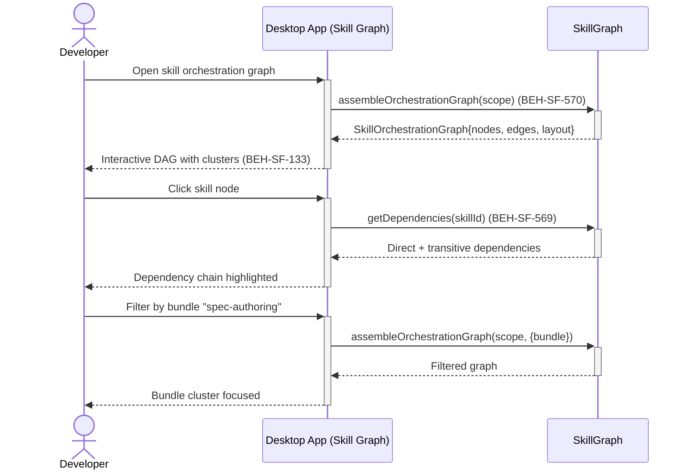

# Explore Skill Orchestration Graph

## Use Case

A developer opens the Skill Graph in the desktop app. The graph enables understanding of skill composition, dependency chains, and potential impact when modifying a skill.

## Interaction Flow

```text
┌───────────┐     ┌───────────┐     ┌─────────────┐
│ Developer │     │ Desktop App │     │ SkillGraph  │
└─────┬─────┘     └─────┬─────┘     └──────┬──────┘
      │ Open skill      │                  │
      │ graph           │                  │
      │────────────────►│                  │
      │                 │ assemble         │
      │                 │ OrchGraph(scope) │
      │                 │─────────────────►│
      │                 │ SkillOrch.Graph  │
      │                 │◄─────────────────│
      │ Interactive     │                  │
      │ DAG (570, 133)  │                  │
      │◄────────────────│                  │
      │                 │                  │
      │ Click skill     │                  │
      │ node            │                  │
      │────────────────►│                  │
      │                 │ getDependencies  │
      │                 │ (skillId)        │
      │                 │─────────────────►│
      │                 │ Dependencies     │
      │                 │◄─────────────────│
      │ Dependency      │                  │
      │ detail (569)    │                  │
      │◄────────────────│                  │
```



## Steps

1. Open the Skill Graph in the desktop app
2. View the DAG with skill nodes clustered by bundle and type (BEH-SF-570)
3. Observe edge types: `DEPENDS_ON` (dependency), `ASSIGNED_TO` (role), `PART_OF` (bundle)
4. Click a skill node to inspect its dependencies and transitive chain (BEH-SF-569)
5. View graph sync status — skills linked to their source files (BEH-SF-563)
6. Filter the graph by bundle, type, or role to focus on a subset
7. Zoom and pan to navigate large graphs; desktop provides hardware-accelerated rendering
8. Inspect node details including properties, links, and status (BEH-SF-001)

## Traceability

| Behavior   | Feature     | Role in this capability                        |
| ---------- | ----------- | ---------------------------------------------- |
| BEH-SF-570 | FEAT-SF-037 | Orchestration graph assembly with layout hints |
| BEH-SF-569 | FEAT-SF-037 | Dependency chains and cycle detection          |
| BEH-SF-563 | FEAT-SF-037 | Graph sync linking skills to source files      |
| BEH-SF-001 | FEAT-SF-001 | Graph node retrieval and traversal             |
| BEH-SF-133 | FEAT-SF-007 | Dashboard graph visualization and interaction  |
