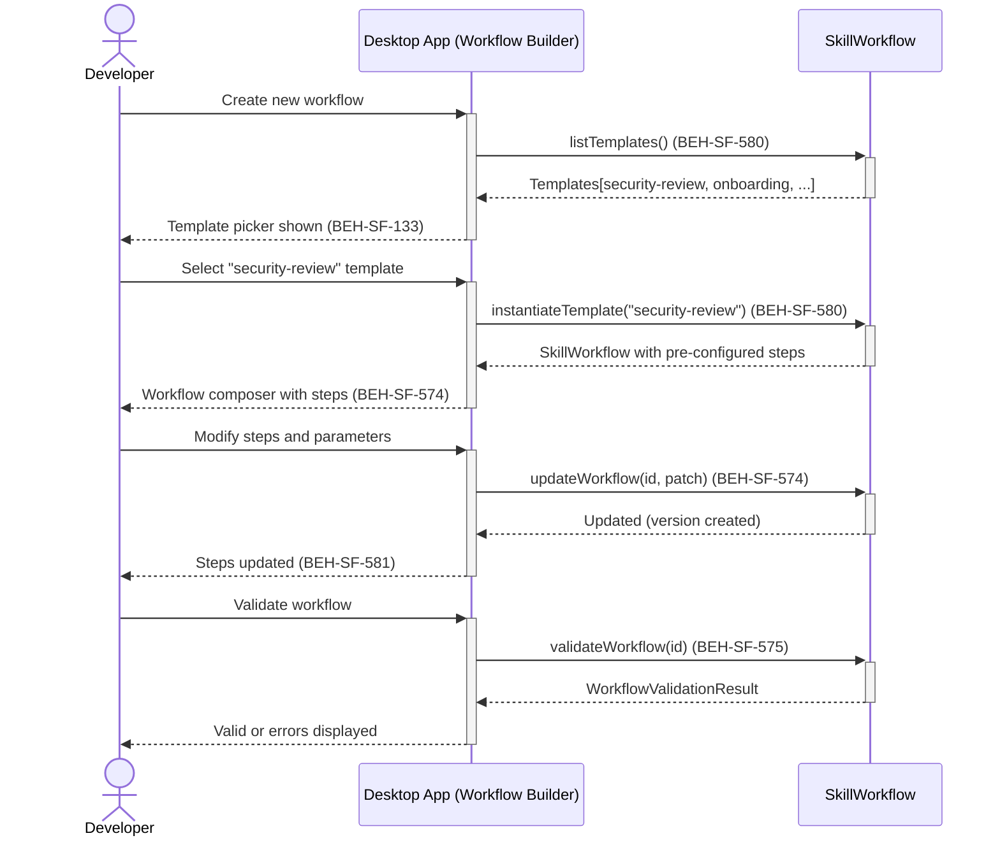
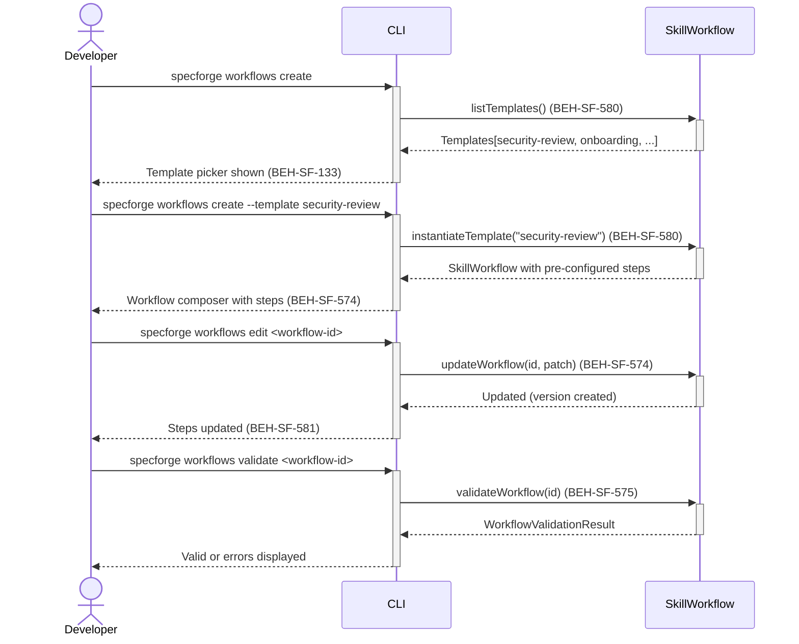

# Define Skill Workflows

## Use Case

A developer opens the Workflow Builder in the desktop app. Workflows can be created from scratch or instantiated from predefined templates. The workflow composer validates references, dependency order, and condition expressions before allowing execution. The same operation is accessible via CLI (`specforge workflows create`) for scripted/CI workflows.

## Interaction Flow

### Desktop App

```text
┌───────────┐     ┌───────────┐     ┌─────────────────┐
│ Developer │     │   Desktop App   │     │ SkillWorkflow   │
└─────┬─────┘     └─────┬─────┘     └───────┬─────────┘
      │ New workflow    │                    │
      │────────────────►│                    │
      │                 │                    │
      │ Choose template │                    │
      │ or blank        │                    │
      │────────────────►│                    │
      │                 │ listTemplates()   │
      │                 │───────────────────►│
      │                 │  Templates[]      │
      │                 │◄───────────────────│
      │ Templates shown │                    │
      │ (580)           │                    │
      │◄────────────────│                    │
      │                 │                    │
      │ Select          │                    │
      │ "security-      │                    │
      │  review"        │                    │
      │────────────────►│                    │
      │                 │ instantiate       │
      │                 │ Template(id)      │
      │                 │───────────────────►│
      │                 │  Workflow created  │
      │                 │◄───────────────────│
      │ Workflow with   │                    │
      │ steps (574)     │                    │
      │◄────────────────│                    │
      │                 │                    │
      │ Validate        │                    │
      │────────────────►│                    │
      │                 │ validateWorkflow   │
      │                 │ (id)              │
      │                 │───────────────────►│
      │                 │  ValidationResult │
      │                 │◄───────────────────│
      │ Valid / errors  │                    │
      │ (575)           │                    │
      │◄────────────────│                    │
```



### CLI

```text
┌───────────┐     ┌───────────┐     ┌─────────────────┐
│ Developer │     │ CLI │     │ SkillWorkflow   │
└─────┬─────┘     └─────┬─────┘     └───────┬─────────┘
      │ New workflow    │                    │
      │────────────────►│                    │
      │                 │                    │
      │ Choose template │                    │
      │ or blank        │                    │
      │────────────────►│                    │
      │                 │ listTemplates()   │
      │                 │───────────────────►│
      │                 │  Templates[]      │
      │                 │◄───────────────────│
      │ Templates shown │                    │
      │ (580)           │                    │
      │◄────────────────│                    │
      │                 │                    │
      │ Select          │                    │
      │ "security-      │                    │
      │  review"        │                    │
      │────────────────►│                    │
      │                 │ instantiate       │
      │                 │ Template(id)      │
      │                 │───────────────────►│
      │                 │  Workflow created  │
      │                 │◄───────────────────│
      │ Workflow with   │                    │
      │ steps (574)     │                    │
      │◄────────────────│                    │
      │                 │                    │
      │ Validate        │                    │
      │────────────────►│                    │
      │                 │ validateWorkflow   │
      │                 │ (id)              │
      │                 │───────────────────►│
      │                 │  ValidationResult │
      │                 │◄───────────────────│
      │ Valid / errors  │                    │
      │ (575)           │                    │
      │◄────────────────│                    │
```



## Steps

1. Open the Workflow Builder in the desktop app
2. Choose to start from a template or create a blank workflow (BEH-SF-580)
3. If using a template, select from: security-review, onboarding, compliance-check, code-quality (BEH-SF-580)
4. Add, remove, or reorder skill steps in the workflow (BEH-SF-574)
5. Configure each step: skill reference, condition expression, parameters, failure policy (BEH-SF-574)
6. Validate the workflow — check references, order, dependencies, and conditions (BEH-SF-575)
7. Fix any validation errors before the workflow can be executed
8. View version history of step changes and rollback if needed (BEH-SF-581)

## Traceability

| Behavior   | Feature     | Role in this capability                             |
| ---------- | ----------- | --------------------------------------------------- |
| BEH-SF-574 | FEAT-SF-037 | Workflow creation with ordered steps and parameters |
| BEH-SF-575 | FEAT-SF-037 | Validation of references, order, and conditions     |
| BEH-SF-580 | FEAT-SF-037 | Predefined workflow templates                       |
| BEH-SF-581 | FEAT-SF-037 | Workflow versioning and rollback                    |
| BEH-SF-133 | FEAT-SF-007 | Dashboard workflow composer UI                      |
