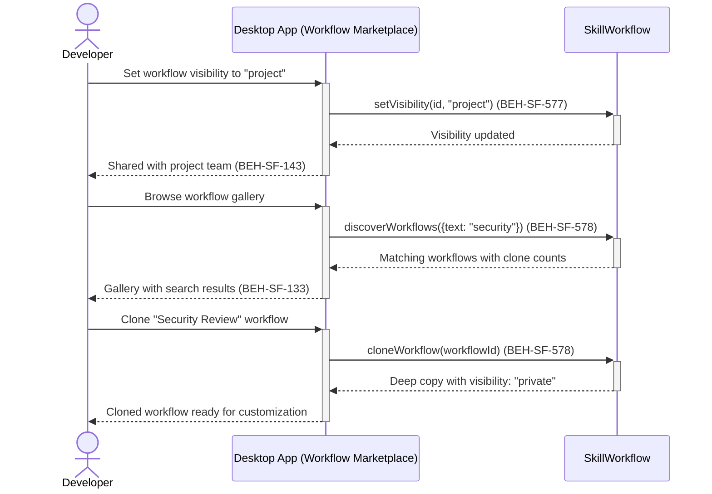

# Share and Discover Skill Workflows

## Use Case

A developer opens the Workflow Marketplace in the desktop app. Team leads discover useful workflows in the gallery, preview their steps, and clone them into their own projects for customization.

## Interaction Flow

```text
┌───────────┐     ┌───────────┐     ┌─────────────────┐
│ Developer │     │ Desktop App │     │ SkillWorkflow   │
└─────┬─────┘     └─────┬─────┘     └───────┬─────────┘
      │ Set visibility  │                    │
      │ "project"       │                    │
      │────────────────►│                    │
      │                 │ setVisibility      │
      │                 │ (id, "project")    │
      │                 │───────────────────►│
      │                 │  Updated           │
      │                 │◄───────────────────│
      │ Shared with     │                    │
      │ team (577)      │                    │
      │◄────────────────│                    │
      │                 │                    │
      │ Browse gallery  │                    │
      │────────────────►│                    │
      │                 │ discoverWorkflows  │
      │                 │ (query)            │
      │                 │───────────────────►│
      │                 │  Gallery results   │
      │                 │◄───────────────────│
      │ Workflow gallery│                    │
      │ (578)           │                    │
      │◄────────────────│                    │
      │                 │                    │
      │ Clone workflow  │                    │
      │────────────────►│                    │
      │                 │ cloneWorkflow(id)  │
      │                 │───────────────────►│
      │                 │  Cloned copy       │
      │                 │◄───────────────────│
      │ Private clone   │                    │
      │ ready (578)     │                    │
      │◄────────────────│                    │
```



## Steps

1. Open the Workflow Marketplace in the desktop app
2. Team members and other users can now discover the shared workflow
3. Browse the workflow gallery with search and filters (BEH-SF-578)
4. Preview a workflow's steps, parameters, and clone count before cloning
5. Clone a workflow to create a private editable copy (BEH-SF-578)
6. Customize the cloned workflow's steps for your project
7. Collaborate on shared workflows through project visibility (BEH-SF-143)

## Traceability

| Behavior   | Feature     | Role in this capability                      |
| ---------- | ----------- | -------------------------------------------- |
| BEH-SF-577 | FEAT-SF-037 | Visibility scoping (private/project/public)  |
| BEH-SF-578 | FEAT-SF-037 | Workflow discovery gallery and cloning       |
| BEH-SF-143 | FEAT-SF-017 | Multi-user collaboration on shared artifacts |
| BEH-SF-133 | FEAT-SF-007 | Dashboard gallery rendering                  |
