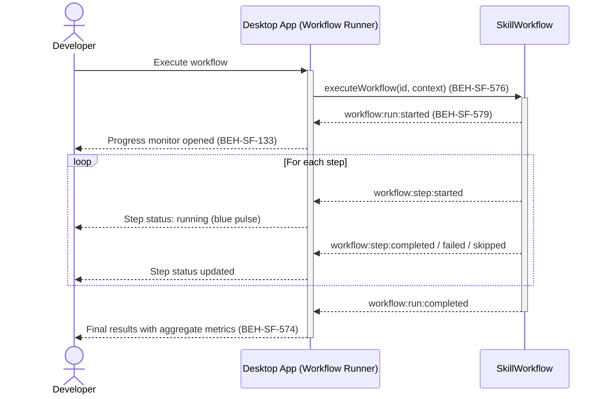
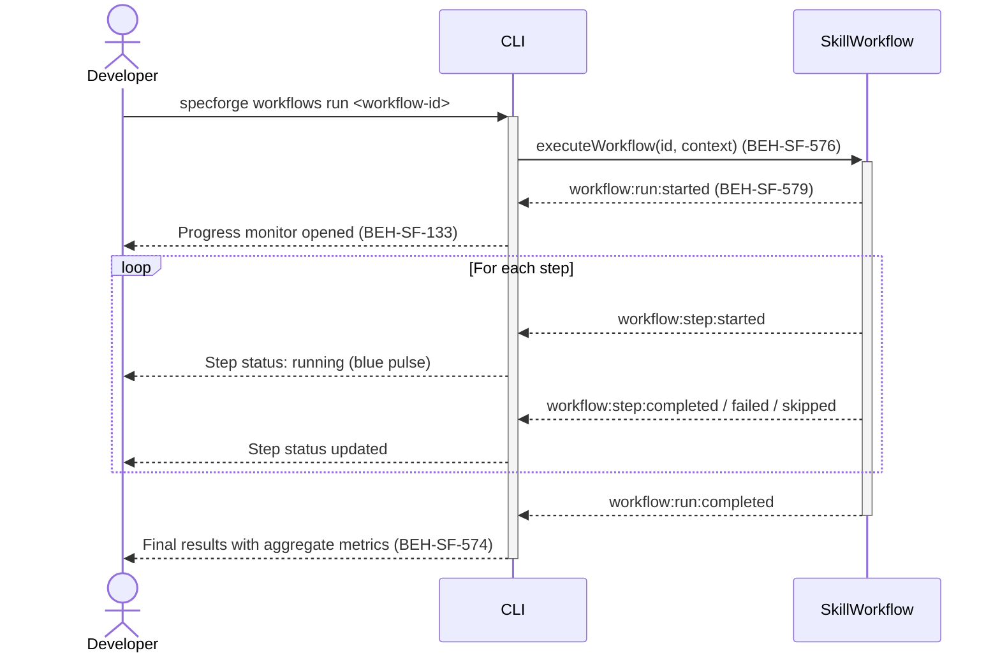

# Run and Monitor Skill Workflows

## Use Case

A developer opens the Workflow Runner in the desktop app to run and monitor skill workflows. The same operation is accessible via CLI (`specforge workflows run <id>`) for scripted/CI workflows.

## Interaction Flow

### Desktop App

```text
┌───────────┐     ┌───────────┐     ┌─────────────────┐
│ Developer │     │   Desktop App   │     │ SkillWorkflow   │
└─────┬─────┘     └─────┬─────┘     └───────┬─────────┘
      │ Execute         │                    │
      │ workflow        │                    │
      │────────────────►│                    │
      │                 │ executeWorkflow    │
      │                 │ (id, context)      │
      │                 │───────────────────►│
      │                 │  run:started       │
      │                 │◄───────────────────│
      │ Progress view   │                    │
      │ (579, 133)      │                    │
      │◄────────────────│                    │
      │                 │                    │
      │                 │  step:started      │
      │                 │◄─ ─ ─ ─ ─ ─ ─ ─ ─│
      │ Step 1 running  │                    │
      │◄─ ─ ─ ─ ─ ─ ─ ─│                    │
      │                 │  step:completed    │
      │                 │◄─ ─ ─ ─ ─ ─ ─ ─ ─│
      │ Step 1 done     │                    │
      │◄─ ─ ─ ─ ─ ─ ─ ─│                    │
      │       ...       │         ...        │
      │                 │  run:completed     │
      │                 │◄───────────────────│
      │ Final results   │                    │
      │ (576)           │                    │
      │◄────────────────│                    │
```



### CLI

```text
┌───────────┐     ┌───────────┐     ┌─────────────────┐
│ Developer │     │ CLI │     │ SkillWorkflow   │
└─────┬─────┘     └─────┬─────┘     └───────┬─────────┘
      │ Execute         │                    │
      │ workflow        │                    │
      │────────────────►│                    │
      │                 │ executeWorkflow    │
      │                 │ (id, context)      │
      │                 │───────────────────►│
      │                 │  run:started       │
      │                 │◄───────────────────│
      │ Progress view   │                    │
      │ (579, 133)      │                    │
      │◄────────────────│                    │
      │                 │                    │
      │                 │  step:started      │
      │                 │◄─ ─ ─ ─ ─ ─ ─ ─ ─│
      │ Step 1 running  │                    │
      │◄─ ─ ─ ─ ─ ─ ─ ─│                    │
      │                 │  step:completed    │
      │                 │◄─ ─ ─ ─ ─ ─ ─ ─ ─│
      │ Step 1 done     │                    │
      │◄─ ─ ─ ─ ─ ─ ─ ─│                    │
      │       ...       │         ...        │
      │                 │  run:completed     │
      │                 │◄───────────────────│
      │ Final results   │                    │
      │ (576)           │                    │
      │◄────────────────│                    │
```



## Steps

1. Open the Workflow Runner in the desktop app
2. The execution engine begins processing steps in order (BEH-SF-576)
3. Monitor real-time progress via WebSocket events (BEH-SF-579)
4. View per-step status indicators: completed (green), running (blue), pending (gray), skipped (yellow), failed (red) (BEH-SF-579)
5. If a step fails, observe the failure policy in action: continue, abort, or retry (BEH-SF-576)
6. After completion, view aggregate metrics: total duration, token usage, step counts (BEH-SF-579)
7. Check the `WorkflowRun` result for per-step details (BEH-SF-576)

## Traceability

| Behavior   | Feature     | Role in this capability                      |
| ---------- | ----------- | -------------------------------------------- |
| BEH-SF-576 | FEAT-SF-037 | Step-by-step execution with failure policies |
| BEH-SF-579 | FEAT-SF-037 | Real-time WebSocket monitoring events        |
| BEH-SF-574 | FEAT-SF-004 | Workflow structure and step configuration    |
| BEH-SF-133 | FEAT-SF-007 | Dashboard progress monitor rendering         |
