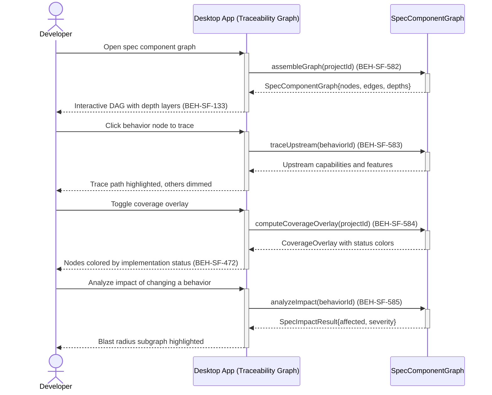

# Explore Spec Component Traceability Graph

## Use Case

A developer opens the Traceability Graph in the desktop app. The explorer supports upstream/downstream navigation, coverage overlays, and impact analysis to understand change blast radius.

## Interaction Flow

```text
┌───────────┐     ┌───────────┐     ┌───────────────────┐
│ Developer │     │ Desktop App │     │ SpecComponent     │
│           │     │           │     │ Graph             │
└─────┬─────┘     └─────┬─────┘     └────────┬──────────┘
      │ Open spec       │                    │
      │ graph           │                    │
      │────────────────►│                    │
      │                 │ assembleGraph      │
      │                 │ (projectId)        │
      │                 │───────────────────►│
      │                 │  SpecComponent     │
      │                 │  Graph             │
      │                 │◄───────────────────│
      │ Interactive     │                    │
      │ DAG (582, 133)  │                    │
      │◄────────────────│                    │
      │                 │                    │
      │ Click behavior  │                    │
      │ node            │                    │
      │────────────────►│                    │
      │                 │ traceUpstream      │
      │                 │ (nodeId)           │
      │                 │───────────────────►│
      │                 │  Upstream nodes    │
      │                 │◄───────────────────│
      │ Trace path      │                    │
      │ highlighted     │                    │
      │ (583)           │                    │
      │◄────────────────│                    │
      │                 │                    │
      │ Toggle coverage │                    │
      │ overlay         │                    │
      │────────────────►│                    │
      │                 │ computeCoverage    │
      │                 │ Overlay(projectId) │
      │                 │───────────────────►│
      │                 │  CoverageOverlay   │
      │                 │◄───────────────────│
      │ Color-coded     │                    │
      │ nodes (584)     │                    │
      │◄────────────────│                    │
      │                 │                    │
      │ Analyze impact  │                    │
      │ of behavior     │                    │
      │────────────────►│                    │
      │                 │ analyzeImpact      │
      │                 │ (nodeId)           │
      │                 │───────────────────►│
      │                 │  SpecImpactResult  │
      │                 │◄───────────────────│
      │ Blast radius    │                    │
      │ shown (585)     │                    │
      │◄────────────────│                    │
```



## Steps

1. Open the Traceability Graph in the desktop app
2. View the DAG with nodes organized by depth: features, capabilities, behaviors, invariants/ADRs, risk assessments (BEH-SF-582)
3. Click any node to view its properties and linked artifacts (BEH-SF-001)
4. Trace upstream from a behavior to see which capabilities and features depend on it (BEH-SF-583)
5. Trace downstream from a capability to see its full implementation chain (BEH-SF-583)
6. Toggle the coverage overlay to color nodes by implementation status (BEH-SF-584)
7. View coverage statistics: per-status counts and average test coverage (BEH-SF-584, BEH-SF-472)
8. Select a node and run impact analysis to see the blast radius of a change (BEH-SF-585)
9. Review severity scoring: low (5 or fewer affected), medium (6--15), high (more than 15) (BEH-SF-585)

## Traceability

| Behavior   | Feature     | Role in this capability                              |
| ---------- | ----------- | ---------------------------------------------------- |
| BEH-SF-582 | FEAT-SF-037 | Spec component graph assembly from all artifacts     |
| BEH-SF-583 | FEAT-SF-037 | Upstream/downstream traceability navigation          |
| BEH-SF-584 | FEAT-SF-037 | Coverage overlay with implementation and test status |
| BEH-SF-585 | FEAT-SF-037 | Impact analysis with blast radius and severity       |
| BEH-SF-001 | FEAT-SF-001 | Graph node retrieval and detail inspection           |
| BEH-SF-133 | FEAT-SF-007 | Dashboard graph visualization and interaction        |
| BEH-SF-472 | FEAT-SF-037 | Test coverage and completeness data                  |
