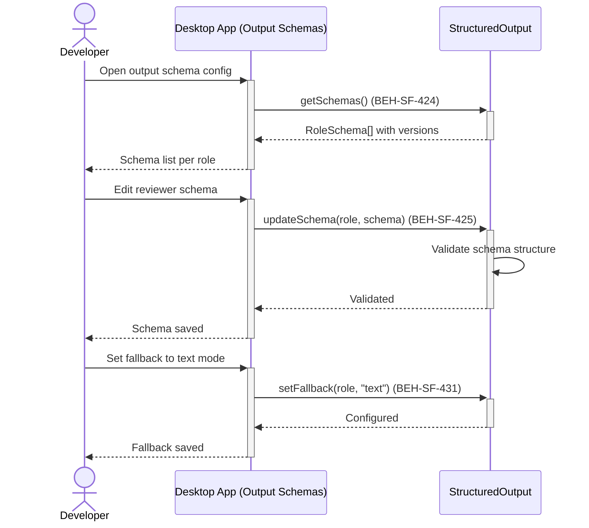
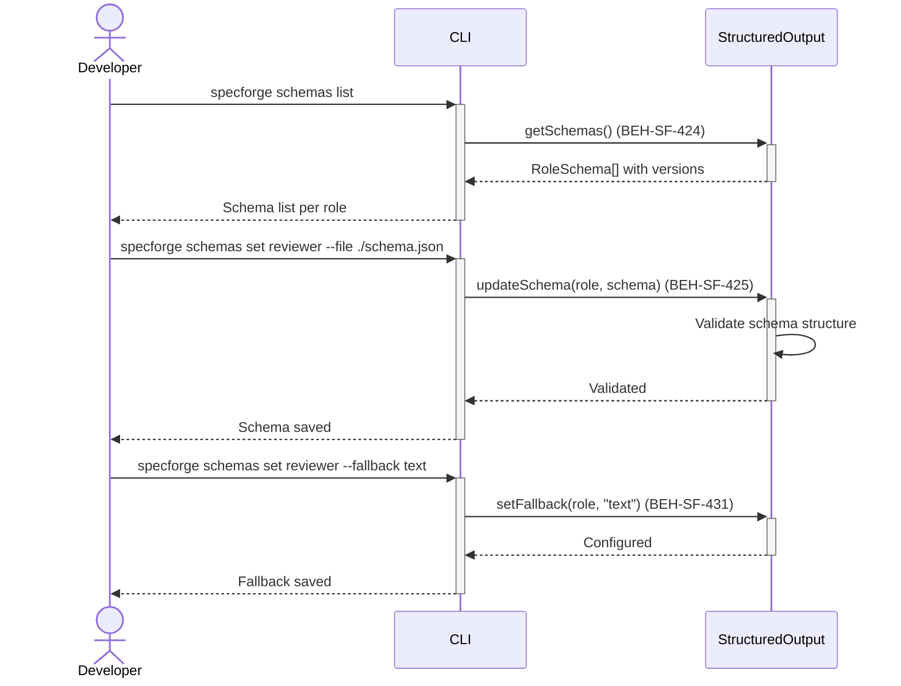

# Configure Agent Output Schemas

## Use Case

A developer opens the Output Schemas in the desktop app. They define which graph node types, finding categories, and metadata fields each role is allowed to produce, set up schema versioning for backward compatibility, and configure fallback behavior when structured output fails repeatedly. The same operation is accessible via CLI for scripted/CI workflows.

## Interaction Flow

### Desktop App

```text
┌───────────┐     ┌───────────┐     ┌──────────────────┐
│ Developer │     │   Desktop App   │     │ StructuredOutput │
└─────┬─────┘     └─────┬─────┘     └────────┬─────────┘
      │ Open output      │                    │
      │ schema config    │                    │
      │────────────────►│                    │
      │                 │ getSchemas()       │
      │                 │───────────────────►│
      │                 │  RoleSchema[]      │
      │                 │◄───────────────────│
      │ Schema list     │                    │
      │ per role        │                    │
      │◄────────────────│                    │
      │                 │                    │
      │ Edit reviewer   │                    │
      │ schema          │                    │
      │────────────────►│                    │
      │                 │ updateSchema       │
      │                 │ (role, schema)     │
      │                 │───────────────────►│
      │                 │  Validated         │
      │                 │◄───────────────────│
      │ Schema saved    │                    │
      │ (424, 425)      │                    │
      │◄────────────────│                    │
      │                 │                    │
      │ Set fallback    │                    │
      │ to text mode    │                    │
      │────────────────►│                    │
      │                 │ setFallback        │
      │                 │ (role, "text")     │
      │                 │───────────────────►│
      │                 │  Configured        │
      │                 │◄───────────────────│
      │ Fallback saved  │                    │
      │ (431)           │                    │
      │◄────────────────│                    │
```



### CLI

```text
┌───────────┐     ┌───────────┐     ┌──────────────────┐
│ Developer │     │ CLI │     │ StructuredOutput │
└─────┬─────┘     └─────┬─────┘     └────────┬─────────┘
      │ Open output      │                    │
      │ schema config    │                    │
      │────────────────►│                    │
      │                 │ getSchemas()       │
      │                 │───────────────────►│
      │                 │  RoleSchema[]      │
      │                 │◄───────────────────│
      │ Schema list     │                    │
      │ per role        │                    │
      │◄────────────────│                    │
      │                 │                    │
      │ Edit reviewer   │                    │
      │ schema          │                    │
      │────────────────►│                    │
      │                 │ updateSchema       │
      │                 │ (role, schema)     │
      │                 │───────────────────►│
      │                 │  Validated         │
      │                 │◄───────────────────│
      │ Schema saved    │                    │
      │ (424, 425)      │                    │
      │◄────────────────│                    │
      │                 │                    │
      │ Set fallback    │                    │
      │ to text mode    │                    │
      │────────────────►│                    │
      │                 │ setFallback        │
      │                 │ (role, "text")     │
      │                 │───────────────────►│
      │                 │  Configured        │
      │                 │◄───────────────────│
      │ Fallback saved  │                    │
      │ (431)           │                    │
      │◄────────────────│                    │
```



## Steps

1. Open the Output Schemas in the desktop app
2. View existing per-role JSON schemas with version history (BEH-SF-430)
3. Edit a role's output schema — constrain allowed node types, finding categories, metadata fields (BEH-SF-424)
4. System validates the schema structure before saving (BEH-SF-425)
5. Configure retry behavior for schema validation failures (BEH-SF-428)
6. Set graceful degradation fallback (text mode) for persistent failures (BEH-SF-431)
7. Publish a new schema version with backward compatibility check (BEH-SF-430)

## Traceability

| Behavior   | Feature     | Role in this capability                         |
| ---------- | ----------- | ----------------------------------------------- |
| BEH-SF-424 | FEAT-SF-023 | Per-role JSON schema definition and editing     |
| BEH-SF-425 | FEAT-SF-023 | Schema validation pipeline for structure checks |
| BEH-SF-428 | FEAT-SF-023 | Retry configuration for validation failures     |
| BEH-SF-430 | FEAT-SF-023 | Schema versioning and backward compatibility    |
| BEH-SF-431 | FEAT-SF-023 | Graceful degradation to text mode fallback      |
