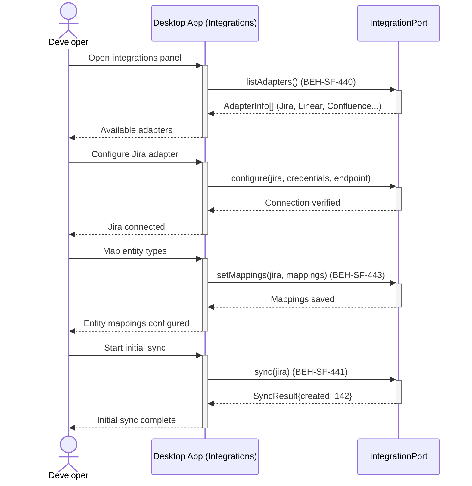
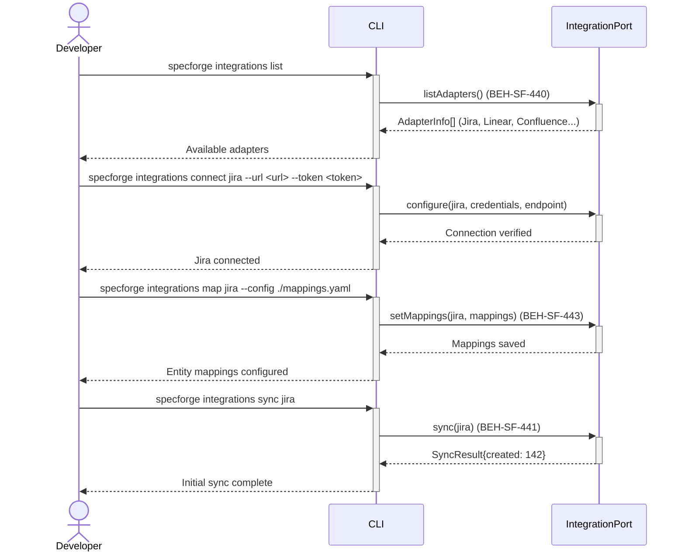

# Connect Third-Party Integration

## Use Case

A developer opens the Integrations in the desktop app. They select an adapter from the registry, provide credentials and endpoint configuration, map external entity types to graph node types, and configure the sync direction and conflict resolution strategy. The same operation is accessible via CLI for scripted/CI workflows.

## Interaction Flow

### Desktop App

```text
┌───────────┐     ┌───────────┐     ┌──────────────────┐
│ Developer │     │   Desktop App   │     │ IntegrationPort  │
└─────┬─────┘     └─────┬─────┘     └────────┬─────────┘
      │ Open             │                    │
      │ integrations     │                    │
      │────────────────►│                    │
      │                 │ listAdapters()     │
      │                 │───────────────────►│
      │                 │  AdapterInfo[]     │
      │                 │◄───────────────────│
      │ Available       │                    │
      │ adapters (440)  │                    │
      │◄────────────────│                    │
      │                 │                    │
      │ Configure Jira  │                    │
      │ adapter         │                    │
      │────────────────►│                    │
      │                 │ configure          │
      │                 │ (jira, config)     │
      │                 │───────────────────►│
      │                 │  Connected         │
      │                 │◄───────────────────│
      │ Connection      │                    │
      │ verified        │                    │
      │◄────────────────│                    │
      │                 │                    │
      │ Map entity      │                    │
      │ types           │                    │
      │────────────────►│                    │
      │                 │ setMappings        │
      │                 │ (jira, mappings)   │
      │                 │───────────────────►│
      │                 │  Mappings saved    │
      │                 │◄───────────────────│
      │ Mappings        │                    │
      │ configured      │                    │
      │ (443)           │                    │
      │◄────────────────│                    │
      │                 │                    │
      │ Start initial   │                    │
      │ sync            │                    │
      │────────────────►│                    │
      │                 │ sync(jira)         │
      │                 │───────────────────►│
      │                 │  SyncResult        │
      │                 │◄───────────────────│
      │ Synced: 142     │                    │
      │ entities (441)  │                    │
      │◄────────────────│                    │
```



### CLI

```text
┌───────────┐     ┌───────────┐     ┌──────────────────┐
│ Developer │     │ CLI │     │ IntegrationPort  │
└─────┬─────┘     └─────┬─────┘     └────────┬─────────┘
      │ Open             │                    │
      │ integrations     │                    │
      │────────────────►│                    │
      │                 │ listAdapters()     │
      │                 │───────────────────►│
      │                 │  AdapterInfo[]     │
      │                 │◄───────────────────│
      │ Available       │                    │
      │ adapters (440)  │                    │
      │◄────────────────│                    │
      │                 │                    │
      │ Configure Jira  │                    │
      │ adapter         │                    │
      │────────────────►│                    │
      │                 │ configure          │
      │                 │ (jira, config)     │
      │                 │───────────────────►│
      │                 │  Connected         │
      │                 │◄───────────────────│
      │ Connection      │                    │
      │ verified        │                    │
      │◄────────────────│                    │
      │                 │                    │
      │ Map entity      │                    │
      │ types           │                    │
      │────────────────►│                    │
      │                 │ setMappings        │
      │                 │ (jira, mappings)   │
      │                 │───────────────────►│
      │                 │  Mappings saved    │
      │                 │◄───────────────────│
      │ Mappings        │                    │
      │ configured      │                    │
      │ (443)           │                    │
      │◄────────────────│                    │
      │                 │                    │
      │ Start initial   │                    │
      │ sync            │                    │
      │────────────────►│                    │
      │                 │ sync(jira)         │
      │                 │───────────────────►│
      │                 │  SyncResult        │
      │                 │◄───────────────────│
      │ Synced: 142     │                    │
      │ entities (441)  │                    │
      │◄────────────────│                    │
```



## Steps

1. Open the Integrations in the desktop app
2. Select an adapter (e.g., Jira) and provide credentials and endpoint URL
3. System verifies the connection and lists available external entity types
4. Map external entity types to graph node types (BEH-SF-443)
5. Configure sync direction (bidirectional, import-only, export-only) and conflict resolution (BEH-SF-441)
6. Configure webhook URL for incremental sync from external events (BEH-SF-442)
7. Trigger initial full sync to populate the knowledge graph (BEH-SF-441)
8. Verify imported entities appear in the graph (BEH-SF-127)

## Traceability

| Behavior   | Feature     | Role in this capability                      |
| ---------- | ----------- | -------------------------------------------- |
| BEH-SF-440 | FEAT-SF-031 | Adapter contract and registry for discovery  |
| BEH-SF-441 | FEAT-SF-031 | Bidirectional sync with conflict resolution  |
| BEH-SF-442 | FEAT-SF-031 | Incremental sync via external webhooks       |
| BEH-SF-443 | FEAT-SF-031 | Entity mapping from external to graph nodes  |
| BEH-SF-127 | FEAT-SF-012 | Import adapter for graph entity verification |
