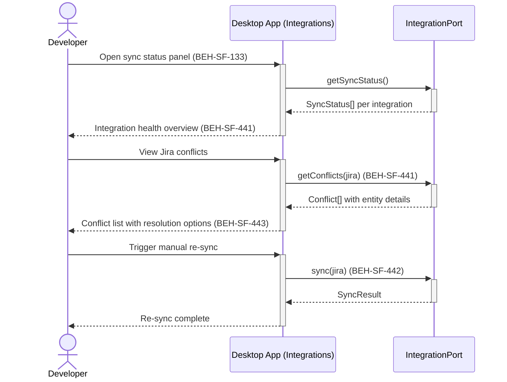

# Monitor Integration Sync Status

## Use Case

A developer opens the Integrations in the desktop app. The dashboard displays sync status for each connected integration — last sync time, entities synced, conflicts detected, errors encountered. They can view sync history, inspect conflict resolution outcomes, and trigger manual re-syncs when needed.

## Interaction Flow

```text
┌───────────┐     ┌───────────┐     ┌──────────────────┐
│ Developer │     │ Desktop App │     │ IntegrationPort  │
└─────┬─────┘     └─────┬─────┘     └────────┬─────────┘
      │ Open sync        │                    │
      │ status           │                    │
      │────────────────►│                    │
      │                 │ getSyncStatus()    │
      │                 │───────────────────►│
      │                 │  SyncStatus[]      │
      │                 │◄───────────────────│
      │ Integration     │                    │
      │ health (441)    │                    │
      │◄────────────────│                    │
      │                 │                    │
      │ View Jira       │                    │
      │ conflicts       │                    │
      │────────────────►│                    │
      │                 │ getConflicts       │
      │                 │ (jira)             │
      │                 │───────────────────►│
      │                 │  Conflict[]        │
      │                 │◄───────────────────│
      │ 3 conflicts     │                    │
      │ with details    │                    │
      │ (441, 443)      │                    │
      │◄────────────────│                    │
      │                 │                    │
      │ Trigger         │                    │
      │ manual re-sync  │                    │
      │────────────────►│                    │
      │                 │ sync(jira)         │
      │                 │───────────────────►│
      │                 │  SyncResult        │
      │                 │◄───────────────────│
      │ Re-sync         │                    │
      │ complete        │                    │
      │◄────────────────│                    │
```



## Steps

1. Open the Integrations in the desktop app
2. View health overview — connected integrations, last sync, entity counts (BEH-SF-441)
3. Inspect sync errors and failed entity mappings (BEH-SF-443)
4. View conflicts where both sides changed the same entity (BEH-SF-441)
5. Resolve conflicts manually or review auto-resolution outcomes
6. View webhook delivery status for incremental sync events (BEH-SF-442)
7. Trigger a manual full re-sync for a specific integration

## Traceability

| Behavior   | Feature     | Role in this capability                          |
| ---------- | ----------- | ------------------------------------------------ |
| BEH-SF-441 | FEAT-SF-031 | Bidirectional sync status and conflict detection |
| BEH-SF-442 | FEAT-SF-031 | Incremental sync webhook delivery monitoring     |
| BEH-SF-443 | FEAT-SF-031 | Entity mapping status and error inspection       |
| BEH-SF-133 | FEAT-SF-007 | Dashboard rendering for sync status panel        |
