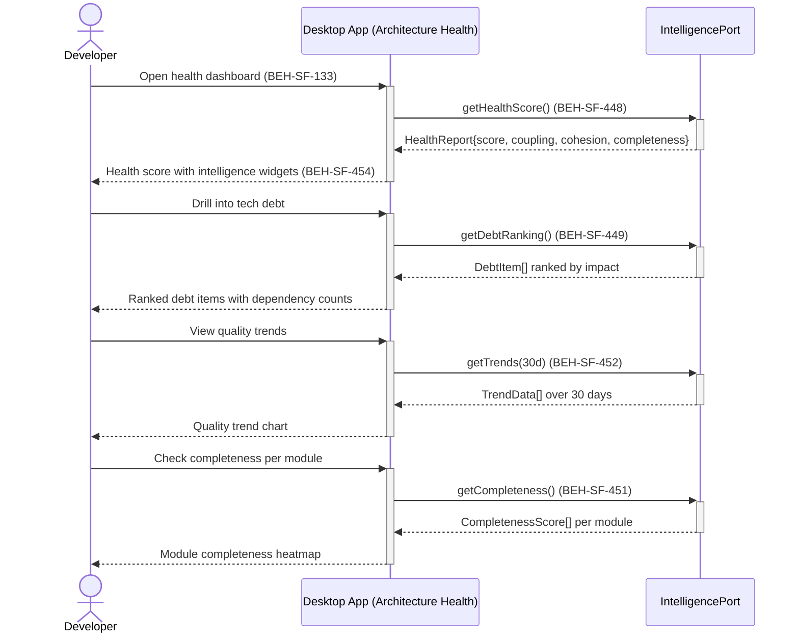

# View Architecture Health Score

## Use Case

A developer opens the Architecture Health in the desktop app. They drill into technical debt rankings, inspect completeness scores per module, and view quality trend lines over time to track improvement or degradation.

## Interaction Flow

```text
┌───────────┐     ┌───────────┐     ┌──────────────────┐
│ Developer │     │ Desktop App │     │ IntelligencePort │
└─────┬─────┘     └─────┬─────┘     └────────┬─────────┘
      │ Open health      │                    │
      │ dashboard        │                    │
      │────────────────►│                    │
      │                 │ getHealthScore()   │
      │                 │───────────────────►│
      │                 │  HealthReport      │
      │                 │◄───────────────────│
      │ Health score    │                    │
      │ + widgets       │                    │
      │ (448, 454)      │                    │
      │◄────────────────│                    │
      │                 │                    │
      │ Drill into      │                    │
      │ tech debt       │                    │
      │────────────────►│                    │
      │                 │ getDebtRanking()   │
      │                 │───────────────────►│
      │                 │  DebtItem[]        │
      │                 │◄───────────────────│
      │ Ranked debt     │                    │
      │ items (449)     │                    │
      │◄────────────────│                    │
      │                 │                    │
      │ View quality    │                    │
      │ trends          │                    │
      │────────────────►│                    │
      │                 │ getTrends(30d)     │
      │                 │───────────────────►│
      │                 │  TrendData[]       │
      │                 │◄───────────────────│
      │ 30-day trend    │                    │
      │ chart (452)     │                    │
      │◄────────────────│                    │
```



## Steps

1. Open the Architecture Health in the desktop app
2. View the aggregate architecture health score computed from graph topology (BEH-SF-448)
3. Inspect intelligence widgets showing coupling, cohesion, and completeness breakdowns (BEH-SF-454)
4. Drill into technical debt rankings sorted by downstream impact (BEH-SF-449)
5. View specification completeness scores per module (BEH-SF-451)
6. Examine quality trend lines over configurable time ranges (BEH-SF-452)
7. Compare current health against historical baselines

## Traceability

| Behavior   | Feature     | Role in this capability                         |
| ---------- | ----------- | ----------------------------------------------- |
| BEH-SF-448 | FEAT-SF-033 | Architecture health scoring from graph topology |
| BEH-SF-449 | FEAT-SF-033 | Technical debt quantification and ranking       |
| BEH-SF-451 | FEAT-SF-033 | Specification completeness scoring              |
| BEH-SF-452 | FEAT-SF-033 | Quality trend analysis over time                |
| BEH-SF-454 | FEAT-SF-033 | Intelligence dashboard widgets                  |
| BEH-SF-133 | FEAT-SF-007 | Dashboard rendering and navigation              |
