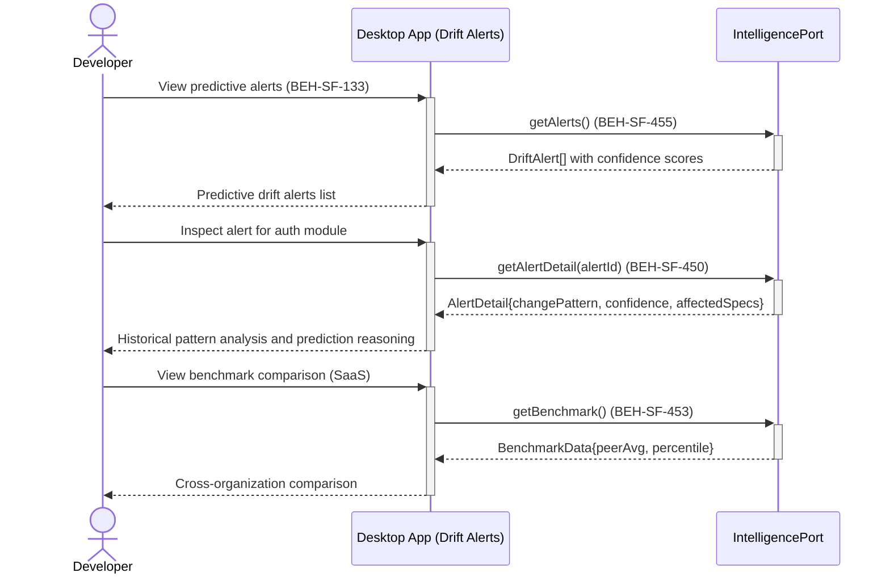

# Review Predictive Drift Alerts

## Use Case

A developer opens the Drift Alerts in the desktop app. The dashboard surfaces these alerts alongside health score degradation notifications, enabling teams to address drift before it accumulates. In SaaS mode, cross-organization benchmarking contextualizes alerts against anonymized peer data.

## Interaction Flow

```text
┌───────────┐     ┌───────────┐     ┌──────────────────┐
│ Developer │     │ Desktop App │     │ IntelligencePort │
└─────┬─────┘     └─────┬─────┘     └────────┬─────────┘
      │ View alerts      │                    │
      │────────────────►│                    │
      │                 │ getAlerts()        │
      │                 │───────────────────►│
      │                 │  DriftAlert[]      │
      │                 │◄───────────────────│
      │ Predictive      │                    │
      │ drift alerts    │                    │
      │ (450, 455)      │                    │
      │◄────────────────│                    │
      │                 │                    │
      │ Inspect alert   │                    │
      │ for auth module │                    │
      │────────────────►│                    │
      │                 │ getAlertDetail     │
      │                 │ (alertId)          │
      │                 │───────────────────►│
      │                 │  AlertDetail       │
      │                 │◄───────────────────│
      │ Change pattern  │                    │
      │ + confidence    │                    │
      │◄────────────────│                    │
      │                 │                    │
      │ View benchmark  │                    │
      │ comparison      │                    │
      │────────────────►│                    │
      │                 │ getBenchmark()     │
      │                 │───────────────────►│
      │                 │  BenchmarkData     │
      │                 │◄───────────────────│
      │ Peer comparison │                    │
      │ (453)           │                    │
      │◄────────────────│                    │
```



## Steps

1. Open the Drift Alerts in the desktop app
2. View predictive drift alerts ranked by confidence and severity (BEH-SF-455)
3. Inspect an alert to see the historical change pattern and prediction reasoning (BEH-SF-450)
4. View which specifications are predicted to drift and their change velocity
5. Acknowledge or dismiss alerts after review
6. View cross-organization benchmarks for drift rate comparison (BEH-SF-453, SaaS only)
7. Configure alert thresholds for health score degradation (BEH-SF-455)

## Traceability

| Behavior   | Feature     | Role in this capability                             |
| ---------- | ----------- | --------------------------------------------------- |
| BEH-SF-450 | FEAT-SF-033 | Predictive drift detection from historical patterns |
| BEH-SF-453 | FEAT-SF-033 | Cross-organization benchmarking (SaaS)              |
| BEH-SF-455 | FEAT-SF-033 | Alerting on health score degradation                |
| BEH-SF-133 | FEAT-SF-007 | Dashboard rendering for alerts panel                |
