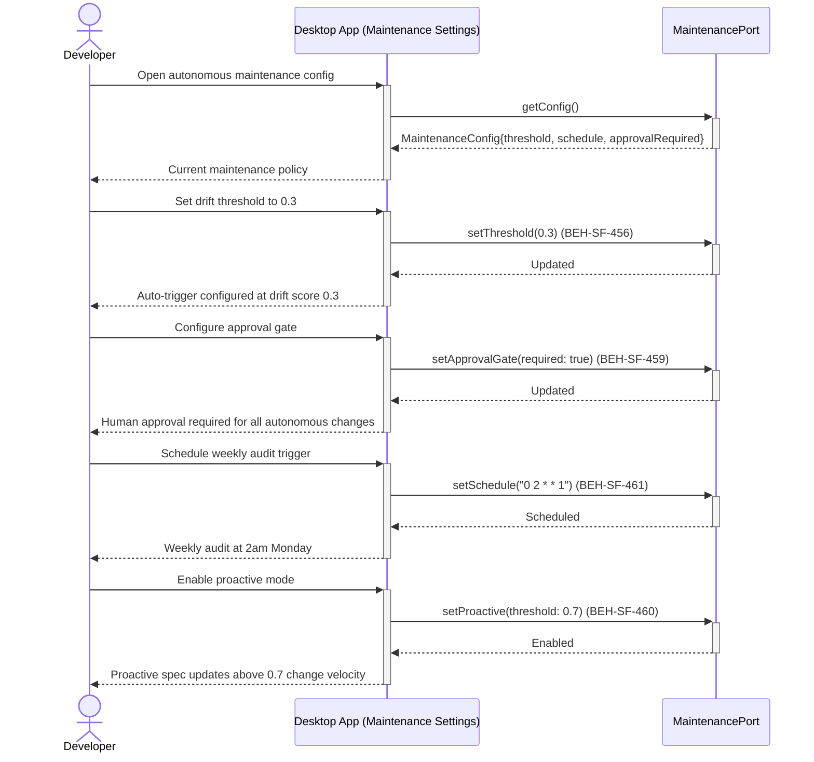
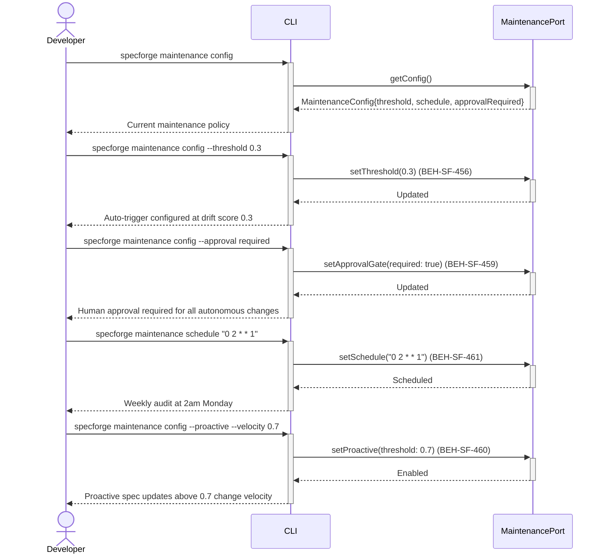

# Configure Autonomous Maintenance

## Use Case

A developer opens the Maintenance Settings in the desktop app. They set up scheduled audit triggers, configure proactive specification thresholds based on change velocity, and ensure all autonomous actions have human approval gates before merging. The same operation is accessible via CLI for scripted/CI workflows.

## Interaction Flow

### Desktop App

```text
┌───────────┐     ┌───────────┐     ┌──────────────────┐
│ Developer │     │   Desktop App   │     │ MaintenancePort  │
└─────┬─────┘     └─────┬─────┘     └────────┬─────────┘
      │ Open auto-       │                    │
      │ maintenance      │                    │
      │ config           │                    │
      │────────────────►│                    │
      │                 │ getConfig()        │
      │                 │───────────────────►│
      │                 │  MaintenanceConfig │
      │                 │◄───────────────────│
      │ Current policy  │                    │
      │◄────────────────│                    │
      │                 │                    │
      │ Set drift       │                    │
      │ threshold       │                    │
      │────────────────►│                    │
      │                 │ setThreshold       │
      │                 │ (score: 0.3)       │
      │                 │───────────────────►│
      │                 │  Updated           │
      │                 │◄───────────────────│
      │ Auto-trigger    │                    │
      │ at 0.3 (456)    │                    │
      │◄────────────────│                    │
      │                 │                    │
      │ Configure       │                    │
      │ approval gate   │                    │
      │────────────────►│                    │
      │                 │ setApprovalGate    │
      │                 │ (required: true)   │
      │                 │───────────────────►│
      │                 │  Updated           │
      │                 │◄───────────────────│
      │ Human approval  │                    │
      │ required (459)  │                    │
      │◄────────────────│                    │
      │                 │                    │
      │ Schedule audit  │                    │
      │ trigger         │                    │
      │────────────────►│                    │
      │                 │ setSchedule        │
      │                 │ (cron: "0 2 * * 1")│
      │                 │───────────────────►│
      │                 │  Scheduled         │
      │                 │◄───────────────────│
      │ Weekly audit    │                    │
      │ at 2am (461)    │                    │
      │◄────────────────│                    │
```



### CLI

```text
┌───────────┐     ┌───────────┐     ┌──────────────────┐
│ Developer │     │ CLI │     │ MaintenancePort  │
└─────┬─────┘     └─────┬─────┘     └────────┬─────────┘
      │ Open auto-       │                    │
      │ maintenance      │                    │
      │ config           │                    │
      │────────────────►│                    │
      │                 │ getConfig()        │
      │                 │───────────────────►│
      │                 │  MaintenanceConfig │
      │                 │◄───────────────────│
      │ Current policy  │                    │
      │◄────────────────│                    │
      │                 │                    │
      │ Set drift       │                    │
      │ threshold       │                    │
      │────────────────►│                    │
      │                 │ setThreshold       │
      │                 │ (score: 0.3)       │
      │                 │───────────────────►│
      │                 │  Updated           │
      │                 │◄───────────────────│
      │ Auto-trigger    │                    │
      │ at 0.3 (456)    │                    │
      │◄────────────────│                    │
      │                 │                    │
      │ Configure       │                    │
      │ approval gate   │                    │
      │────────────────►│                    │
      │                 │ setApprovalGate    │
      │                 │ (required: true)   │
      │                 │───────────────────►│
      │                 │  Updated           │
      │                 │◄───────────────────│
      │ Human approval  │                    │
      │ required (459)  │                    │
      │◄────────────────│                    │
      │                 │                    │
      │ Schedule audit  │                    │
      │ trigger         │                    │
      │────────────────►│                    │
      │                 │ setSchedule        │
      │                 │ (cron: "0 2 * * 1")│
      │                 │───────────────────►│
      │                 │  Scheduled         │
      │                 │◄───────────────────│
      │ Weekly audit    │                    │
      │ at 2am (461)    │                    │
      │◄────────────────│                    │
```



## Steps

1. Open the Maintenance Settings in the desktop app
2. Set the drift threshold that triggers automatic maintenance flows (BEH-SF-456)
3. Configure the human approval gate — all autonomous changes require approval before merge (BEH-SF-459)
4. Set up scheduled audit triggers (daily, weekly, or custom cron) (BEH-SF-461)
5. Enable proactive specification mode with change velocity threshold (BEH-SF-460)
6. Configure which flow template is used for autonomous maintenance runs (BEH-SF-057)
7. View the autonomous maintenance audit trail (BEH-SF-463)
8. Test the configuration with a dry-run maintenance flow

## Traceability

| Behavior   | Feature     | Role in this capability                        |
| ---------- | ----------- | ---------------------------------------------- |
| BEH-SF-456 | FEAT-SF-034 | Drift-triggered auto-update flow configuration |
| BEH-SF-459 | FEAT-SF-034 | Human approval gate for autonomous changes     |
| BEH-SF-460 | FEAT-SF-034 | Proactive specification from change velocity   |
| BEH-SF-461 | FEAT-SF-034 | Self-maintenance trigger from scheduled audits |
| BEH-SF-463 | FEAT-SF-034 | Autonomous maintenance audit trail             |
| BEH-SF-057 | FEAT-SF-004 | Flow execution mechanics for maintenance runs  |
