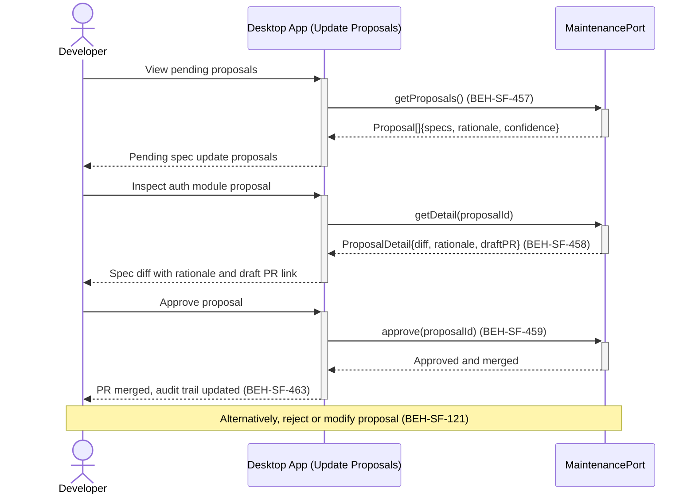

# Review Autonomous Spec Update Proposals

## Use Case

A developer opens the Update Proposals in the desktop app. The system produces proposals with clear rationale — which specifications drifted, what changes are suggested, and why. Proposals appear as draft PRs for review. The reviewer approves, rejects, or modifies proposals through the dashboard's human-in-the-loop approval gate, ensuring no autonomous change merges without human oversight.

## Interaction Flow

```text
┌───────────┐     ┌───────────┐     ┌──────────────────┐
│ Developer │     │ Desktop App │     │ MaintenancePort  │
└─────┬─────┘     └─────┬─────┘     └────────┬─────────┘
      │ View proposals   │                    │
      │────────────────►│                    │
      │                 │ getProposals()     │
      │                 │───────────────────►│
      │                 │  Proposal[]        │
      │                 │◄───────────────────│
      │ Pending         │                    │
      │ proposals (457) │                    │
      │◄────────────────│                    │
      │                 │                    │
      │ Inspect auth    │                    │
      │ module proposal │                    │
      │────────────────►│                    │
      │                 │ getDetail          │
      │                 │ (proposalId)       │
      │                 │───────────────────►│
      │                 │  ProposalDetail    │
      │                 │◄───────────────────│
      │ Diff + rationale│                    │
      │ + draft PR link │                    │
      │ (457, 458)      │                    │
      │◄────────────────│                    │
      │                 │                    │
      │ Approve         │                    │
      │ proposal        │                    │
      │────────────────►│                    │
      │                 │ approve            │
      │                 │ (proposalId)       │
      │                 │───────────────────►│
      │                 │  Approved + merged │
      │                 │◄───────────────────│
      │ PR merged       │                    │
      │ (459, 463)      │                    │
      │◄────────────────│                    │
```



## Steps

1. Open the Update Proposals in the desktop app
2. Inspect a proposal — see the spec diff, change rationale, and confidence score (BEH-SF-457)
3. Review the draft PR created by the maintenance flow (BEH-SF-458)
4. View the trigger source — drift detection, scheduled audit, or production anomaly (BEH-SF-462)
5. Approve the proposal through the human approval gate (BEH-SF-459)
6. Alternatively, reject the proposal with feedback for the system to learn from (BEH-SF-121)
7. Alternatively, modify the proposal before approving
8. Verify the action is recorded in the autonomous maintenance audit trail (BEH-SF-463)

## Traceability

| Behavior   | Feature     | Role in this capability                        |
| ---------- | ----------- | ---------------------------------------------- |
| BEH-SF-457 | FEAT-SF-034 | Spec update proposal generation with rationale |
| BEH-SF-458 | FEAT-SF-034 | Draft PR creation for spec changes             |
| BEH-SF-459 | FEAT-SF-034 | Human approval gate for autonomous changes     |
| BEH-SF-462 | FEAT-SF-034 | Production anomaly trigger for proposals       |
| BEH-SF-463 | FEAT-SF-034 | Autonomous maintenance audit trail             |
| BEH-SF-121 | FEAT-SF-018 | Human-in-the-loop feedback and rejection       |
