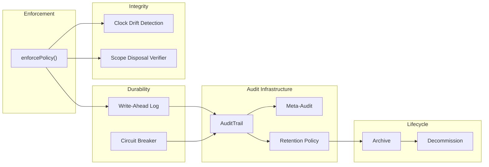

# GxP Infrastructure

For regulated environments (pharmaceutical, biotech, medical devices), the guard package includes infrastructure that supports audit trail requirements, data integrity, and system lifecycle management.

## Infrastructure Overview



## Write-Ahead Log

The write-ahead log (WAL) ensures audit entries are durably persisted before the authorization decision is acted upon. If the system crashes after granting access but before the audit trail write completes, the WAL can recover the entry on restart.

```typescript
import { createWriteAheadLog } from "@hex-di/guard";

const wal = createWriteAheadLog({
  storage: walStorageAdapter, // persistent storage backend
});
```

The WAL follows the classic pattern: write to the log first, then write to the audit trail, then mark the log entry as committed. On recovery, uncommitted log entries are replayed.

## Circuit Breaker

Protects the audit trail from cascading failures. If the audit trail backend becomes unavailable, the circuit breaker prevents repeated failed writes from impacting system performance.

```typescript
import { createCircuitBreaker } from "@hex-di/guard";

const breaker = createCircuitBreaker({
  failureThreshold: 5, // open after 5 consecutive failures
  resetTimeout: 30_000, // try again after 30 seconds
});
```

States:

- **Closed** -- normal operation, writes pass through
- **Open** -- writes fail immediately without hitting the backend
- **Half-open** -- a single test write is attempted; success closes the breaker, failure reopens it

## Audit Trail

The `AuditTrailPort` defines the contract for recording authorization decisions.

```typescript
type AuditEntry = {
  readonly id: string;
  readonly timestamp: Date;
  readonly subjectId: string;
  readonly portName: string;
  readonly policy: string; // serialized policy
  readonly decision: "allow" | "deny";
  readonly trace: EvaluationTrace;
  readonly durationMs: number;
};
```

Every entry is immutable and append-only. Entries cannot be modified or deleted (only archived through the retention policy).

## Meta-Audit

Meta-audit tracks changes to the audit system itself -- who modified audit configuration, when retention policies were applied, when archives were created.

```typescript
import { createMetaAuditEntry } from "@hex-di/guard";

const metaEntry = createMetaAuditEntry({
  action: "retention_applied",
  performedBy: "system",
  details: { entriesArchived: 1500, policy: "90-day" },
});
```

This creates an audit trail of the audit trail, required for 21 CFR Part 11 compliance.

## Retention Policy

Controls how long audit entries are kept before archiving.

```typescript
import { enforceRetention } from "@hex-di/guard";

const result = enforceRetention(entries, {
  maxAge: 90 * 24 * 60 * 60 * 1000, // 90 days
  archiveTarget: archiveAdapter,
});
```

Entries past the retention period are moved to the archive, not deleted. The retention enforcement itself is recorded as a meta-audit entry.

## Archive and Decommission

### `archiveAuditTrail()`

Moves audit entries to long-term storage.

```typescript
import { archiveAuditTrail } from "@hex-di/guard";

const result = archiveAuditTrail(entries, {
  target: coldStorageAdapter,
  compress: true,
});
```

### `createDecommissioningChecklist()`

Generates a checklist for system decommissioning, verifying that all audit data has been archived, all active sessions are terminated, and the system can be safely shut down.

```typescript
import { createDecommissioningChecklist } from "@hex-di/guard";

const checklist = createDecommissioningChecklist();
// Returns a list of verification steps with pass/fail status
```

## Clock Drift Detection

Detects clock drift between system components. In distributed systems, clock skew can cause audit entries to have inconsistent timestamps, violating data integrity requirements.

```typescript
import { detectClockDrift } from "@hex-di/guard";

const drift = detectClockDrift(localTimestamp, remoteTimestamp);
// drift.withinTolerance: boolean
// drift.driftMs: number
```

## Scope Disposal Verification

Verifies that DI scopes are properly disposed after use. In request-scoped authorization, a scope that isn't disposed could leak subject data across requests.

```typescript
import { createScopeDisposalVerifier } from "@hex-di/guard";

const verifier = createScopeDisposalVerifier();
// Tracks scope creation and disposal
// Reports undisposed scopes
```
