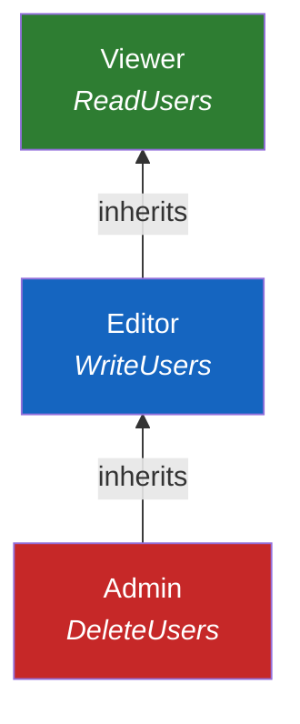
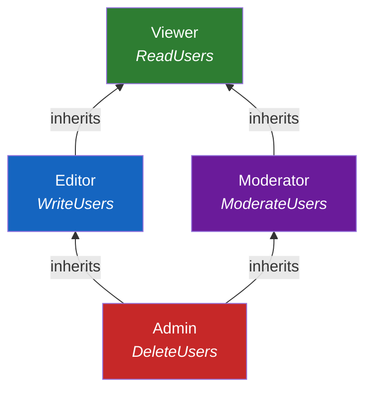

# Roles & Inheritance

Roles aggregate permissions into named sets and support DAG-based inheritance with automatic permission flattening.

## Creating Roles

```typescript
import { createRole } from "@hex-di/guard";

const ViewerRole = createRole("Viewer", {
  permissions: [ReadUsers],
});

const EditorRole = createRole("Editor", {
  permissions: [WriteUsers],
  inherits: [ViewerRole], // inherits ReadUsers from Viewer
});

const AdminRole = createRole("Admin", {
  permissions: [DeleteUsers],
  inherits: [EditorRole], // inherits ReadUsers + WriteUsers
});
```

## Role Inheritance DAG

Roles form a directed acyclic graph (DAG) through the `inherits` option. When a role inherits from another, it automatically receives all of that role's permissions -- including permissions from further ancestors.



## Permission Flattening

Permissions flatten automatically through the inheritance chain. Each role's effective permissions include its directly declared permissions plus all permissions inherited from ancestors.

| Role   | Direct Permissions | Flattened Permissions                    |
| ------ | ------------------ | ---------------------------------------- |
| Viewer | `ReadUsers`        | `ReadUsers`                              |
| Editor | `WriteUsers`       | `WriteUsers`, `ReadUsers`                |
| Admin  | `DeleteUsers`      | `DeleteUsers`, `WriteUsers`, `ReadUsers` |

Flattening happens at construction time, not at evaluation time. This means `hasRole(AdminRole)` checks are O(1) -- the flattened permission set is precomputed.

## Diamond Inheritance

Multiple inheritance paths to the same ancestor are handled correctly. Permissions are deduplicated during flattening.



```typescript
const ViewerRole = createRole("Viewer", {
  permissions: [ReadUsers],
});

const EditorRole = createRole("Editor", {
  permissions: [WriteUsers],
  inherits: [ViewerRole],
});

const ModeratorRole = createRole("Moderator", {
  permissions: [ModerateUsers],
  inherits: [ViewerRole],
});

// Admin inherits from both Editor and Moderator
// ReadUsers appears once in the flattened set (deduplicated)
const AdminRole = createRole("Admin", {
  permissions: [DeleteUsers],
  inherits: [EditorRole, ModeratorRole],
});
```

Admin's flattened permissions: `DeleteUsers`, `WriteUsers`, `ModerateUsers`, `ReadUsers` -- no duplicates despite two paths to `Viewer`.

## Cycle Detection

Circular inheritance is detected at construction time. If role A inherits from B and B inherits from A (directly or transitively), `createRole` returns a `CircularRoleInheritanceError`.

```typescript
// This would be caught at construction time:
const RoleA = createRole("A", { permissions: [], inherits: [RoleB] });
const RoleB = createRole("B", { permissions: [], inherits: [RoleA] });
// -> CircularRoleInheritanceError
```

Cycle detection runs during `createRole`, not at evaluation time. Invalid role graphs fail fast.
